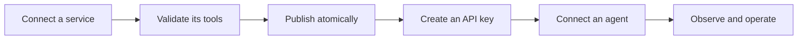
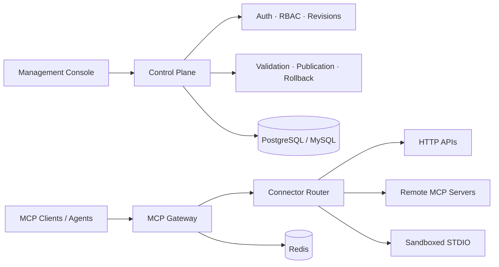

<div align="center">

# LiteMCP

### A unified MCP gateway and governance platform for HTTP APIs, remote MCP servers, and custom code packages.

LiteMCP aims to bring existing HTTP APIs, remote MCP servers, and FastMCP/STDIO packages behind one control plane, reducing the need to build and maintain a dedicated MCP server for every API.

English | [简体中文](README.zh-CN.md)

[](#project-status)
[](LICENSE)
[](backend/pyproject.toml)
[](frontend/package.json)
[](https://modelcontextprotocol.io/)

[Get started](#quick-start) · [Explore the architecture](docs/architecture/README.md) · [View the roadmap](#roadmap)

</div>

> [!IMPORTANT]
> **Current state: early foundation, no product features yet.** The repository has a real FastAPI application with typed configuration, health checks, an async database layer with cross-dialect (PostgreSQL/MySQL) types and Alembic migrations, a Docker Compose local stack, and a project harness (`feature_list.json` / `progress.md`) that tracks verified progress. Domain models, the MCP gateway, connectors, authentication and authorization, atomic publication, and the sandbox runtime are not yet implemented, and the frontend is still the original React/HeroUI template. LiteMCP is not ready for production use.

## Project status

| Area | Status | Notes |
| --- | --- | --- |
| Architecture and security design | **Internally reviewed** | Design documents cover the control/data/build planes, data model, authentication, sandbox, and verification strategy; implementation and production security validation remain pending |
| Product and UI/UX design | **Internally reviewed** | Information architecture and core workflows have a documented review baseline |
| Project foundation (M0) | **Complete** | Typed config with fail-fast validation, `/livez` + `/readyz`, root `Makefile` (`test`/`lint`/`build`/`validate-*`), `docker-compose.yml` for database/redis/backend/worker/frontend, and an ADR set — all 15 foundation features passing |
| Data layer (M1) | **In progress** | Async session factory, cross-dialect base types, and an Alembic migration system are passing (3 of 17 features); domain models (users, services, toolsets, artifacts, audit/outbox), secret encryption, and API key storage are not started |
| Management console | **Scaffold only** | The current frontend is the original React/HeroUI template, not a LiteMCP product UI |
| HTTP API connector | **Planned** | Intended as the first end-to-end service slice |
| Remote MCP connector | **Planned** | Intended to follow the shared gateway and publication foundation |
| STDIO sandbox | **Planned** | Intended to cover isolated build, probe, runtime, and cleanup lifecycles |

The architecture documents describe the intended system, not functionality already available in the repository. `feature_list.json` and `progress.md` are the authoritative, up-to-date record of what has actually passed verification.

## One gateway for every MCP service

MCP services often arrive in different shapes: an existing HTTP API, a remote MCP server, or a local STDIO package. Each brings its own deployment model, credentials, lifecycle, and operational risks.

LiteMCP is designed to provide one place to connect and govern them. In the target system, services will be validated and published as immutable toolsets, then exposed to agents through a consistent Streamable HTTP endpoint:

```text
/mcp/{service_id}
```

The intended result is one stable interface for agents, with controlled releases, access management, and clear runtime state for platform teams.

## Design goals

- **Governance designed for enterprise requirements** — the target architecture includes RBAC, audit trails, secret rotation, atomic publish/rollback, and PostgreSQL/MySQL support, with a planned Compose-based local deployment stack.
- **One gateway instead of N dedicated MCP servers** — define a Tool schema and deterministic HTTP binding once; LiteMCP is intended to handle protocol conversion, validation, credential injection, SSRF protection, and invocation.
- **A shared security layer for remote MCP servers** — the planned passthrough connector centralizes agent authentication, rate limiting, and audit logging in front of downstream servers.
- **Managed custom code packages** — the planned STDIO runtime will build, probe, and run FastMCP source packages in sandboxed, resource-bounded containers.

## Connect any service shape

| Planned service type | You provide | LiteMCP is intended to manage |
| --- | --- | --- |
| **HTTP API** | MCP Tool schemas and deterministic HTTP bindings | Validation, credential injection, SSRF controls, invocation, and response validation |
| **Remote MCP (passthrough)** | A remote MCP server endpoint and credentials | Tool discovery, synchronization, proxying, **agent auth, rate limiting, and audit**, circuit breaking, and revision switching |
| **Custom code package (STDIO / FastMCP)** | A source package | Isolated build, MCP probing, sandboxed execution, and runtime lifecycle |

> All three connectors are design targets and are not available in the current scaffold. Their implementation order is tracked in the [roadmap](#roadmap).

## Intended service lifecycle



The design keeps configuration, build artifacts, and toolsets immutable. A candidate toolset becomes active only after validation succeeds. Failed builds or synchronizations must not replace the version currently serving agents, and retained versions are intended to support safe rollback.

## Planned product capabilities

### Unified service catalog

The planned operations console will bring HTTP API, remote MCP, and STDIO services into one catalog, with filters for ownership, type, authentication mode, and observed runtime health.

### Atomic tool publishing

Complete toolsets will be staged and validated before the active pointer changes, so agents see either the previous complete release or the next one—never a partially updated set of tools.

### Stable MCP gateway

Every downstream is intended to use the same MCP Streamable HTTP surface while preserving official MCP lifecycle, Tool schema, metadata, and error semantics.

### Secure agent access

The planned access layer includes per-service API keys, object-level permissions, rate limits, secret redaction, and auditable lifecycle actions without exposing downstream credentials to agents.

### Sandboxed STDIO runtime

The target runtime separates package validation, image building, probing, and execution. STDIO workloads are intended to run inside hardened, resource-bounded containers rather than the control-plane process.

### Operations you can trust

The operations design separates desired state from observed runtime state and calls for correlated logs, metrics, traces, audit events, health conditions, and build or synchronization progress.

## Target architecture



The target architecture separates the management control plane, agent data plane, and asynchronous build/synchronization plane. The backend is designed around FastAPI and the official MCP Python SDK; the planned management console uses React, TypeScript, Vite, HeroUI, and Tailwind CSS.

Read the [architecture overview](docs/architecture/00-overview.md) for the complete domain model, security boundaries, publication invariants, and deployment design.

## Quick start

### Option A: Docker Compose

Requirements: Docker with Compose v2.

```bash
docker compose up -d --wait
```

This starts PostgreSQL, Redis, the backend (`/livez`, `/readyz`), a placeholder worker, and the frontend dev server. Every `${VAR}` in `docker-compose.yml` has an inline default, so it runs without a `.env` file; copy [.env.example](.env.example) to `.env` to override ports or secrets.

### Option B: Root Makefile

Requirements: GNU Make, Python 3.11+ with [uv](https://docs.astral.sh/uv/), and Node.js with npm.

```bash
make help    # list all targets
make test    # backend pytest (+ frontend vitest once wired)
make lint    # backend ruff + frontend eslint
make build   # backend compileall + frontend tsc/vite build
```

### Option C: Run services directly

**Backend** (Python 3.11+ and [uv](https://docs.astral.sh/uv/)):

```bash
cd backend
uv sync
uv run uvicorn litemcp.main:app --reload
```

The backend exposes:

- `GET http://127.0.0.1:8000/livez` — process liveness only
- `GET http://127.0.0.1:8000/readyz` — real database + Redis dependency probes

**Frontend** (a current Node.js release with npm):

```bash
cd frontend
npm install
npm run dev
```

> The frontend currently renders the original HeroUI/Vite starter template, not a LiteMCP management console. It only verifies that the frontend toolchain runs and is not connected to service management APIs.

## Roadmap

- [x] **Foundation** — configuration, Makefile, Compose stack, ADRs, health checks, async DB layer, cross-dialect types, and Alembic migrations are complete; domain models and security primitives (M1) are in progress
- [ ] **Management plane** — authentication, object-level authorization, service catalog, and operations console shell
- [ ] **HTTP API vertical slice** — create, publish, authorize, list, and call tools end to end
- [ ] **Remote MCP** — synchronize and proxy remote MCP servers with safe revision changes
- [ ] **Sandboxed STDIO** — upload, build, probe, publish, execute, drain, and roll back packages
- [ ] **Production readiness** — observability, browser and dialect matrices, fault injection, runbooks, and release evidence

Detailed milestones and acceptance gates live in the [implementation plan](docs/architecture/08-implementation-plan.md) and [TDD execution plan](docs/architecture/10-tdd-execution-plan.md).

## Documentation

| Topic | Document |
| --- | --- |
| System overview | [Architecture overview](docs/architecture/00-overview.md) |
| Data and publication model | [Data model](docs/architecture/01-data-model.md) |
| Admin authentication and authorization | [Admin auth](docs/architecture/02-admin-auth.md) |
| Service lifecycle and APIs | [Service CRUD](docs/architecture/03-service-crud.md) |
| STDIO security boundary | [STDIO sandbox](docs/architecture/04-stdio-sandbox.md) |
| Agent-facing MCP gateway | [Agent gateway](docs/architecture/05-agent-gateway.md) |
| Frontend architecture | [Frontend design](docs/architecture/06-frontend.md) |
| Logs, metrics, traces, and SLOs | [Observability](docs/architecture/07-observability.md) |
| Delivery sequence | [Implementation plan](docs/architecture/08-implementation-plan.md) |
| Test and release evidence | [Verification strategy](docs/architecture/09-verification.md) |
| Product experience | [UI/UX plan](docs/UI_UX_PLAN.md) |

## Contributing

LiteMCP is not ready for production deployments, but architecture reviews, issue reports, and implementation contributions are welcome. Before implementing a major capability, review the relevant architecture document and its verification requirements so the change preserves the intended security and publication invariants.

## License

LiteMCP is licensed under the [MIT License](LICENSE).
