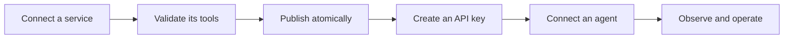
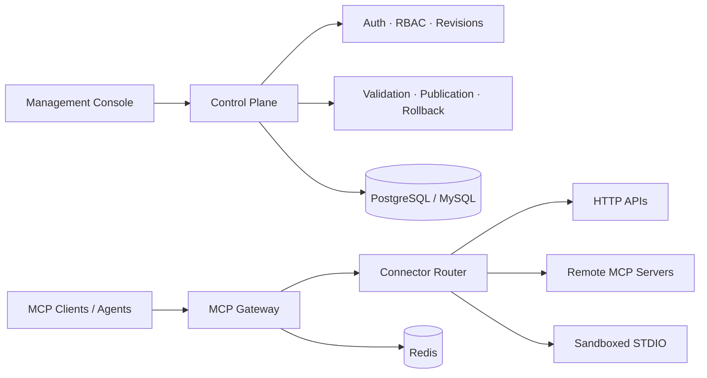

<div align="center">

# LiteMCP

### Enterprise-grade MCP governance. Zero hand-written MCP servers for the APIs you already have.

Stop writing a new MCP server for every HTTP API. Describe it once, and LiteMCP converts, governs, and gateways it — alongside MCP servers you pass through and custom code packages you upload — from one open-source control plane.

English | [简体中文](README.zh-CN.md)

[](#project-status)
[](backend/pyproject.toml)
[](frontend/package.json)
[](https://modelcontextprotocol.io/)

[Get started](#quick-start) · [Explore the architecture](docs/architecture/README.md) · [View the roadmap](#roadmap)

</div>

> [!IMPORTANT]
> LiteMCP is in active development. The architecture and product experience are well-defined, while the runtime, connectors, and management console are still being implemented. See [Project status](#project-status) for what is available today.

## One gateway for every MCP service

MCP services often arrive in different shapes: an existing HTTP API, a remote MCP server, or a local STDIO package. Each brings its own deployment model, credentials, lifecycle, and operational risks.

LiteMCP provides one place to connect and govern them. Services are validated and published as immutable toolsets, then exposed to agents through a consistent Streamable HTTP endpoint:

```text
/mcp/{service_id}
```

Agents get one stable interface. Platform teams get controlled releases, access management, and a clear view of what is actually serving traffic.

## Why LiteMCP

- **Enterprise-grade governance, one compose stack away** — RBAC, audit trails, secret rotation, and atomic publish/rollback across dual-dialect PostgreSQL/MySQL, backed by a single `docker compose` (database, Redis, backend, worker, frontend). The questions a security review asks are already answered; you don't stand up a platform to get there.
- **One gateway instead of N hand-written MCP servers** — stop writing and maintaining a bespoke MCP server for every HTTP API. Describe a Tool schema and an HTTP binding once; LiteMCP owns protocol conversion, validation, credential injection, SSRF protection, and invocation for every service behind it.
- **Pass through existing MCP servers, LiteMCP owns the security layer** — connect a remote MCP server as-is; LiteMCP centralizes agent authentication, rate limiting, and audit logging in front of it, so the downstream server never has to implement its own gateway security.
- **Run custom code packages** — upload a FastMCP source package and LiteMCP builds, probes, and runs it inside a sandboxed, resource-bounded container. No image pipeline or runtime to maintain yourself.

## Connect any service shape

| Service type | You provide | LiteMCP manages |
| --- | --- | --- |
| **HTTP API** | MCP Tool schemas and deterministic HTTP bindings | Validation, credential injection, SSRF controls, invocation, and response validation |
| **Remote MCP (passthrough)** | A remote MCP server endpoint and credentials | Tool discovery, synchronization, proxying, **agent auth, rate limiting, and audit**, circuit breaking, and revision switching |
| **Custom code package (STDIO / FastMCP)** | A source package | Isolated build, MCP probing, sandboxed execution, and runtime lifecycle |

> These connectors are part of the approved architecture and are not yet available in the current scaffold. Their implementation order is tracked in the [roadmap](#roadmap).

## From service to agent



LiteMCP keeps configuration, build artifacts, and toolsets immutable. A candidate toolset becomes active only after validation succeeds. A failed build or synchronization never replaces the version currently serving agents, and retained versions can be rolled back safely.

## Built as a product, not a protocol wrapper

### Unified service catalog

Discover HTTP API, remote MCP, and STDIO services from one high-density operations console. Filter by ownership, type, authentication mode, and real runtime health.

### Atomic tool publishing

Stage and validate complete toolsets before switching the active pointer. Agents see either the previous complete release or the next one—never a partially updated set of tools.

### Stable MCP gateway

Expose every downstream through the same MCP Streamable HTTP surface while preserving official MCP lifecycle, Tool schema, metadata, and error semantics.

### Secure agent access

Manage per-service API keys, object-level permissions, rate limits, secret redaction, and auditable lifecycle actions without leaking downstream credentials to agents.

### Sandboxed STDIO runtime

Separate package validation, image building, probing, and execution. STDIO workloads run inside hardened, resource-bounded containers rather than the control-plane process.

### Operations you can trust

Keep desired state separate from observed runtime state. Correlated logs, metrics, traces, audit events, health conditions, and build or sync progress make failures diagnosable.

## Architecture



LiteMCP separates the management control plane, agent data plane, and asynchronous build/synchronization plane. The backend is designed around FastAPI and the official MCP Python SDK; the management console uses React, TypeScript, Vite, HeroUI, and Tailwind CSS.

Read the [architecture overview](docs/architecture/00-overview.md) for the complete domain model, security boundaries, publication invariants, and deployment design.

## Project status

| Area | Status | Notes |
| --- | --- | --- |
| Architecture and security model | **Reviewed** | Control/data/build planes, data model, authentication, sandbox, and verification plans are documented |
| Product and UI/UX design | **Reviewed** | Information architecture and core workflows have an approved review baseline |
| Backend foundation | **In progress** | FastAPI package and liveness/readiness endpoints exist |
| Management console | **In progress** | React/HeroUI application scaffold exists; product screens are not implemented yet |
| HTTP API connector | **Planned** | First end-to-end service slice |
| Remote MCP connector | **Planned** | Follows the shared gateway and publication foundation |
| STDIO sandbox | **Planned** | Isolated build, probe, runtime, and cleanup lifecycle |

The repository currently represents an early implementation scaffold backed by a detailed, reviewed product and architecture plan. It is not ready for production use.

## Quick start

The current scaffold can be run as two local development processes.

### Backend

Requirements: Python 3.11+ and [uv](https://docs.astral.sh/uv/).

```bash
cd backend
uv sync
uv run uvicorn litemcp.main:app --reload
```

The current backend exposes:

- `GET http://127.0.0.1:8000/livez`
- `GET http://127.0.0.1:8000/readyz`

### Frontend

Requirements: a current Node.js release with npm.

```bash
cd frontend
npm install
npm run dev
```

> The management UI is currently a frontend scaffold. It is not yet connected to the planned service management APIs.

## Roadmap

- [ ] **Foundation** — configuration, database model, migrations, security primitives, and production-ready application lifecycle
- [ ] **Management plane** — authentication, object-level authorization, service catalog, and operations console shell
- [ ] **HTTP API vertical slice** — create, publish, authorize, list, and call tools end to end
- [ ] **Remote MCP** — synchronize and proxy remote MCP servers with safe revision changes
- [ ] **Sandboxed STDIO** — upload, build, probe, publish, execute, drain, and roll back packages
- [ ] **Production readiness** — observability, browser and dialect matrices, fault injection, runbooks, and release evidence

Detailed milestones and acceptance gates live in the [implementation plan](docs/architecture/08-implementation-plan.md) and [TDD execution plan](docs/architecture/10-tdd-execution-plan.md).

## Documentation

| Topic | Document |
| --- | --- |
| System overview | [Architecture overview](docs/architecture/00-overview.md) |
| Data and publication model | [Data model](docs/architecture/01-data-model.md) |
| Admin authentication and authorization | [Admin auth](docs/architecture/02-admin-auth.md) |
| Service lifecycle and APIs | [Service CRUD](docs/architecture/03-service-crud.md) |
| STDIO security boundary | [STDIO sandbox](docs/architecture/04-stdio-sandbox.md) |
| Agent-facing MCP gateway | [Agent gateway](docs/architecture/05-agent-gateway.md) |
| Frontend architecture | [Frontend design](docs/architecture/06-frontend.md) |
| Logs, metrics, traces, and SLOs | [Observability](docs/architecture/07-observability.md) |
| Delivery sequence | [Implementation plan](docs/architecture/08-implementation-plan.md) |
| Test and release evidence | [Verification strategy](docs/architecture/09-verification.md) |
| Product experience | [UI/UX plan](docs/UI_UX_PLAN.md) |

## Contributing

LiteMCP is not yet accepting production deployments, but architecture reviews, issue reports, and implementation contributions are welcome. Before implementing a major capability, review the relevant architecture document and its verification requirements so the change preserves the project's security and publication invariants.

## License

The repository does not currently declare a project-wide license. A root license will be added before the first public release.
