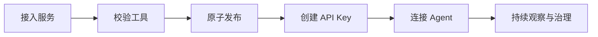
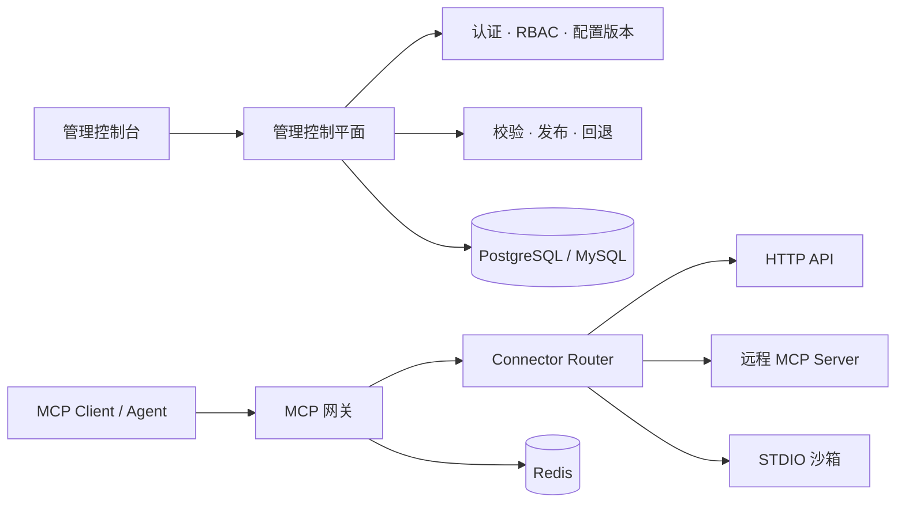

<div align="center">

# LiteMCP

### 面向 HTTP API、远程 MCP Server 和自定义代码包的统一 MCP 接入与治理平台。

LiteMCP 旨在将已有 HTTP API、远程 MCP Server 和 FastMCP/STDIO 代码包接入统一控制面，减少为每个 API 单独开发和维护 MCP Server 的成本。

[English](README.md) | [简体中文](README.zh-CN.md)

[](#项目状态)
[](LICENSE)
[](backend/pyproject.toml)
[](frontend/package.json)
[](https://modelcontextprotocol.io/)

[快速开始](#快速开始) · [查看架构](docs/architecture/README.md) · [了解路线图](#路线图)

</div>

> [!IMPORTANT]
> **当前状态：基础工程已完成，产品能力尚未开始。** 仓库现已包含真实可用的 FastAPI 应用（带类型化配置、健康检查）、支持 PostgreSQL/MySQL 跨方言类型和 Alembic 迁移的异步数据库层、Docker Compose 本地部署栈，以及跟踪已验证进度的项目治理机制（`feature_list.json` / `progress.md`）。领域模型、MCP 网关、三类 Connector、认证授权、原子发布和沙箱运行尚未实现，前端仍是原始 React/HeroUI 模板。LiteMCP 目前不能用于生产环境。

## 项目状态

| 模块 | 状态 | 说明 |
| --- | --- | --- |
| 架构与安全设计 | **已完成内部评审** | 设计文档覆盖控制面、数据面、构建面、数据模型、认证、沙箱和验证策略；实现与生产安全验证仍未完成 |
| 产品与 UI/UX 设计 | **已完成内部评审** | 信息架构和核心用户流程已有文档化评审基线 |
| 工程基础（M0） | **已完成** | 类型化配置与快速失败校验、`/livez` + `/readyz`、根目录 `Makefile`（`test`/`lint`/`build`/`validate-*`）、覆盖数据库/Redis/后端/worker/前端的 `docker-compose.yml`，以及 ADR 体系——15 项基础特性全部通过验证 |
| 数据层（M1） | **开发中** | 异步会话工厂、跨方言基础类型和 Alembic 迁移体系已通过验证（17 项中的 3 项）；用户/服务/工具集/构建产物/审计事件等领域模型、秘密加密和 API Key 存储尚未开始 |
| 管理控制台 | **仅有脚手架** | 当前前端仍是原始 React/HeroUI 模板，并非 LiteMCP 产品界面 |
| HTTP API Connector | **规划中** | 计划作为第一条端到端服务纵向切片 |
| Remote MCP Connector | **规划中** | 计划在统一网关和发布基础能力之后实现 |
| STDIO 沙箱 | **规划中** | 计划覆盖隔离构建、探测、运行和清理生命周期 |

架构文档描述的是目标系统，并不代表其中的能力已经在当前仓库中实现。`feature_list.json` 和 `progress.md` 才是已通过验证内容的权威、实时记录。

## 一个网关，接入所有 MCP 服务

MCP 服务可能来自已有的 HTTP API、远程 MCP Server，也可能是本地 STDIO 代码包。它们拥有不同的部署方式、凭据、生命周期和运行风险。

LiteMCP 的目标是提供一个统一的接入与治理入口。在目标系统中，服务经过校验后将以不可变工具集的形式发布，并通过一致的 Streamable HTTP 端点提供给 Agent：

```text
/mcp/{service_id}
```

目标体验是让 Agent 只面对一个稳定接口，同时让平台团队能够管理发布、访问权限，并准确判断当前真正对外服务的版本。

## 设计目标

- **面向企业治理需求设计**——目标架构包括 RBAC、审计日志、密钥轮换、原子发布/回退和 PostgreSQL/MySQL 支持，并计划提供基于 Compose 的本地部署栈。
- **一个网关，减少专用 MCP Server**——只需定义一次 Tool Schema 和确定性的 HTTP Binding；LiteMCP 计划统一承担协议转换、校验、凭据注入、SSRF 防护和调用。
- **为远程 MCP Server 提供统一安全层**——规划中的透传 Connector 将集中处理 Agent 鉴权、限流和审计，减少下游重复建设网关安全能力。
- **托管自定义代码包**——规划中的 STDIO 运行时将负责构建、探测 FastMCP 源码包，并在沙箱化、资源受限的容器中运行。

## 接入三类服务

| 规划服务类型 | 你需要提供 | LiteMCP 计划负责 |
| --- | --- | --- |
| **HTTP API** | MCP Tool Schema 和确定性的 HTTP Binding | 校验、凭据注入、SSRF 防护、调用和响应校验 |
| **Remote MCP（透传）** | 远程 MCP Server 地址与凭据 | 工具发现、同步、代理、**Agent 鉴权、限流与审计**、熔断和版本切换 |
| **自定义代码包（STDIO / FastMCP）** | 源代码包 | 隔离构建、MCP 探测、沙箱执行和运行时生命周期 |

> 三类 Connector 都是目标设计，当前脚手架尚未实现。具体实现顺序请查看[路线图](#路线图)。

## 目标服务生命周期



设计方案将配置、构建产物和工具集保存为不可变版本。候选工具集只有在校验成功后才能成为活动版本；构建或同步失败不得替换当前正在服务的版本，保留期内的历史版本计划支持安全回退。

## 规划中的产品能力

### 统一服务市场

规划中的运维控制台将统一展示 HTTP API、远程 MCP 和 STDIO 服务，并支持按归属、类型、鉴权方式和观测到的运行状态筛选。

### 原子工具发布

完整工具集将先进入候选状态，全部校验通过后再切换活动指针，使 Agent 只看到完整的旧版本或完整的新版本，而不会读到更新一半的工具集。

### 稳定的 MCP 网关

目标网关将通过统一的 MCP Streamable HTTP 接口暴露所有下游，同时保留官方 MCP 生命周期、Tool Schema、元数据和错误语义。

### 安全的 Agent 接入

规划中的访问层包括服务级 API Key、对象级权限、限流、秘密脱敏和可审计的生命周期操作，避免将下游凭据直接暴露给 Agent。

### STDIO 沙箱运行时

目标运行时将代码包校验、镜像构建、探测和执行彼此分离，并让 STDIO 服务运行在加固且资源受限的容器中，而不是控制平面进程内。

### 可信的运行状态

运维设计将用户期望状态与真实运行状态分离，并计划通过关联日志、指标、链路、审计事件、健康条件和构建/同步进度定位故障。

## 目标系统架构



目标架构将管理控制面、Agent 数据面以及异步构建/同步面彼此分离。后端基于 FastAPI 和 MCP 官方 Python SDK 设计；规划中的管理控制台使用 React、TypeScript、Vite、HeroUI 与 Tailwind CSS。

完整的领域模型、安全边界、发布不变量和部署方案请阅读[架构概览](docs/architecture/00-overview.md)。

## 快速开始

### 方式一：Docker Compose

环境要求：Docker 与 Compose v2。

```bash
docker compose up -d --wait
```

该命令会启动 PostgreSQL、Redis、后端（`/livez`、`/readyz`）、占位 worker 和前端开发服务器。`docker-compose.yml` 中的每个 `${VAR}` 都带有内联默认值，因此无需 `.env` 文件即可运行；如需覆盖端口或密钥，可复制 [.env.example](.env.example) 为 `.env`。

### 方式二：根目录 Makefile

环境要求：GNU Make、Python 3.11+ 与 [uv](https://docs.astral.sh/uv/)、以及带 npm 的 Node.js。

```bash
make help    # 列出所有目标
make test    # 后端 pytest（前端 vitest 接入后一并运行）
make lint    # 后端 ruff + 前端 eslint
make build   # 后端 compileall + 前端 tsc/vite build
```

### 方式三：直接运行各服务

**后端**（Python 3.11+ 和 [uv](https://docs.astral.sh/uv/)）：

```bash
cd backend
uv sync
uv run uvicorn litemcp.main:app --reload
```

后端提供：

- `GET http://127.0.0.1:8000/livez`——仅反映进程存活状态
- `GET http://127.0.0.1:8000/readyz`——真实探测数据库与 Redis 依赖

**前端**（当前受支持的 Node.js 版本与 npm）：

```bash
cd frontend
npm install
npm run dev
```

> 前端目前展示的是原始 HeroUI/Vite 初始模板，并非 LiteMCP 管理控制台。它只能用于验证前端工程链路，尚未连接服务管理 API。

## 路线图

- [x] **工程基础**——配置、Makefile、Compose 部署栈、ADR、健康检查、异步数据库层、跨方言类型和 Alembic 迁移已完成；领域模型与安全原语（M1）开发中
- [ ] **管理控制面**——认证、对象级授权、服务市场和运维控制台壳层
- [ ] **HTTP API 纵向切片**——完成工具的创建、发布、授权、列出和调用闭环
- [ ] **Remote MCP**——安全地同步和代理远程 MCP Server，并支持版本切换
- [ ] **STDIO 沙箱**——完成上传、构建、探测、发布、执行、排空和回退闭环
- [ ] **生产就绪**——可观测性、浏览器与数据库矩阵、故障注入、Runbook 和发布证据

详细里程碑和验收门槛请查看[实施计划](docs/architecture/08-implementation-plan.md)和 [TDD 执行计划](docs/architecture/10-tdd-execution-plan.md)。

## 文档

| 主题 | 文档 |
| --- | --- |
| 系统概览 | [架构概览](docs/architecture/00-overview.md) |
| 数据与发布模型 | [数据模型](docs/architecture/01-data-model.md) |
| 管理认证与授权 | [管理认证](docs/architecture/02-admin-auth.md) |
| 服务生命周期与 API | [服务 CRUD](docs/architecture/03-service-crud.md) |
| STDIO 安全边界 | [STDIO 沙箱](docs/architecture/04-stdio-sandbox.md) |
| 面向 Agent 的 MCP 网关 | [Agent 网关](docs/architecture/05-agent-gateway.md) |
| 前端架构 | [前端设计](docs/architecture/06-frontend.md) |
| 日志、指标、链路与 SLO | [可观测性](docs/architecture/07-observability.md) |
| 交付顺序 | [实施计划](docs/architecture/08-implementation-plan.md) |
| 测试与发布证据 | [验证策略](docs/architecture/09-verification.md) |
| 产品体验 | [UI/UX 方案](docs/UI_UX_PLAN.md) |

## 参与贡献

LiteMCP 尚不具备生产部署条件，但欢迎参与架构评审、提交问题和贡献实现。在开发重要能力前，请先阅读对应的架构文档与验证要求，确保变更不会破坏设计中的安全边界和发布不变量。

## 许可证

LiteMCP 基于 [MIT 许可证](LICENSE) 开源。
