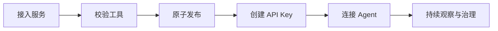
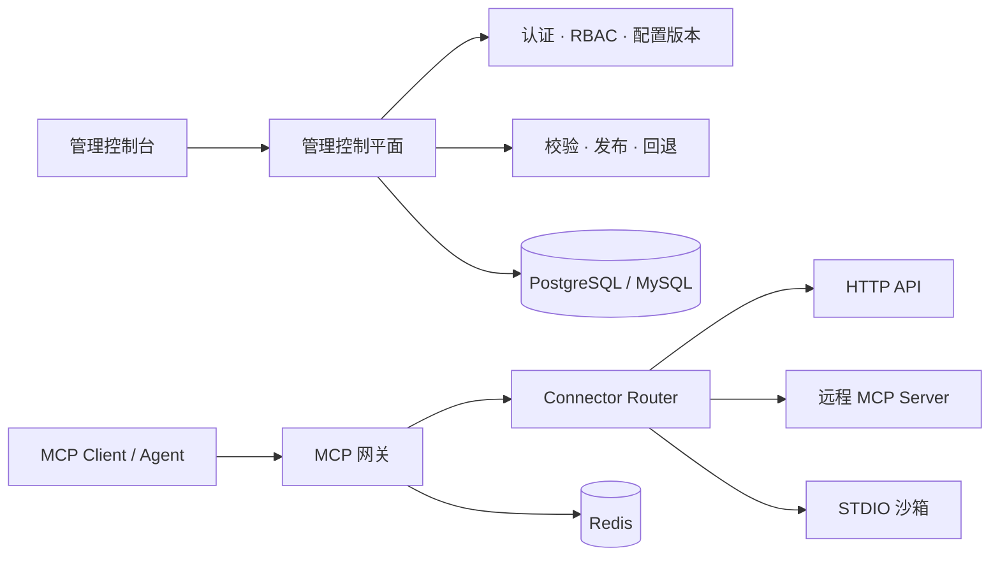

<div align="center">

# LiteMCP

### 通过一个安全网关，发布你的所有 MCP 服务。

一个用于接入、发布和治理 MCP 服务的开源控制平面与网关。

[English](README.md) | [简体中文](README.zh-CN.md)

[](#项目状态)
[](backend/pyproject.toml)
[](frontend/package.json)
[](https://modelcontextprotocol.io/)

[快速开始](#快速开始) · [查看架构](docs/architecture/README.md) · [了解路线图](#路线图)

</div>

> [!IMPORTANT]
> LiteMCP 正处于积极开发阶段。产品体验与系统架构已经形成完整方案，但运行时、连接器和管理后台仍在实现中。请通过[项目状态](#项目状态)了解当前真正可用的内容。

## 一个网关，接入所有 MCP 服务

MCP 服务可能来自已有的 HTTP API、远程 MCP Server，也可能是本地 STDIO 代码包。它们拥有不同的部署方式、凭据、生命周期和运行风险。

LiteMCP 提供一个统一的接入与治理入口。服务经过校验后，以不可变工具集的形式发布，并通过一致的 Streamable HTTP 端点提供给 Agent：

```text
/mcp/{service_id}
```

Agent 只需要面对一个稳定接口；平台团队则可以管理发布、访问权限，并准确判断当前真正对外服务的版本。

## 接入三类服务

| 服务类型 | 你需要提供 | LiteMCP 负责 |
| --- | --- | --- |
| **HTTP API** | MCP Tool Schema 和确定性的 HTTP Binding | 校验、凭据注入、SSRF 防护、调用和响应校验 |
| **Remote MCP** | 远程 MCP Server 地址与凭据 | 工具发现、同步、代理、熔断和版本切换 |
| **STDIO / FastMCP** | 源代码包 | 隔离构建、MCP 探测、沙箱执行和运行时生命周期 |

> 三类连接器已经进入正式架构方案，但当前脚手架尚未实现。具体实现顺序请查看[路线图](#路线图)。

## 从服务接入到 Agent 调用



LiteMCP 将配置、构建产物和工具集保存为不可变版本。候选工具集只有在校验成功后才会成为活动版本。构建或同步失败不会替换当前正在服务的版本，保留期内的历史版本也可以安全回退。

## 不只是一个协议代理

### 统一服务市场

在高信息密度的运维控制台中发现 HTTP API、远程 MCP 和 STDIO 服务，并按归属、类型、鉴权方式和真实运行状态筛选。

### 原子工具发布

完整工具集先进入候选状态，全部校验通过后再切换活动指针。Agent 只会看到完整的旧版本或完整的新版本，不会读到更新一半的工具集。

### 稳定的 MCP 网关

通过统一的 MCP Streamable HTTP 接口暴露所有下游，同时保留官方 MCP 生命周期、Tool Schema、元数据和错误语义。

### 安全的 Agent 接入

管理服务级 API Key、对象级权限、限流、秘密脱敏和可审计的生命周期操作，避免将下游凭据直接暴露给 Agent。

### STDIO 沙箱运行时

将代码包校验、镜像构建、探测和执行彼此分离。STDIO 服务运行在加固且资源受限的容器中，而不是控制平面进程内。

### 可信的运行状态

严格区分用户期望状态与真实运行状态。通过关联日志、指标、链路、审计事件、健康条件和构建/同步进度定位故障。

## 系统架构



LiteMCP 将管理控制面、Agent 数据面以及异步构建/同步面彼此分离。后端基于 FastAPI 和 MCP 官方 Python SDK 设计，管理控制台使用 React、TypeScript、Vite、HeroUI 与 Tailwind CSS。

完整的领域模型、安全边界、发布不变量和部署方案请阅读[架构概览](docs/architecture/00-overview.md)。

## 项目状态

| 模块 | 状态 | 说明 |
| --- | --- | --- |
| 架构与安全模型 | **已评审** | 控制面、数据面、构建面、数据模型、认证、沙箱和验证方案已有完整文档 |
| 产品与 UI/UX 设计 | **已评审** | 信息架构和核心用户流程已经形成评审基线 |
| 后端基础 | **开发中** | FastAPI 包以及存活/就绪检查端点已经存在 |
| 管理控制台 | **开发中** | React/HeroUI 脚手架已经存在，产品页面尚未实现 |
| HTTP API Connector | **规划中** | 第一条端到端服务纵向切片 |
| Remote MCP Connector | **规划中** | 在统一网关和发布基础能力之后实现 |
| STDIO 沙箱 | **规划中** | 包含隔离构建、探测、运行和清理生命周期 |

当前仓库是一个由完整产品与架构方案支撑的早期实现脚手架，尚不能用于生产环境。

## 快速开始

当前脚手架可以通过两个本地开发进程运行。

### 后端

环境要求：Python 3.11+ 和 [uv](https://docs.astral.sh/uv/)。

```bash
cd backend
uv sync
uv run uvicorn litemcp.main:app --reload
```

当前后端提供：

- `GET http://127.0.0.1:8000/livez`
- `GET http://127.0.0.1:8000/readyz`

### 前端

环境要求：当前受支持的 Node.js 版本与 npm。

```bash
cd frontend
npm install
npm run dev
```

> 管理界面目前仍是前端脚手架，尚未连接规划中的服务管理 API。

## 路线图

- [ ] **工程基础**——配置、数据库模型、迁移、安全原语和生产级应用生命周期
- [ ] **管理控制面**——认证、对象级授权、服务市场和运维控制台壳层
- [ ] **HTTP API 纵向切片**——完成工具的创建、发布、授权、列出和调用闭环
- [ ] **Remote MCP**——安全地同步和代理远程 MCP Server，并支持版本切换
- [ ] **STDIO 沙箱**——完成上传、构建、探测、发布、执行、排空和回退闭环
- [ ] **生产就绪**——可观测性、浏览器与数据库矩阵、故障注入、Runbook 和发布证据

详细里程碑和验收门槛请查看[实施计划](docs/architecture/08-implementation-plan.md)和 [TDD 执行计划](docs/architecture/10-tdd-execution-plan.md)。

## 文档

| 主题 | 文档 |
| --- | --- |
| 系统概览 | [架构概览](docs/architecture/00-overview.md) |
| 数据与发布模型 | [数据模型](docs/architecture/01-data-model.md) |
| 管理认证与授权 | [管理认证](docs/architecture/02-admin-auth.md) |
| 服务生命周期与 API | [服务 CRUD](docs/architecture/03-service-crud.md) |
| STDIO 安全边界 | [STDIO 沙箱](docs/architecture/04-stdio-sandbox.md) |
| 面向 Agent 的 MCP 网关 | [Agent 网关](docs/architecture/05-agent-gateway.md) |
| 前端架构 | [前端设计](docs/architecture/06-frontend.md) |
| 日志、指标、链路与 SLO | [可观测性](docs/architecture/07-observability.md) |
| 交付顺序 | [实施计划](docs/architecture/08-implementation-plan.md) |
| 测试与发布证据 | [验证策略](docs/architecture/09-verification.md) |
| 产品体验 | [UI/UX 方案](docs/UI_UX_PLAN.md) |

## 参与贡献

LiteMCP 尚不接受生产部署，但欢迎参与架构评审、提交问题和贡献实现。在开发重要能力前，请先阅读对应的架构文档与验证要求，确保变更不会破坏项目的安全边界和发布不变量。

## 许可证

仓库目前尚未声明项目级许可证。根许可证文件将在首次公开发布前补充。
