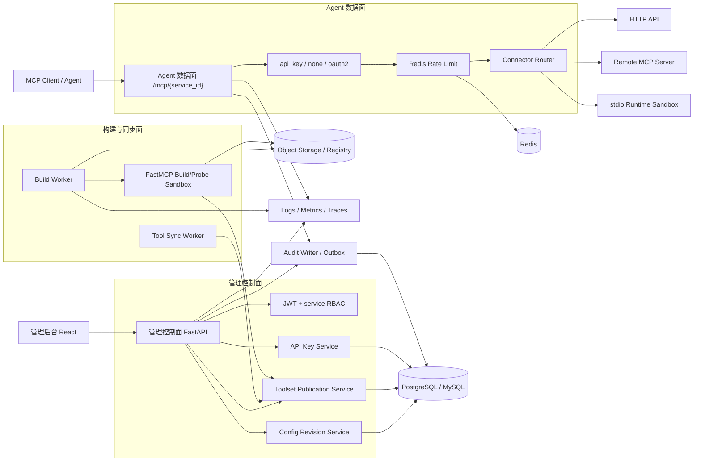
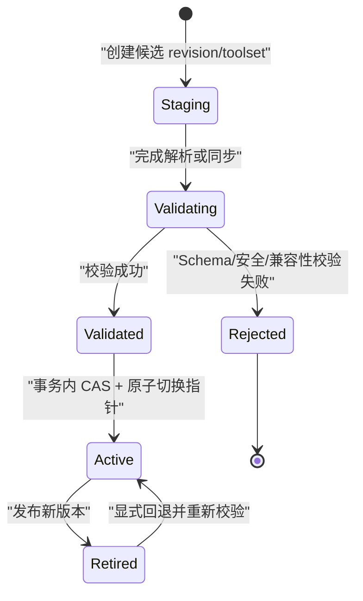

# 00 · Overview

[← 返回索引](README.md)

## 1. Context

LiteMCP 是一个独立的 MCP 网关与服务市场，统一管理三类服务：

- `http_api`：把存量 HTTP API 映射为 MCP Tool。
- `stdio`：上传 FastMCP 代码包，由 LiteMCP 自建沙箱完成构建、探测和运行；后续支持标准 descriptor、自定义 adapter 和人工配置。
- `mcp_http`：连接并代理远程 MCP Server。

Agent 无论调用哪类下游，都通过统一的 Streamable HTTP 端点 `/mcp/{service_id}` 访问。管理后台和 Agent 调用端是两套独立安全边界：后台使用用户/JWT/RBAC，Agent 侧按服务配置 `api_key`、`none` 或后续的标准 MCP `oauth2`。

本项目不再依赖旧系统完成 stdio 构建，也不使用“同步时直接删除并覆盖工具”的旧模型。配置、构建产物和工具集均采用不可变版本；候选版本通过校验后原子发布，失败继续使用旧版本，并支持在保留期内回退。

## 2. 架构目标

- 前后端分离：FastAPI 后端、React + HeroUI 前端。
- 真正使用 MCP 官方 SDK 的 server/client 能力，不手写一套近似 MCP 的私有协议。
- 完整保存 MCP 2025-11-25 Tool Schema，以 JSON Schema 2020-12 为默认 dialect。
- MCP Tool 是内部规范真源；OpenAI、Claude、Gemini 等模型厂商格式通过 provider adapter 投影，并报告 `exact/lossy/unsupported`。
- PostgreSQL 14+、MySQL 8.0+ 为一级正式支持数据库；领域模型与业务代码不得依赖单一数据库方言。
- stdio 构建和执行在加固沙箱内完成，构建与运行分离。
- 服务期望配置与运行状态分离，后台任务不得反向覆盖用户配置。
- 审计日志与普通运行日志分离，所有敏感配置加密，API Key 只保存摘要。
- Redis 限流失败只影响限流，不影响 Agent 鉴权；降级行为必须可观测。
- 根 Makefile 是统一管理入口，docker compose 负责本地多进程编排。

## 3. 逻辑架构



### 3.1 管理控制面

负责用户登录、服务 CRUD、权限、配置 revision、API Key、构建/同步任务触发和发布/回退。管理写入使用 `row_version` 乐观锁；外部网络调用和容器构建不能在数据库事务或行锁内执行。

### 3.2 Agent 数据面

按固定顺序执行：服务可用性 → Agent 鉴权 → service/key 两级限流 → connector 分发。Agent 只读取 `active_config_revision_id` 和 `active_toolset_id`，永远不会读取 staging、rejected 或半写入的数据。

### 3.3 构建与同步面

第一版 stdio 使用 FastMCP：校验代码包 → 隔离构建 → 临时启动 → MCP initialize/tools/list 探测 → 生成候选 toolset → Schema 和安全校验 → 原子发布。mcp_http 和人工 HTTP 工具最终也走同一个 toolset publication service。

### 3.4 审计面

`audit_event` 记录可归责的安全和管理行为；structlog 记录运行诊断信息。两者通过 `request_id/correlation_id` 关联，但不能互相替代。秘密值在审计中只能记录“发生变化”，不能记录 before/after 明文。

## 4. 核心发布模型



关键不变量：

- 配置变化使 `generation + 1`；后台任务只允许提交它收到的 generation。
- 旧任务晚完成时标记 `superseded`，不能覆盖新配置。
- 发布事务只切换 active 指针，不复制或重写整套工具。
- 校验失败时 active 指针不变。
- 回退目标必须属于同一服务、artifact 尚未被 GC，并通过当前安全策略。

完整状态、实体和事务定义见 [01-data-model.md](01-data-model.md)。

## 5. 技术栈

### 5.1 后端

- Python 3.11+、FastAPI async、Pydantic v2。
- SQLAlchemy 2.0 async + Alembic。
- PostgreSQL 14+ / MySQL 8.0+；默认 compose 使用 PostgreSQL。
- MCP 官方 Python SDK：Agent 端使用 server 低阶 API；stdio/mcp_http connector 使用 client API。
- JSON Schema 2020-12 validator；协议版本和未知 `_meta` 扩展必须可保留。
- httpx；所有 URL 在调用前经过 SSRF、TLS 和出网策略校验。
- Redis：Refresh Token 白名单、限流、MCP Session、短期锁和熔断状态。
- Docker SDK for Python：所有 docker-py 阻塞 I/O 必须通过专用 executor，不得阻塞事件循环。
- `cryptography.MultiFernet`：服务凭据和私密运行参数的版本化加密与轮换。
- Argon2id 密码哈希；已有 bcrypt 数据仅作迁移兼容，成功登录后按 [02-admin-auth.md](02-admin-auth.md) 升级重哈希。
- structlog、prometheus-client、OpenTelemetry API/SDK 与 OTLP；第一版按 [07-observability.md](07-observability.md) 落实 traces、W3C Trace Context、指标/日志关联、SLO 与告警门禁，遥测导出故障不得阻塞或拖垮业务请求。

### 5.2 前端

- React + TypeScript + Vite。
- HeroUI + Tailwind CSS。
- React Router、TanStack Query、axios。
- 服务表单按类型使用 discriminated union；工具编辑器提交完整 MCP Tool Schema + execution binding。

### 5.3 基础设施

- docker compose 管理 database、redis、backend、**worker**、frontend；`worker` 是独立 compose service（与 backend 同镜像、不同启动命令/entrypoint），承载 `src/litemcp/workers/`（build、sync、GC、密钥轮换）这类长时间运行或阻塞 docker-py 调用的任务，不与处理 Agent 请求的 backend 进程抢事件循环；stdio 沙箱容器的构建/运行仍由 `sandbox/`（builder/runner/bridge）驱动，可以运行在 backend 或 worker 进程内，取决于触发路径是同步 API 调用（backend）还是异步任务（worker）。
- 默认 database profile 使用 PostgreSQL；MySQL profile 通过独立 service 和 `DATABASE_URL` 切换，同一环境只启动一个关系数据库。
- backend 与 worker 都需要连接 rootless Docker daemon socket（worker 跑镜像 GC/异步构建，backend 跑同步构建触发与 runner 生命周期管理），两者一律挂载同一个 rootless daemon 的 socket，不挂载宿主特权 daemon socket。
- 本地开发使用文件系统 `StorageBackend`；生产使用 S3/MinIO，容器镜像可进入 OCI Registry。

## 6. 数据与状态边界

| 数据 | 真源 | 一致性 |
|---|---|---|
| 用户、服务、revision、toolset、权限、Key 元数据 | PostgreSQL/MySQL | 强一致事务 |
| 审计事件 | 关系库独立表；可归档审计系统 | 业务成功事件同事务/outbox |
| 代码包、descriptor、构建日志、构建产物 | StorageBackend / Registry | 内容摘要校验；数据库保存引用 |
| 限流桶、Refresh Token、Session、短锁 | Redis | TTL；不可作为配置真源 |
| stdio 活跃队列和容器句柄 | runner 运行状态 | 可重建；多副本需协调 |
| 普通日志、metrics、trace | 可观测性系统 | 最终一致，不承载审计真源 |

数据库抽象、软删除唯一性、加密和完整实体定义见 [01-data-model.md](01-data-model.md)。

## 7. 目录结构

```text
LiteMCP/
├── Makefile
├── docker-compose.yml
├── docker-compose.mysql.yml        # 或 compose profile：MySQL 测试/开发
├── .env.example
├── backend/
│   ├── pyproject.toml
│   ├── alembic.ini
│   ├── alembic/versions/
│   └── src/litemcp/
│       ├── main.py                 # FastAPI、correlation id、路由与 metrics
│       ├── core/
│       │   ├── config.py
│       │   ├── db/
│       │   │   ├── session.py
│       │   │   ├── types.py       # ID/UTC_TS/JSON_DOC/CIPHERTEXT
│       │   │   └── dialects/      # postgres.py, mysql.py, capabilities.py
│       │   ├── redis.py
│       │   ├── security.py        # JWT、MultiFernet、Key hash
│       │   ├── storage.py         # StorageBackend
│       │   ├── errors.py
│       │   ├── logging.py
│       │   └── metrics.py
│       ├── models/                 # user/service/revision/artifact/build/toolset/
│       │                           # tool/projection/sync/condition/permission/key/audit/task
│       ├── schemas/                # 管理 API、MCP canonical、descriptor Schema
│       ├── api/                    # auth/services/tools/permissions/keys/builds/sync/audit
│       ├── middleware/
│       │   ├── auth_admin.py       # JWT + user 状态
│       │   ├── auth_agent.py       # api_key/none/oauth2
│       │   └── rate_limit.py       # Redis Lua 令牌桶 + 熔断
│       ├── gateway/
│       │   ├── router.py           # MCP endpoint 与 connector 分发
│       │   ├── sessions.py         # Streamable HTTP Session + Redis TTL
│       │   └── connectors/         # http_api.py, mcp_http.py, stdio.py
│       ├── sandbox/
│       │   ├── package_validator.py
│       │   ├── builder.py
│       │   ├── runner.py
│       │   └── bridge.py
│       ├── adapters/
│       │   ├── descriptors/        # fastmcp.py, litemcp_descriptor.py
│       │   └── providers/          # openai.py, anthropic.py, google.py
│       ├── services/
│       │   ├── service_crud.py
│       │   ├── revisions.py
│       │   ├── publication.py      # toolset 校验、CAS 发布与回退
│       │   ├── permissions.py
│       │   ├── api_keys.py
│       │   └── audit.py
│       ├── workers/                # build、sync、GC、密钥轮换
│       └── audit/                  # writer、redaction、outbox dispatcher
│   └── tests/
│       ├── unit/
│       ├── integration/
│       └── dialects/               # PostgreSQL/MySQL 同一契约测试
└── frontend/
    ├── package.json
    └── src/
        ├── pages/
        │   ├── Login.tsx
        │   └── market/{MarketList,HttpApiForm,StdioForm,McpHttpForm}.tsx
        ├── components/             # ToolSchemaEditor、RevisionStatus、KeyPanel 等
        ├── api/
        └── router.tsx
```

目录表示职责边界，不要求初始提交一次创建所有空文件；模块实现时必须遵守依赖方向：API/worker 调用 service，service 调用 repository/adapter，connector 不直接切换 active toolset。

## 8. 安全边界摘要

- 管理权限 `editor/viewer` 与 Agent 调用权限完全独立。
- API Key 格式为公开 selector + 高熵 secret；数据库只保存摘要，明文仅创建时返回一次。
- `auth_config` 和私密 stdio 环境变量进入版本化密文，不进入普通 JSON 配置。
- Agent 入口收到的 token 不得透传为下游 token；上游凭据来自独立 service secret。
- stdio 构建和运行容器默认无网络、非 root、有限 CPU/内存/PID/磁盘，并启用 seccomp。
- 对象存储 key 不是可信路径；上传包必须检查路径穿越、符号链接、压缩炸弹和文件白名单。
- 运行日志、构建日志、错误摘要、审计 changes 使用统一 redaction；审计事件的应用账号无 UPDATE/DELETE 权限。

详细设计见 [02-admin-auth.md](02-admin-auth.md)、[04-stdio-sandbox.md](04-stdio-sandbox.md)、[05-agent-gateway.md](05-agent-gateway.md)。

## 9. Makefile 与验证入口

```text
make setup                     # 安装本地依赖
make dev                       # 默认 PostgreSQL compose 环境
make dev-mysql                 # MySQL compose/profile 环境
make backend                   # 启动后端依赖与 backend
make worker                    # 启动 worker（build/sync/GC/密钥轮换常驻任务，见 5.3/7）
make frontend                  # 启动 frontend
make migrate                   # 当前 DATABASE_URL 执行 upgrade head
make migration name=xxx        # 生成候选迁移；提交前必须双方言验证
make test                      # 单元测试 + 默认集成测试 + 前端测试
make test-postgres             # PostgreSQL 迁移/约束/事务契约
make test-mysql                # MySQL 迁移/约束/事务契约
make test-db-matrix            # 两个一级数据库完整矩阵
make lint
make fmt
make build
make docker-down
```

数据模型验收见 [01-data-model.md](01-data-model.md)，端到端验收见 [09-verification.md](09-verification.md)。
