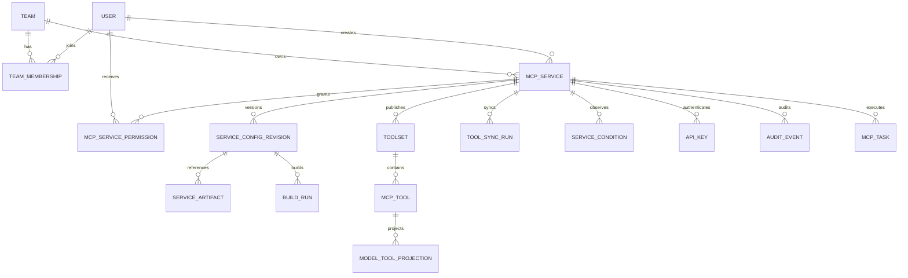

# 01 · 数据模型

[← 返回索引](README.md)

本文定义 LiteMCP 的规范领域模型、持久化边界、状态机、约束、版本发布、审计、加密和数据库适配规则。本文是独立设计，不依赖旧项目 DDL；SQLAlchemy 模型、Alembic 迁移和 API Schema 必须以本文为准。

## 1. 设计目标与范围

- 同一套领域模型支持 PostgreSQL 14+、MySQL 8.0+；SQLite 仅用于轻量单元测试，不作为生产数据库。
- 三类服务统一管理：`http_api`、`stdio`、`mcp_http`。
- 用户期望配置与系统观测到的运行状态分离。
- 配置、构建产物和工具集均可版本化、验证、原子发布和回退。
- 第一版 stdio 原生支持 FastMCP；后续可以通过标准服务描述文件、自动探测器或人工配置接入其他代码包。
- 内部工具定义完整保存 MCP Tool Schema；模型厂商格式由适配器生成，不把某一家厂商格式作为数据库真源。
- 审计日志与应用运行日志严格分离。
- 所有凭据、运行时秘密和 API Key 均有明确的生成、加密/哈希、轮换、吊销和脱敏规则。

本文的“完整兼容 MCP Schema”特指：规范保存并输出 MCP 2025-11-25 Tool 定义以及相关协议版本、能力和扩展元数据。MCP 的 Resource、Prompt、Elicitation 等能力可以在后续按相同的 capability snapshot + versioned collection 模式扩展，不把它们错误塞入 `mcp_tool`。

## 2. 数据存储边界

| 数据 | 真源 | 说明 |
|---|---|---|
| 用户、服务、权限、配置版本、工具集、API Key 元数据 | 关系数据库 | PostgreSQL/MySQL 均支持 |
| 审计事件 | 关系数据库中的独立表，生产可异步归档到审计系统 | 不与普通日志混表，不保存秘密明文 |
| 代码包、服务描述文件、构建日志、构建产物 | `StorageBackend` / 镜像仓库 | 数据库只保存不可变对象 key、摘要和元数据 |
| Refresh Token 白名单、限流桶、熔断、短期分布式锁 | Redis | 明确 TTL；不是配置真源 |
| Streamable HTTP Session | Redis，单实例开发可用内存 | key 含 service/session，必须有 TTL |
| stdio 请求队列 | 运行实例内存；多副本后迁移到 Redis/专用队列 | 不在数据库轮询实现 |
| 结构化运行日志、metrics、trace | 日志/监控系统 | 与 `audit_event` 用 correlation id 关联 |

## 3. 跨数据库抽象

### 3.1 支持策略

领域层只使用下列逻辑类型。`core/db/types.py` 提供 SQLAlchemy `TypeDecorator`，`core/db/dialects/` 提供方言能力和迁移辅助；业务代码禁止直接依赖 `JSONB`、PostgreSQL partial index、MySQL `ON UPDATE` 等单一数据库特性。

| 逻辑类型 | SQLAlchemy | PostgreSQL | MySQL 8 | 规则 |
|---|---|---|---|---|
| `ID` | `Uuid(as_uuid=True)` | `UUID` | `CHAR(36)`；可选优化为 `BINARY(16)` | API 一律使用规范 UUID 字符串 |
| `UTC_TS` | `DateTime(timezone=True)` | `TIMESTAMPTZ` | `DATETIME(6)` | 应用写 UTC；MySQL 读取后补 UTC 语义 |
| `JSON_DOC` | 自定义 JSON 类型 | `JSONB` | `JSON` | 业务正确性不得依赖 JSON 内部索引 |
| `CIPHERTEXT` | `LargeBinary` | `BYTEA` | `LONGBLOB` | 不允许直接查询内容 |
| `LONG_TEXT` | `Text` | `TEXT` | `LONGTEXT` | 错误摘要另设长度上限 |
| `BOOL` | `Boolean` | `BOOLEAN` | `BOOLEAN/TINYINT(1)` | 只接受 true/false |
| `ENUM_CODE` | `String` + CHECK | `VARCHAR + CHECK` | `VARCHAR + CHECK` | 不使用数据库原生 ENUM，便于升级 |

支持分级如下：

- **一级正式支持**：PostgreSQL 14+、MySQL 8.0+，每次迁移和发布都必须进入 CI 矩阵。
- **二级适配目标**：MariaDB 10.6+、SQL Server 2019+。领域模型不得主动使用阻碍适配的单一方言能力；只有补齐驱动、Alembic 方言迁移和完整 CI 后才能声明正式支持。
- **开发测试**：SQLite，只验证轻量领域逻辑，不验证生产并发、约束或迁移兼容性。

一级兼容性测试必须覆盖建库、全量迁移、升级/降级迁移、CRUD、并发切换、唯一约束、循环外键建立和事务回滚。SQLite 测试通过不能代替上述测试。

### 3.2 通用字段约定

- 所有时间字段使用 UTC，精度至少微秒。
- 可变业务表统一包含 `created_at`、`created_by`、`updated_at`、`updated_by`、`row_version`。
- 软删除资源增加 `deleted_at`、`deleted_by`；删除用户采用禁用，不物理删除其审计身份。
- `row_version` 用于管理 API 乐观锁；更新时执行 `WHERE id=? AND row_version=?`，冲突返回 `409 CONCURRENT_MODIFICATION`。
- JSON Schema、配置 JSON 在摘要计算前使用稳定序列化规则规范化，摘要算法为 SHA-256。
- 外键、唯一约束和 CHECK 约束必须在数据库层实现；Pydantic 校验不是数据库约束的替代品。

### 3.3 跨数据库软删除唯一性

不依赖 PostgreSQL partial unique index。所有需要“仅未删除记录唯一”的表使用 `uniqueness_scope`：

- 活跃记录固定为 `LIVE`。
- 软删除事务中先把它改成 `DELETED:<record_id>`，再写 `deleted_at/deleted_by`。
- 唯一键示例：`UNIQUE(namespace_key, name_normalized, uniqueness_scope)`。
- `name_normalized` 在应用层按 Unicode NFKC + trim + casefold 生成，不依赖数据库 collation 差异。
- CHECK 保证未删除记录只能使用 `LIVE`，已删除记录不能使用 `LIVE`；应用不得让客户端提交该字段。

该方案允许删除后复用名称，并在 PostgreSQL/MySQL 上得到一致语义。PostgreSQL 部署可额外增加只读性能索引，但不能改变约束语义。

## 4. 核心关系



`mcp_service.active_config_revision_id` 和 `active_toolset_id` 是已发布版本指针。所有草稿、构建中或校验失败的数据都不可直接被 Agent 读取。

## 5. 表设计

以下 `ID`、`UTC_TS`、`JSON_DOC`、`CIPHERTEXT` 均指第 3 节逻辑类型。未注明可空的字段均为 `NOT NULL`。

### 5.1 `user`

| 字段 | 类型 | 约束/说明 |
|---|---|---|
| `id` | ID | PK |
| `username` | varchar(128) | 展示值 |
| `username_normalized` | varchar(128) | UNIQUE；规范化登录名 |
| `password_hash` | varchar(255) | Argon2id PHC 字符串；已有 bcrypt 仅作迁移兼容 |
| `role` | varchar(16) | CHECK `admin/user` |
| `status` | varchar(16) | CHECK `active/disabled/locked` |
| `password_changed_at` | UTC_TS | 密码版本判断 |
| `last_login_at` | UTC_TS nullable | 最近成功登录时间 |
| `failed_login_count` | integer | 默认 0，必须 >= 0 |
| `failed_login_window_started_at` | UTC_TS nullable | 当前失败观察窗口起点；成功登录、窗口过期或解锁时清空 |
| `locked_until` | UTC_TS nullable | 临时锁定 |
| 通用审计字段 | — | `created/updated`；用户不做普通物理删除 |

用户变为 `disabled` 后应删除其 Redis refresh token 白名单；已有短期 access token 按 [02-admin-auth.md](02-admin-auth.md) 的策略自然过期。

### 5.2 `mcp_service`

服务主表只保存稳定身份、期望状态、当前发布指针和运行摘要，不保存构建历史。

| 字段 | 类型 | 约束/说明 |
|---|---|---|
| `id` | ID | PK |
| `namespace_key` | varchar(64) | 第一版固定 `default`；为未来部署级租户/工作区保留，语义与下方 `team_id` 的部门/团队分区不同 |
| `team_id` | ID | FK → `team.id`，RESTRICT；服务归属团队，只影响创建归属、市场默认筛选和转移操作，**不自动授予可见性**——可见性完全由 5.12 `mcp_service_permission` 的显式授权行决定，见 12 章 |
| `type` | varchar(24) | CHECK `http_api/stdio/mcp_http`，创建后不可变 |
| `name` | varchar(128) | 展示名 |
| `name_normalized` | varchar(128) | 规范化名称 |
| `uniqueness_scope` | varchar(64) | 默认 `LIVE`；见 3.3 |
| `tags` | JSON_DOC | 默认 `[]`，字符串数组，数量和单项长度受限 |
| `description` | LONG_TEXT nullable | 服务描述 |
| `icon_object_key` | varchar(512) nullable | 对象存储 key，不直接保存不受控外部 URL |
| `desired_status` | varchar(16) | CHECK `enabled/disabled`；用户期望 |
| `generation` | bigint | 默认 1；有效配置变更后 +1 |
| `observed_generation` | bigint | 默认 0；运行时已处理到的 generation |
| `runtime_status` | varchar(24) | CHECK `pending/ready/degraded/unhealthy/failed`；只读摘要 |
| `active_config_revision_id` | ID nullable | FK → `service_config_revision.id`；当前已发布配置 |
| `active_toolset_id` | ID nullable | FK → `toolset.id`；当前已发布工具集 |
| `agent_auth_mode` | varchar(24) | CHECK `api_key/none/oauth2`；第一版 `api_key/none`，预留标准 OAuth |
| `rate_limit_qps` | decimal nullable | > 0；NULL 使用全局配置 |
| `rate_limit_burst` | integer nullable | >= 1；NULL 使用全局配置 |
| `queue_max_depth` | integer nullable | stdio 专属，>= 1；NULL 默认 50 |
| `queue_timeout_ms` | integer nullable | stdio 专属，> 0；NULL 默认 30000 |
| `stdio_instance_max` | integer nullable | stdio 专属，1–8；NULL 默认 1。实例池上限，见 [04-stdio-sandbox.md](04-stdio-sandbox.md) 8.1 |
| `stdio_concurrency_per_instance` | integer nullable | stdio 专属，1–8；NULL 默认 1。单实例内允许的并发在途 `tools/call` 数，调高要求用户代码并发安全 |
| 通用审计/软删除字段 | — | 含 `row_version` |

约束与索引：

- UNIQUE `(namespace_key, name_normalized, uniqueness_scope)`。命名唯一性仍按部署级 `namespace_key` 判定，不按 `team_id` 二次拆分；同名服务不能出现在不同团队下，避免市场检索和 Agent 路由出现歧义。
- INDEX `(namespace_key, desired_status, type)` 支撑市场筛选。
- INDEX `(team_id, desired_status)` 支撑按团队浏览市场。
- INDEX `(created_by, deleted_at)` 支撑创建人查询。
- `observed_generation <= generation`。
- `queue_*`、`stdio_instance_max`、`stdio_concurrency_per_instance` 仅允许 stdio 使用；其他类型必须为 NULL。
- `team_id` 指向的 team 必须处于 `active` 状态才允许创建或转移；team 被 archive 后其下已有服务继续运行，但不能再接收新服务或转入。
- `active_config_revision_id` 和 `active_toolset_id` 必须属于当前 service。使用复合外键 `(active_*_id,id)` 分别引用 revision/toolset 的 `(id,service_id)`；为解决建表循环依赖，Alembic 在各表创建完成后再增加这些 FK。
- 删除服务时同一事务设置 `desired_status=disabled`、吊销所有 API Key、改变 `uniqueness_scope`，并写审计事件。对象和镜像由异步 GC 按引用计数/保留期回收。

### 5.3 `service_config_revision`

保存不可变的期望配置版本。**不可变**指 `public_config`/`secret_blob_id`/`config_digest` 等内容字段：已创建的 revision 不允许原地修改这些字段，修改服务产生新 revision；`state`/`validation_report`/`activated_at`/`superseded_at` 属于该 revision 自身的生命周期状态，允许按第 7 节流程原地转移。

| 字段 | 类型 | 约束/说明 |
|---|---|---|
| `id` | ID | PK |
| `service_id` | ID | FK → service，删除采用 RESTRICT |
| `generation` | bigint | UNIQUE `(service_id,generation)` |
| `schema_version` | integer | 配置文档版本 |
| `config_kind` | varchar(24) | 与 service type 一致 |
| `public_config` | JSON_DOC | 非秘密配置，按类型 Schema 校验 |
| `secret_blob_id` | ID nullable | FK → `service_secret.id` |
| `source_descriptor` | JSON_DOC nullable | 用户上传或系统解析的标准服务描述快照 |
| `source_mode` | varchar(32) | `fastmcp_introspection/descriptor/manual/remote_sync` |
| `config_digest` | char(64) | 规范化配置 SHA-256 |
| `state` | varchar(16) | `draft/validating/validated/active/rejected/superseded` |
| `validation_report` | JSON_DOC nullable | 错误码、JSON pointer、warning；不得含秘密 |
| `activated_at` | UTC_TS nullable | 原子发布时间 |
| `superseded_at` | UTC_TS nullable | 被替代时间 |
| 通用创建字段 | — | revision 不使用 updated 字段 |

`public_config` 分型内容：

- `http_api`：base URL、默认 timeout、TLS 策略、HTTP 工具执行默认值。
- `mcp_http`：server URL、transport、MCP protocol preference、连接/读取 timeout、TLS 策略。
- `stdio`：入口、运行时、公开环境变量、资源限制、队列覆盖、健康检查和出网策略引用。

额外建立 UNIQUE `(id,service_id)`，供 service active config 指针的跨表归属约束使用。

服务 URL 必须经过 SSRF 校验；秘密 Header、Token、Basic Auth 密码、私密环境变量不得进入 `public_config`。

### 5.4 `service_secret`

| 字段 | 类型 | 约束/说明 |
|---|---|---|
| `id` | ID | PK |
| `service_id` | ID | FK → service |
| `purpose` | varchar(32) | `upstream_auth/runtime_env/oauth_client` 等 |
| `ciphertext` | CIPHERTEXT | MultiFernet 密文；整份秘密文档一次加解密 |
| `cipher_suite` | varchar(32) | 第一版固定 `fernet-v1` |
| `key_version` | varchar(64) | 写入时使用的主密钥版本 |
| `secret_schema_version` | integer | 解密后文档 Schema 版本 |
| `plaintext_fingerprint` | char(64) nullable | 带服务端 pepper 的 HMAC，仅用于变更/复用检测 |
| `rotated_from_id` | ID nullable | 自关联；记录轮换链 |
| `expires_at` | UTC_TS nullable | 上游秘密到期时间 |
| `destroyed_at` | UTC_TS nullable | 密文销毁标记 |
| 通用创建字段 | — | 不允许返回 `ciphertext` 到管理 API |

加密规则：

- Fernet 主密钥只来自 secret manager/受保护环境，不与数据库或备份放在一起。
- MultiFernet 首 key 加密、其余 key 只用于解密；后台轮换创建新 `service_secret`，再原子切换 revision 引用，不原地覆盖。
- `auth_config` 和 stdio 私密 `mcp_params/env` 都必须进入本表；公开运行参数进入 `public_config`。
- 解密明文只在请求生命周期内存在；异常、trace、审计、构建日志和 API 响应必须统一脱敏。
- 备份恢复测试必须同时覆盖密文和外部密钥恢复，否则备份视为不可用。

### 5.5 `service_artifact`

统一记录代码包、服务描述、依赖包和运行镜像等不可变对象。

| 字段 | 类型 | 约束/说明 |
|---|---|---|
| `id` | ID | PK |
| `service_id` | ID | FK → service |
| `config_revision_id` | ID nullable | FK → revision |
| `kind` | varchar(32) | `source_package/descriptor/build_bundle/container_image/build_log` |
| `storage_backend` | varchar(24) | `filesystem/s3/minio/registry` |
| `object_key` | varchar(1024) | 对象 key 或 image digest；禁止本地绝对路径 |
| `sha256` | char(64) | 内容摘要 |
| `size_bytes` | bigint | >= 0 |
| `media_type` | varchar(128) | 如 `application/zip` |
| `format` | varchar(32) | `py/zip/json/yaml/oci` 等 |
| `state` | varchar(16) | `staging/available/quarantined/gc_pending/deleted` |
| `scan_report` | JSON_DOC nullable | 安全扫描摘要 |
| `retain_until` | UTC_TS nullable | GC 最早时间 |
| 通用创建字段 | — | `(storage_backend,object_key)` UNIQUE |

GC 只能删除 `gc_pending`、已过 `retain_until`、且未被 active revision/运行容器引用的 artifact。

### 5.6 `build_run`

第一版 stdio 构建策略固定支持 FastMCP，但模型允许后续扩展解析器和构建器。

| 字段 | 类型 | 约束/说明 |
|---|---|---|
| `id` | ID | PK |
| `service_id` | ID | FK → service |
| `config_revision_id` | ID | FK → revision |
| `source_artifact_id` | ID | FK → source artifact |
| `strategy` | varchar(32) | 第一版 `fastmcp`；预留 `descriptor/custom_adapter` |
| `parser_version` | varchar(64) | 解析器版本，保证可复现 |
| `base_image_digest` | varchar(255) | 必须锁定 digest |
| `dependency_digest` | char(64) nullable | requirements/lockfile 规范摘要 |
| `status` | varchar(24) | `queued/building/validating/succeeded/failed/cancelled/superseded` |
| `output_artifact_id` | ID nullable | FK → 构建产物 |
| `discovered_descriptor` | JSON_DOC nullable | FastMCP 自动解析出的服务描述 |
| `error_code` | varchar(64) nullable | 机器可读错误码 |
| `error_summary` | varchar(2048) nullable | 已脱敏摘要 |
| `log_artifact_id` | ID nullable | 完整构建日志对象；访问受 editor/admin 控制且仍需脱敏 |
| `started_at/finished_at` | UTC_TS nullable | 生命周期时间 |
| 通用创建字段 | — | INDEX `(service_id,status,created_at)` |

FastMCP 第一版流程：校验上传包 → 隔离构建 → 启动临时容器 → MCP initialize/list_tools 自动探测 → 生成规范 descriptor/toolset → Schema 校验 → 成功后发布。自动解析失败时允许 editor 提交人工 descriptor，但仍必须经过同一校验和发布流程。

### 5.7 `toolset`

工具集是原子发布单位。

| 字段 | 类型 | 约束/说明 |
|---|---|---|
| `id` | ID | PK |
| `service_id` | ID | FK → service |
| `config_revision_id` | ID nullable | 产生该工具集的配置版本 |
| `version_no` | bigint | UNIQUE `(service_id,version_no)` |
| `source_kind` | varchar(32) | `manual/fastmcp/descriptor/remote_mcp` |
| `source_digest` | char(64) | 原始定义摘要 |
| `mcp_protocol_version` | varchar(16) | 如 `2025-11-25` |
| `json_schema_dialect` | varchar(128) | 默认 2020-12 URI |
| `server_capabilities` | JSON_DOC nullable | initialize 返回的 capabilities 快照 |
| `server_info` | JSON_DOC nullable | name/version 等 |
| `instructions` | LONG_TEXT nullable | MCP server instructions |
| `state` | varchar(16) | `staging/validating/validated/active/rejected/retired` |
| `validation_report` | JSON_DOC nullable | 汇总错误和兼容性 warning |
| `tool_count` | integer | >= 0 |
| `activated_at/retired_at` | UTC_TS nullable | 生命周期时间 |
| 通用创建字段 | — | 只有一个 active，由 service 指针决定 |

额外建立 UNIQUE `(id,service_id)`，供 service active 指针的跨表归属约束使用。

### 5.8 `mcp_tool`

本表无损保存 MCP Tool 定义。`input_schema`/`output_schema` 必须按声明 dialect 校验；未声明 `$schema` 时按 JSON Schema 2020-12。

| 字段 | 类型 | 约束/说明 |
|---|---|---|
| `id` | ID | PK |
| `toolset_id` | ID | FK → toolset，ON DELETE CASCADE 仅用于未发布 staging 清理 |
| `service_id` | ID | 冗余 FK，便于鉴权和查询；通过复合 FK `(toolset_id,service_id)` 保证与 toolset 一致 |
| `name` | varchar(128) | MCP 程序标识；UNIQUE `(toolset_id,name)` |
| `title` | varchar(256) nullable | MCP title |
| `description` | LONG_TEXT nullable | 工具说明 |
| `input_schema` | JSON_DOC | 完整 JSON Schema，根必须为 object |
| `output_schema` | JSON_DOC nullable | 完整 JSON Schema，根必须为 object |
| `annotations` | JSON_DOC nullable | 完整 ToolAnnotations，不能作为可信授权依据 |
| `execution` | JSON_DOC nullable | 含 `taskSupport` |
| `icons` | JSON_DOC nullable | MCP Icon 数组；远程 SVG 等必须按安全策略处理 |
| `meta` | JSON_DOC nullable | 原样保存 `_meta`，限制大小并过滤秘密 |
| `raw_definition` | JSON_DOC | 从下游收到/用户提交的完整 Tool 对象，保证未知扩展可保留 |
| `definition_digest` | char(64) | 规范化定义 SHA-256 |
| `source` | varchar(16) | `manual/synced` |
| `http_binding` | JSON_DOC nullable | 仅 http_api：method/path/参数位置/body/response mapping/timeout |
| `enabled` | BOOL | 默认 true；toolset 内局部禁用 |
| 通用创建字段 | — | published tool 不原地更新 |

`http_binding` 必须完整描述参数如何映射到 path/query/header/cookie/body，以及响应 content type、状态码和结构化结果映射；不能从 `input_schema` 猜测。

### 5.9 `model_tool_projection`

MCP 定义是唯一真源。OpenAI、Anthropic Claude、Google Gemini 及后续厂商通过 provider adapter 生成投影；不承诺所有 JSON Schema 关键字在每个厂商都能无损执行。

| 字段 | 类型 | 约束/说明 |
|---|---|---|
| `id` | ID | PK |
| `tool_id` | ID | FK → mcp_tool |
| `provider` | varchar(32) | `openai/anthropic/google/...` |
| `profile_version` | varchar(64) | 适配器规则版本，不等同模型名 |
| `model_family` | varchar(128) nullable | 仅规则确实依赖模型时填写 |
| `source_digest` | char(64) | 必须等于工具定义摘要 |
| `projected_definition` | JSON_DOC nullable | 厂商原生 tool/function definition |
| `compatibility` | varchar(16) | `exact/lossy/unsupported` |
| `warnings` | JSON_DOC | 被删除/改写的关键字和影响 |
| `validated_at` | UTC_TS | 适配校验时间 |
| 通用创建字段 | — | UNIQUE `(tool_id,provider,profile_version,model_family)` |

兼容原则：

- MCP 规范定义支持 `inputSchema`、`outputSchema`、`annotations`、`execution`、`icons` 和 `_meta`；内部必须全部保存。
- OpenAI function tools 使用 `parameters` JSON Schema，strict 模式只支持 JSON Schema 子集；适配器必须输出兼容性结果，不能静默删约束。
- Claude tools 使用 `name/description/input_schema`；MCP 独有的 output schema、annotations 等按 profile 转换或报告 warning。
- Gemini 使用 function declarations 及其 Schema/OpenAPI 风格子集；同样通过 profile 转换。
- 请求执行前仍以 MCP `input_schema` 做网关侧校验；厂商投影不能降低服务端安全边界。
- 新增厂商只新增 adapter/profile 和投影缓存，不迁移 `mcp_tool` 核心表。

相关规范：[MCP Schema 2025-11-25](https://modelcontextprotocol.io/specification/2025-11-25/schema)、[OpenAI API 文档](https://developers.openai.com/api/docs/)、[Claude Tool Use](https://platform.claude.com/docs/en/agents-and-tools/tool-use/define-tools)、[Gemini Function Calling](https://ai.google.dev/gemini-api/docs/function-calling)。

### 5.10 `tool_sync_run`

| 字段 | 类型 | 约束/说明 |
|---|---|---|
| `id` | ID | PK |
| `service_id` | ID | FK → service |
| `config_revision_id` | ID nullable | 同步所用配置 |
| `requested_generation` | bigint | 防止旧任务覆盖新配置 |
| `trigger` | varchar(16) | `create/manual/scheduled/build` |
| `status` | varchar(24) | `queued/fetching/validating/ready/activated/failed/rolled_back/superseded` |
| `candidate_toolset_id` | ID nullable | FK → staging toolset |
| `previous_toolset_id` | ID nullable | 回退目标 |
| `source_etag` | varchar(255) nullable | 下游可提供时保存 |
| `source_digest` | char(64) nullable | 完整列表摘要 |
| `tool_count` | integer nullable | >= 0 |
| `error_code/error_summary` | varchar nullable | 机器码 + 脱敏摘要 |
| `validation_report` | JSON_DOC nullable | 逐工具错误 |
| `started_at/finished_at` | UTC_TS nullable | 生命周期 |
| 通用创建字段 | — | INDEX `(service_id,created_at)` |

### 5.11 `service_condition`

系统观测状态按 condition 保存，避免 `build_status/last_error` 互相覆盖。

| 字段 | 类型 | 约束/说明 |
|---|---|---|
| `id` | ID | PK |
| `service_id` | ID | FK → service |
| `type` | varchar(32) | `ConfigReady/BuildReady/ToolsReady/RuntimeHealthy/UpstreamReachable` |
| `status` | varchar(16) | `true/false/unknown` |
| `reason` | varchar(64) | 稳定机器码 |
| `message` | varchar(2048) nullable | 已脱敏的人类可读摘要 |
| `observed_generation` | bigint | 此 condition 对应的配置代次 |
| `last_transition_at` | UTC_TS | 状态变化时间 |
| `last_probe_at` | UTC_TS nullable | 最近探测时间 |
| 通用创建/更新字段 | — | UNIQUE `(service_id,type)` |

`mcp_service.runtime_status` 是 condition 的可查询摘要；condition 才是诊断真源。运行状态写入不能修改期望配置 generation。

### 5.12 `mcp_service_permission`

服务的可见性和写权限**完全**由本表的显式记录决定，不存在任何"没有记录就默认怎样"的隐式判断；"开放给所有人"本身也是本表里一条看得见、可以被增删的记录，而不是"记录为空"这种模糊状态的副作用。

| 字段 | 类型 | 约束/说明 |
|---|---|---|
| `id` | ID | PK |
| `service_id` | ID | FK → service |
| `principal_type` | varchar(16) | CHECK `user/team/everyone` |
| `user_id` | ID nullable | FK → user；仅 `principal_type=user` 时必填，其余场景必须为 NULL |
| `team_id` | ID nullable | FK → team；仅 `principal_type=team` 时必填，其余场景必须为 NULL |
| `role` | varchar(16) | CHECK `editor/viewer`；`principal_type=team` 或 `everyone` 时只允许 `viewer`——写权限第一版只能授予具名用户，不允许"团队里任何人都能改配置"或"所有人都能改配置"这类弱化 |
| `principal_key` | varchar(80) | 写入时按类型固定生成：`user:<user_id>`／`team:<team_id>`／`everyone`；用于跨方言唯一约束，规避"多行 user_id 为 NULL 是否算重复"的方言差异 |
| 通用审计字段 | — | UNIQUE `(service_id, principal_key)`；因此一个 service 最多一条 `everyone` 记录、同一用户或同一团队最多一条记录，角色变化走 UPDATE 而不是插入新行 |

约束：

- `principal_type='user'` ⇒ `user_id IS NOT NULL AND team_id IS NULL`。
- `principal_type='team'` ⇒ `team_id IS NOT NULL AND user_id IS NULL AND role='viewer'`。
- `principal_type='everyone'` ⇒ `user_id IS NULL AND team_id IS NULL AND role='viewer'`。

创建服务的事务必须同时插入 creator 的 `principal_type=user, role=editor` 记录；creator 这条记录不可移除，属于跨行不变量，由领域服务在同一事务中校验并写审计，数据库 FK 保证身份存在。创建请求同时决定是否插入 `principal_type=everyone, role=viewer` 记录：第一版创建向导默认插入（即新服务默认对所有已认证用户开放只读），用户在创建时或之后随时可以显式删除这条记录改为限定名单；删除后必须至少保留 creator 的 editor 记录，是否还有其他 viewer 完全取决于后续显式添加的 `user`/`team` 记录。

可见性与写权限判定（供 [02-admin-auth.md](02-admin-auth.md) 12 章、[05-agent-gateway.md](05-agent-gateway.md) 管理侧引用不适用于此处的 Agent 鉴权）：

```text
visible(user, service)  = admin(user)
                        OR EXISTS(row WHERE principal_type='user' AND user_id=user.id)
                        OR EXISTS(row WHERE principal_type='everyone')
                        OR EXISTS(row WHERE principal_type='team' AND team_id IN teams(user))
writable(user, service) = admin(user)
                        OR EXISTS(row WHERE principal_type='user' AND user_id=user.id AND role='editor')
```

viewer（不论来自 `user`/`team`/`everyone` 哪一行）只能查看脱敏 API Key 元数据，不能查看秘密、生成或吊销 Key，不能读取 staging/rejected 候选详情（仍按 [03-service-crud.md](03-service-crud.md) 只对 editor/admin 开放）。

### 5.13 `api_key`

Key 格式：`litemcp_<public_id>_<random_secret>`。`public_id` 用于单行定位；随机部分使用 CSPRNG，熵至少 256 bit。明文只在创建成功响应中出现一次。

| 字段 | 类型 | 约束/说明 |
|---|---|---|
| `id` | ID | PK |
| `service_id` | ID | FK → service |
| `public_id` | varchar(32) | UNIQUE；非秘密选择器 |
| `display_prefix` | varchar(32) | 管理页面脱敏展示 |
| `secret_hash` | char(64) | UNIQUE；完整 Key 的 SHA-256/HMAC 摘要 |
| `hash_algorithm` | varchar(32) | 第一版 `sha256-v1`；可升级 |
| `pepper_version` | varchar(64) nullable | 使用 HMAC 时记录 |
| `name` | varchar(128) | Key 用途 |
| `status` | varchar(16) | CHECK `active/revoked` |
| `expires_at` | UTC_TS nullable | 必须晚于 created_at |
| `last_used_at` | UTC_TS nullable | 异步节流更新，避免每请求写库 |
| `last_used_ip_hash` | char(64) nullable | 可选带 pepper HMAC，不存原始 IP |
| `revoked_at` | UTC_TS nullable | status=revoked 时必须有值 |
| `revoked_by` | ID nullable | FK → user，系统吊销可为空 |
| `rate_limit_qps` | decimal nullable | > 0；为空不加 key 级桶 |
| `rate_limit_burst` | integer nullable | >= 1 |
| 通用创建字段 | — | `created_by` 必须存在 |

验证流程：解析 `public_id` → 单行查询 → 检查服务/Key 状态和过期时间 → 计算完整 Key 摘要 → 常量时间比较 → 更新限流。完整 Key、摘要输入和 Authorization Header 均禁止进入日志。

自定义 API Key 是 LiteMCP 内部兼容模式；标准互联网 MCP 授权应使用 `agent_auth_mode=oauth2`，遵循 OAuth 2.1、Protected Resource Metadata 和 token audience 绑定。参见 [MCP Authorization](https://modelcontextprotocol.io/specification/2025-11-25/basic/authorization)。

### 5.14 `audit_event`

审计表是追加写（append-only）业务证据，不是应用日志。业务事务成功时采用 transactional outbox 或同库同事务写入；失败尝试由认证/网关安全审计通道写入。普通运行日志不得替代本表。

| 字段 | 类型 | 约束/说明 |
|---|---|---|
| `id` | ID | PK |
| `occurred_at` | UTC_TS | 审计发生时间，单独索引 |
| `request_id` | varchar(128) | correlation id |
| `actor_type` | varchar(16) | `user/api_key/system/anonymous` |
| `actor_id` | varchar(128) nullable | 用户 ID、Key public_id 或任务身份 |
| `action` | varchar(64) | 如 `service.update/key.revoke/build.activate` |
| `resource_type` | varchar(32) | 资源类型 |
| `resource_id` | varchar(128) nullable | 资源 ID |
| `service_id` | ID nullable | 便于按服务审计 |
| `result` | varchar(16) | `success/denied/failed` |
| `reason_code` | varchar(64) nullable | 稳定错误码 |
| `source_ip` | varchar(64) nullable | 按部署隐私策略保存原值或脱敏值 |
| `user_agent` | varchar(1024) nullable | 长度限制并清洗控制字符 |
| `changes` | JSON_DOC nullable | 字段级 before/after 摘要；秘密只记录 `changed=true` |
| `metadata` | JSON_DOC nullable | 非敏感上下文 |
| `previous_event_hash` | char(64) nullable | 可选防篡改 hash chain |
| `event_hash` | char(64) nullable | 可选防篡改 hash chain |

禁止 UPDATE/DELETE 审计事件的应用权限；按 `occurred_at` 和 `service_id,occurred_at` 建索引。大规模部署可按月归档/分区，但跨数据库基线不依赖数据库原生分区。至少审计：登录/失败登录、配置变更、权限变更、秘密轮换、Key 创建/验证失败/吊销、鉴权关闭、构建/同步发布与回退、删除/恢复和管理员操作。

### 5.15 `mcp_task`

当工具的 `execution.taskSupport` 为 `optional/required` 且网关启用 MCP Tasks 时使用；未启用时不得向客户端声明该 capability。

| 字段 | 类型 | 约束/说明 |
|---|---|---|
| `id` | ID | PK，同时作为 taskId |
| `service_id` | ID | FK → service |
| `toolset_id/tool_id` | ID | 固定任务创建时的工具版本 |
| `session_id_hash` | char(64) nullable | 不保存原 session token |
| `downstream_task_id` | varchar(255) nullable | 代理远端 task |
| `status` | varchar(24) | `working/input_required/completed/failed/cancelled` |
| `status_message` | varchar(2048) nullable | 已脱敏 |
| `result_artifact_id` | ID nullable | 大结果存对象存储 |
| `created_at/last_updated_at` | UTC_TS | MCP 时间 |
| `expires_at` | UTC_TS nullable | 根据 task TTL 计算 |
| `poll_interval_ms` | integer nullable | > 0 |

终态不可转回工作态；过期任务由 GC 删除结果并保留必要审计摘要。

### 5.16 `team`

企业内部按部门/团队对服务市场分区的组织单元。第一版不做跨部署多租户隔离（那仍是 `namespace_key` 的职责），`team` 只在同一 `namespace_key` 内提供可见性和归属边界。

| 字段 | 类型 | 约束/说明 |
|---|---|---|
| `id` | ID | PK |
| `key` | varchar(64) | 短标识，用于 URL/展示，如 `crm`、`platform` |
| `key_normalized` | varchar(64) | NFKC + trim + casefold；UNIQUE |
| `name` | varchar(128) | 展示名 |
| `description` | LONG_TEXT nullable | 团队说明 |
| `status` | varchar(16) | CHECK `active/archived` |
| 通用审计字段 | — | 含 `row_version`；team 不做物理删除，停用用 `archived` |

约束：

- team 不使用软删除三态（`uniqueness_scope`），因为 team 不能被删除后同名复用——历史服务需要稳定指向同一个 team 记录；停用统一走 `archived`。
- `archived` team 不允许新增成员、不允许新服务归属或转入，但已归属的服务和历史 `team_membership` 保留，供审计和只读查询使用。
- 至少存在一个默认 team（部署初始化时创建，`key=default`），避免第一版没有团队体系时创建服务无处归属；组织决定不做部门划分时可以只使用这一个 team。

### 5.17 `team_membership`

| 字段 | 类型 | 约束/说明 |
|---|---|---|
| `id` | ID | PK |
| `team_id` | ID | FK → `team.id` |
| `user_id` | ID | FK → `user.id` |
| `team_role` | varchar(16) | CHECK `admin/member` |
| 通用审计字段 | — | UNIQUE `(team_id,user_id)` |

`team_role=admin` 可以管理本团队成员和团队下服务的归属/权限，不等同全局 `user.role=admin`；具体授权规则见 [02-admin-auth.md](02-admin-auth.md) 12 章。用户被移出团队不追溯删除其已产生的历史审计记录。

## 6. 期望配置与运行状态

### 6.1 写入路径

1. editor 基于当前 `row_version` 提交配置。
2. 事务创建不可变 `service_config_revision`，服务 `generation + 1`，但不立即替换 active revision。
3. 验证/构建/同步任务只处理指定 generation。
4. 所有校验成功后，在一个短数据库事务中切换 `active_config_revision_id` 和 `active_toolset_id`。
5. 运行控制器应用新 revision，写 `observed_generation` 和 conditions。
6. 若运行应用失败，保留已发布定义并将运行状态标为 degraded/failed；是否自动回退由第 7 节策略决定。

### 6.2 有效可用性

Agent 请求按以下顺序判断：

1. `deleted_at != NULL` → 404。
2. `desired_status=disabled` → `SERVICE_DISABLED`。
3. 没有 active config/toolset → 503 `SERVICE_NOT_READY`。
4. stdio 的 `BuildReady=false` 或 `RuntimeHealthy=false` → 503，并带 `Retry-After`。
5. 鉴权和限流通过后才进入 connector。

`desired_status` 不能被健康检查自动改写；`runtime_status` 不能被管理 API 当作配置字段提交。

## 7. 工具集同步、发布与回退

采用“生成新 toolset → 校验成功 → 原子切换”：

1. 创建 `tool_sync_run` 和 `toolset(state=staging)`。
2. 从 FastMCP、descriptor、远程 MCP 或人工配置读取完整定义。
3. 全量写入 staging toolset，不影响 active toolset。
4. 校验 MCP Tool Schema、JSON Schema dialect、名称唯一性、大小限制、HTTP binding 和安全策略。
5. 生成目标 provider projection；第一版**不提供逐服务可配置的兼容性策略字段**，固定策略为：`lossy/unsupported` 只记录 warning 不阻止发布，发布是否可用由调用方在真正对接某个 provider 时自行读取 `model_tool_projection.compatibility` 判断。若后续需要"某些 provider 必须 exact 兼容才允许发布"，需在 `mcp_service` 或 `toolset` 上新增显式策略字段，属于后续可选，不在本期设计。
6. 若校验失败：toolset 标为 `rejected`，sync run 标为 `failed`；服务继续使用 `previous_toolset_id`。
7. 若校验成功：在单一事务内锁定 service，重新确认 `requested_generation == service.generation`，把 candidate 标为 active、旧 toolset 标为 retired、切换 `active_toolset_id`，写审计事件。
8. 如果 generation 已变化，任务标为 `superseded`，不得覆盖新配置。

显式回退同样是一次原子指针切换：目标 toolset 必须属于同一 service、状态为 retired/validated，关联 artifact 未被 GC，且重新通过当前安全策略校验。回退不复制工具行，只切换指针并产生新审计事件。

## 8. FastMCP 与后续自定义包

第一版仅承诺 FastMCP 自动解析：

- 约定入口或 descriptor 指定入口。
- 在隔离临时容器中启动，使用 MCP initialize + tools/list 获取规范定义。
- 保存 `protocolVersion/capabilities/serverInfo/instructions` 和完整 Tool Schema。
- 自动解析结果形成不可变 `discovered_descriptor`，用户可查看但不能绕过校验直接修改已发布版本。

后续自定义包采用三种接入方式，落到同一个数据模型：

| 方式 | `source_mode` | 说明 |
|---|---|---|
| 自动协议探测 | `fastmcp_introspection` 或新 adapter | 启动后通过 MCP 读取描述和工具 |
| 标准服务描述文件 | `descriptor` | 包内提供 `litemcp-service.json/yaml`，声明入口、运行时、工具、secret 引用和出网需求 |
| 用户人工配置 | `manual` | UI/API 提交完整 MCP Tool + 执行 binding，不再使用简化参数数组 |

描述文件必须有 `schemaVersion`；未知字段原样保存在 `source_descriptor/raw_definition`，但只有当前解析器理解且验证过的内容能够参与运行。解析器升级必须生成新 revision/toolset，不能静默重写历史版本。

## 9. 事务与并发不变量

- 创建服务、creator editor 权限、（默认的）`everyone` viewer 权限、初始 revision 和审计事件必须同事务提交；同事务校验 `team_id` 存在且 `status=active`，且操作者是该 team 的 `member/admin` 或全局 `admin`。
- 转移服务所属 team 是 metadata-only 更新（不产生新 generation），但只允许全局 admin、目标/来源 team 的 `team_admin` 或该服务的 editor 执行，并写 `service.team_changed` 审计。
- 管理更新使用 `row_version` 乐观锁。
- 发布/回退使用 service 行锁或等价 compare-and-swap；事务只做指针切换，不在锁内执行网络/构建工作。
- API Key 吊销与服务删除同事务更新，DB 内立即生效；第一版 `auth_agent` 鉴权按 [05-agent-gateway.md](05-agent-gateway.md) 设计为逐请求查库（无 Redis 鉴权缓存层），吊销即时生效，不存在缓存失效延迟。若后续为降低 DB 压力引入鉴权结果缓存，必须先在 05 文档定义失效机制（订阅吊销事件 or 极短 TTL），不能在本表这里单方面假设缓存已存在。
- 权限批量替换必须在事务中校验 creator 仍为 editor。
- artifact 写入流程为“对象 staging → 摘要校验 → DB available”；DB 回滚后由 staging GC 清理孤儿对象。
- `last_used_at`、probe 时间等高频弱一致字段允许批量/异步写入，不得阻塞调用主链路。

## 10. 索引原则

除前述唯一约束外，首期建立：

- `mcp_service(namespace_key, desired_status, type)`。
- `mcp_service_permission(service_id, principal_type)`，用于渲染某服务当前的授权列表（含"开放给所有人"行）。
- `mcp_service_permission(user_id, role, service_id)`，用于"我可见/可写的服务"（`principal_type=user` 的行）。
- `mcp_service_permission(team_id, service_id)`，用于团队授权反查（`principal_type=team` 的行）。
- `team_membership(user_id, team_id, team_role)`，用于"我所属的团队"。
- `mcp_service(team_id, desired_status)`，用于按团队浏览市场。
- `mcp_tool(service_id, toolset_id, name)`。
- `api_key(service_id, status, expires_at)`；`public_id` 唯一索引。
- `service_condition(service_id, type)` 唯一索引。
- `build_run(service_id, created_at)`、`tool_sync_run(service_id, created_at)`。
- `audit_event(service_id, occurred_at)`、`audit_event(actor_type, actor_id, occurred_at)`。

标签搜索第一版使用规范化关联表或应用层筛选二选一；不能为 PostgreSQL 写 GIN 后宣称 MySQL 同等支持。若市场列表需要高性能标签筛选，新增可移植的 `mcp_service_tag(service_id, tag_normalized, tag)` 表及 `(tag_normalized,service_id)` 索引。

索引最终以真实查询和 `EXPLAIN` 验证为准，不为每个枚举字段机械建索引。

## 11. 删除、恢复和保留

- 服务采用软删除，名称可复用；默认 30 天可恢复，具体值由部署配置决定。
- 恢复前重新检查名称唯一性；冲突时要求改名。
- 服务删除立即禁用 Agent 访问并吊销 Key，但不立即删除历史 revision/toolset/audit。
- API Key 吊销不可恢复；需要新 Key 时重新创建。
- staging/rejected toolset 和失败构建产物按短保留期 GC；active/retired 可回退版本按较长保留期保存。
- 审计事件保留期独立于业务数据；生产部署应支持归档到不可篡改存储。
- 真正物理清除服务前必须确认没有 active task、运行容器、artifact 引用和合规保留要求。

## 12. 验收清单

- PostgreSQL 与 MySQL 的 Alembic 全量建库及升级测试均通过。
- 两个并发同名创建只有一个成功；软删除后名称可复用。
- 并发编辑能通过 `row_version` 阻止丢失更新。
- 新构建/同步失败时 active revision/toolset 不变。
- 旧 generation 的构建晚完成时不能覆盖新配置。
- toolset 切换前后，任一事务读到的都是完整旧集或完整新集，不出现半套工具。
- 已退休 toolset 可以在保留期内原子回退。
- FastMCP 可以自动发现并保存完整 MCP Tool Schema，包括 output schema、annotations、execution、icons 和 `_meta`。
- OpenAI/Claude/Gemini profile 对不支持的 Schema 关键字给出 `lossy/unsupported`，不静默丢失。
- `auth_config`、私密环境变量和 API Key 明文不出现在 DB、API 二次查询、运行日志、构建日志和审计 changes 中。
- 服务禁用/删除、Key 过期/吊销、用户禁用均能按定义失效。
- 存在 `principal_type=everyone` 记录的服务对全体已认证用户至少可只读；删除该记录后，只有 creator/editor 和显式 `user`/`team` 授权记录里的人能看到该服务，不存在"记录为空即开放"的隐式规则；archived team 不能接收新服务或新成员，但历史数据可查询。
- 审计记录可以回答“谁在何时以什么身份修改/发布/回退/吊销了什么”，且与普通日志通过 request id 关联。
