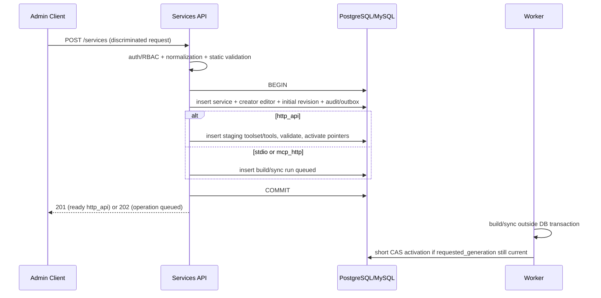

# 03 · 三类服务 CRUD（管理侧）

[← 返回索引](README.md)

本文定义 `/api/v1/admin/services` 的管理面契约、按服务类型分流的校验与发布流程，以及并发、失败、删除、审计和验收规则。数据实体和状态机以 [01-data-model.md](01-data-model.md) 为真源，身份认证和对象级授权以 [02-admin-auth.md](02-admin-auth.md) 为真源；本文不重新定义 Agent 调用协议、stdio 沙箱细节或远程 MCP connector。

文中使用以下标记区分承诺层级：

- **既定决策（MUST）**：第一版实现与验收必须满足。
- **建议（SHOULD）**：不改变第一版领域模型的增强项；若暂缓，必须记录原因和补齐条件。
- **后续可选（MAY）**：不进入第一版验收，不得在 API 中伪装成已支持。

## 1. 需求映射和边界

| 项目要求 | 本文落点 | 主要验收 |
|---|---|---|
| 统一管理 `http_api`、`stdio`、`mcp_http` | 统一 service 资源；创建请求使用 Pydantic discriminated union | 三种合法请求可创建；跨类型字段被拒绝 |
| 用户期望配置与运行状态分离 | `desired_status/generation` 与只读 `runtime_status/conditions/observed_generation` 分离 | 客户端不能写运行状态；后台任务不能改用户期望 |
| 配置和工具不可变版本化 | 更新创建 config revision；工具发布创建 staging toolset | 失败不污染 active；可查看 active 版本摘要 |
| 完整 MCP Tool Schema | `http_api` 提交完整 Tool + HTTP binding；其余类型由 connector 发现 | 未知 `_meta` 得以保存；Schema 2020-12 校验 |
| PostgreSQL/MySQL 一级支持 | 不使用 partial index/JSONB 特有语义；列表排序有复合游标 | 双方言 CRUD、唯一性、并发测试一致 |
| 对象级 RBAC | viewer 只读、editor 写、admin 全局可见 | SQL 层授权过滤；不可见对象返回 404 |
| 安全秘密不泄漏 | secret document 独立加密，响应仅返回 presence 摘要 | DB/API/log/audit 均无明文 |
| 长任务不占用请求事务 | 构建/同步在短事务提交后异步运行 | 网络、MCP 握手、Docker 调用均不在 DB 锁内 |
| 删除可恢复且立即停止 Agent 访问 | 软删除 + Key 同事务吊销 + 异步 GC | 删除后 Agent 404；恢复不恢复旧 Key |

### 1.1 本文负责

- 服务列表、详情、创建、替换配置/元数据、启停、软删除与恢复。
- 三类创建/更新请求及返回表示。
- `http_api` 人工工具集的完整替换、校验和原子发布入口。
- `stdio` 构建和 `mcp_http` 同步任务的触发语义与控制面返回值。
- 乐观并发、重试语义、统一错误、审计和测试契约。

### 1.2 本文不负责

- API Key、权限成员、构建日志、toolset 回退等子资源的完整接口；它们由相应 service 模块提供，但必须服从本文的对象级授权和 `row_version` 约定。
- stdio 包的字节上传、解压和容器执行细节，见 [04-stdio-sandbox.md](04-stdio-sandbox.md)。
- Agent 请求的鉴权、限流和 connector 调用，见 [05-agent-gateway.md](05-agent-gateway.md)。
- 把 OpenAPI 自动转换成 MCP Tool。第一版 `http_api` 是人工提交完整 MCP Tool + binding；OpenAPI importer 属于后续 descriptor adapter，不能在 CRUD 层做不可追踪的隐式转换。

## 2. 与成熟方案的比较和取舍

| 方案/规范 | 可借鉴点 | LiteMCP 取舍 |
|---|---|---|
| HTTP Semantics | PUT/DELETE 幂等语义、条件请求、状态码边界 | **既定**：更新采用完整替换语义，领域并发沿用 `row_version + 409`；**建议**：未来公开 API 可增加 `ETag/If-Match + 412`，但不能同时制造两套不一致的版本规则 |
| RFC 9457 Problem Details | 机器码与人类说明分离、字段级错误可用 JSON Pointer 定位 | **既定**：错误体使用 `application/problem+json` 兼容超集，保留项目稳定 `code` 和 `request_id` |
| Zalando RESTful API Guidelines | 游标分页、稳定排序、幂等键需与业务写入强事务绑定 | **既定**：列表使用不透明游标；**既定**：MVP 不宣称强 `Idempotency-Key`，因为 01 尚无幂等记录实体 |
| Kubernetes API conventions | desired state 与 observed status 分离，`generation/observedGeneration` 防止旧控制器结果覆盖新配置 | **既定**：直接采用 01 的 generation、condition 和 status 摘要模型 |
| MCP 2025-11-25 Tool Schema | 完整保存 Tool、JSON Schema dialect、annotations/execution/icons/`_meta` | **既定**：MCP Tool 是规范真源，HTTP binding 是执行扩展而不是替代 Schema |
| OWASP SSRF Prevention | URL 解析、域名/IP/重定向和出网控制必须组合防御 | **既定**：保存前静态校验，连接时再次解析与校验；秘密 Header 不由工具参数覆盖 |

本项目不采用“更新时先删除全部工具再逐条插入”。该做法在并发读、部分失败和回退场景下会暴露半套工具；LiteMCP 始终生成完整 staging toolset，全部校验通过后才在短事务中切换 active 指针。

## 3. 资源和表示模型

### 3.1 路径总表

| 方法与路径 | viewer | editor | 结果 |
|---|---:|---:|---|
| `GET /api/v1/admin/services` | 允许 | 允许 | 当前用户可见服务的游标分页 |
| `POST /api/v1/admin/services` | 禁止 | 允许 | 创建服务、creator editor 权限和初始 revision |
| `GET /api/v1/admin/services/{service_id}` | 允许 | 允许 | 脱敏详情和状态摘要 |
| `PUT /api/v1/admin/services/{service_id}` | 禁止 | 允许 | 完整替换可变元数据与期望配置 |
| `PATCH /api/v1/admin/services/{service_id}/desired-status` | 禁止 | 允许 | 仅启用/禁用，避免为启停重复提交秘密或大工具集 |
| `DELETE /api/v1/admin/services/{service_id}` | 禁止 | 允许 + step-up | 软删除并立即停止 Agent 访问 |
| `POST /api/v1/admin/services/{service_id}/restore` | 禁止 | 允许 + step-up | 在保留期内恢复服务身份，不恢复 Key |

admin 可访问全部 service，但不绕过状态机、乐观锁、step-up、秘密脱敏和审计。普通用户创建服务时不需要“预先拥有”尚不存在的对象；成功事务必须同时授予其 creator editor。所有其他对象请求先做 SQL 层可见性过滤：不可见返回 404，可见但动作不允许返回 403。

CRUD 页面依赖的只读/长任务子资源使用下列规范路径，避免各切片自行发明 URL：

| 方法与路径 | 作用 |
|---|---|
| `GET /services/{service_id}/tools` | 游标读取 active toolset；返回 toolset ID/version，禁止读取 staging 半成品 |
| `GET /services/{service_id}/config-revisions` | 读取脱敏 revision 历史与 validation report |
| `GET /services/{service_id}/toolsets` | 读取 active/retired/rejected 摘要，供发布记录与回退界面使用 |
| `POST /services/{service_id}/tool-sync-runs` | 仅 `mcp_http` 手动重同步；创建异步 operation |
| `GET /services/{service_id}/tool-sync-runs/{run_id}` | 读取同步进度与脱敏错误 |
| `POST /services/{service_id}/build-runs` | 仅 `stdio` 基于当前 revision 重建；创建异步 operation |
| `GET /services/{service_id}/build-runs/{run_id}` | 读取构建进度与脱敏错误；日志另有受限端点 |

这些路径仍位于 `/api/v1/admin` 前缀下，表中为节省宽度省略前缀。对不匹配的服务类型返回 409 `OPERATION_NOT_SUPPORTED_FOR_SERVICE_TYPE`。tool list 和两个历史列表必须分页；rejected/staging 数据只对 editor/admin 可见。回退是 publication service 的敏感动作，不伪装成更新 service 或单工具写入。

### 3.2 Service 详情响应

响应不得直接序列化 ORM 对象。稳定 API Schema 至少包含：

```json
{
  "id": "8a02e9e3-0ba8-4594-86d1-d83837987a60",
  "type": "http_api",
  "name": "CRM 查询",
  "description": "只读查询接口",
  "tags": ["crm", "internal"],
  "icon_url": "/api/v1/admin/services/8a02e9e3-0ba8-4594-86d1-d83837987a60/icon",
  "desired_status": "enabled",
  "generation": 3,
  "observed_generation": 3,
  "runtime_status": "ready",
  "conditions": [
    {
      "type": "ToolsReady",
      "status": "true",
      "reason": "TOOLSET_ACTIVATED",
      "message": null,
      "observed_generation": 3,
      "last_transition_at": "2026-08-09T04:00:00Z"
    }
  ],
  "config": {
    "schema_version": 1,
    "public": {},
    "secrets": {
      "configured": true,
      "fields": ["authorization"]
    }
  },
  "active_config_revision": {
    "id": "69c2721d-86fe-4ef0-a132-46a7af195b92",
    "generation": 3,
    "state": "active",
    "config_digest": "<sha256>"
  },
  "active_toolset": {
    "id": "2c1db9d5-7db8-4ce7-8637-b10f8a7f45fd",
    "version_no": 3,
    "state": "active",
    "tool_count": 4,
    "source_digest": "<sha256>"
  },
  "row_version": 7,
  "created_at": "2026-08-08T10:00:00Z",
  "created_by": "<user-id>",
  "updated_at": "2026-08-09T04:00:00Z",
  "updated_by": "<user-id>"
}
```

约束：

- `type` 创建后不可变；更新请求出现不同 type 返回 `SERVICE_TYPE_IMMUTABLE`。
- `runtime_status` 和 `conditions` 为只读；管理写请求包含这些字段返回 422，而不是静默忽略。
- secret 响应只返回是否已配置和允许公开的字段名，不返回密文、摘要、长度或可用于猜测秘密的错误。
- `icon_url` 由 LiteMCP 受控端点生成；数据库中的 object key 不直接暴露，外部 URL 不作为图标真源。
- active revision/toolset 不存在时对应字段为 `null`，并通过 `runtime_status=pending` 或 condition 解释原因。
- 时间为 UTC RFC 3339；ID 为规范 UUID 字符串。

### 3.3 列表契约

`GET /services` 支持：

| 参数 | 规则 |
|---|---|
| `limit` | 默认 20，范围 1–100 |
| `cursor` | 服务端签名/校验的不透明字符串，客户端不得解析或拼接 |
| `q` | 对规范化 name 和受限 description 做简单搜索；最大 128 字符 |
| `type` | 可重复或逗号分隔：`http_api/stdio/mcp_http` |
| `team_id` | 按归属团队筛选；省略时默认返回"我可见"的全部服务（按 [01-data-model.md](01-data-model.md) 5.12 的 `visible()` 公式过滤，不区分归属团队） |
| `desired_status` | `enabled/disabled` |
| `runtime_status` | `pending/ready/degraded/unhealthy/failed` |
| `tag` | 第一版固定 AND 或 OR 之一并写入 OpenAPI；不得由数据库方言决定语义 |
| `created_by` | admin 或有权限用户可使用；仍受对象可见性限制 |
| `include_deleted` | 默认 false；只有 admin 或对已删除服务仍有 editor 权限者可请求 |

第一版固定排序为 `updated_at DESC, id DESC`，游标包含排序锚点、方向和过滤条件摘要；过滤条件与游标不匹配返回 `INVALID_CURSOR`。分页查询必须把权限过滤、软删除过滤和业务过滤放进同一 SQL，不得先取全量再由应用或前端裁剪。响应：

```json
{
  "items": [],
  "next_cursor": null,
  "has_more": false
}
```

第一版不默认计算 `total`，避免每次市场列表都执行昂贵授权计数。若产品明确需要页数，**建议**增加显式 `include_total=true` 并单独压测，不能让 `total` 的存在阻塞首屏。

## 4. 分型请求 Schema

所有请求 `Content-Type: application/json`，Pydantic v2 以 `type` 为 discriminator，`extra='forbid'`。顶层公共字段：

| 字段 | 创建 | 更新 | 约束 |
|---|---:|---:|---|
| `type` | 必填 | 必填且只能等于现值 | 枚举值 |
| `team_id` | 必填 | 可选（转移团队） | 必须是 `status=active` 的 team；创建时提交者须是该 team 的 member/admin 或全局 admin，见 [02-admin-auth.md](02-admin-auth.md) 12.2 |
| `access` | 可选 | 不适用（走权限子资源） | 仅创建时使用，决定初始 `mcp_service_permission` 记录：省略或 `{"mode":"everyone"}`（默认）创建 `principal_type=everyone` 记录，即对所有已认证用户开放只读；`{"mode":"restricted","grants":[...]}` 不创建 `everyone` 记录，改为按 `grants` 数组创建 `principal_type=team\|user` 记录（`grants` 每项形如 `{"type":"team","team_id":...}` 或 `{"type":"user","user_id":...,"role":"viewer"}`，`editor` 角色不通过本字段授予，创建后走权限子资源）。创建后调整访问范围一律走 `/permissions` 子资源的增删记录，不通过 `PUT /services/{id}` |
| `name` | 必填 | 必填 | trim 后 1–128；NFKC + casefold 生成 `name_normalized` |
| `description` | 可选 | 可选 | 最大长度由配置固定，建议 16 KiB |
| `tags` | 可选 | 可选 | 默认最多 20 项；每项 1–64；规范化去重 |
| `icon_upload_id` | 可选 | 可选 | 必须属于当前用户/服务且处于 staging；禁止客户端提交 object key |
| `desired_status` | 可选 | 必填 | 创建默认 `disabled`，仅完整验证/发布后才建议启用 |
| `agent_auth_mode` | 可选 | 必填 | 第一版 `api_key/none`；`oauth2` 仅在实现完成后开放 |
| `rate_limit_qps/burst` | 可选 | 可选 | 要么同时为空取全局值，要么均合法；qps > 0、burst >= 1 |
| `config` | 必填 | 必填 | 分型公开配置；完整替换而非深层 merge |
| `secrets` | 按需 | 可选 | write-only；省略表示沿用，显式 `null` 表示清除（仅允许可选秘密） |
| `row_version` | 无 | 必填 | 当前 service 乐观锁版本 |

`agent_auth_mode=none` 是高风险配置：只允许受信内网部署、editor 二次确认，并要求短期 step-up；审计 changes 记录从何模式切换，但不记录凭据。`oauth2` 仅是数据模型预留值，在 [05-agent-gateway.md](05-agent-gateway.md) 完成标准 MCP OAuth 资源服务器之前，请求必须返回 `FEATURE_NOT_ENABLED`，不能保存一个运行时无法执行的配置。

### 4.1 `http_api`

```json
{
  "type": "http_api",
  "name": "CRM 查询",
  "desired_status": "enabled",
  "agent_auth_mode": "api_key",
  "config": {
    "schema_version": 1,
    "base_url": "https://crm.example.com/api/",
    "default_timeout_ms": 10000,
    "tls": {"verify": true},
    "allowed_response_media_types": ["application/json"]
  },
  "secrets": {
    "upstream_auth": {
      "kind": "bearer",
      "token": "<write-only>"
    }
  },
  "tools": [
    {
      "definition": {
        "name": "get_customer",
        "title": "查询客户",
        "description": "按客户编号查询",
        "inputSchema": {
          "$schema": "https://json-schema.org/draft/2020-12/schema",
          "type": "object",
          "properties": {"id": {"type": "string"}},
          "required": ["id"],
          "additionalProperties": false
        },
        "outputSchema": {"type": "object"},
        "annotations": {"readOnlyHint": true},
        "_meta": {}
      },
      "binding": {
        "method": "GET",
        "path_template": "customers/{id}",
        "parameters": [
          {"input_pointer": "/id", "location": "path", "name": "id", "required": true}
        ],
        "success_statuses": [200],
        "response": {"media_type": "application/json", "body_pointer": ""},
        "timeout_ms": 5000
      },
      "enabled": true
    }
  ]
}
```

**既定校验：**

- `tools` 是完整目标集合，至少允许空集合，但每个 tool name 在 toolset 内唯一；不能用请求顺序表达稳定身份。
- `definition` 无损映射 MCP 2025-11-25 Tool：`inputSchema` 根必须为 object，`outputSchema` 若有也必须为 object；未声明 `$schema` 时按 JSON Schema 2020-12。
- JSON Schema 先做 meta-schema 校验，再做项目资源限制：文档字节数、嵌套深度、属性数、正则长度和引用策略。第一版只允许本地 `$ref`；远程 `$ref` 被拒绝，避免验证时产生 SSRF 和不确定依赖。
- `_meta` 和未知扩展按大小限制保存，但不能含已知 secret/key/token/header；annotations 只是提示，不能成为授权或安全策略依据。
- `binding` 显式覆盖 path/query/header/cookie/body 映射；不得从 input schema 猜测。每个 required path placeholder 必须恰好绑定一次，无 placeholder 的 path 不允许动态改写 host/scheme/port。
- method 使用受控 allowlist。第一版至少支持 GET/POST/PUT/PATCH/DELETE；CONNECT/TRACE 和绝对 URI request target 禁止。
- 工具参数不能设置或覆盖 `Host`、`Authorization`、`Proxy-Authorization`、hop-by-hop headers、签名 Header 和系统注入的 upstream auth。Header 名/值必须防 CRLF 注入。
- base URL 只允许显式启用的 `https`（本机开发例外）；拒绝 userinfo、fragment、异常端口和非 HTTP scheme。保存时解析校验；每次连接及每次重定向都重新执行 DNS/IP/出网策略检查，阻止 loopback、link-local、私网和云 metadata 地址，除非部署级 allowlist 明确允许。
- 默认不跟随重定向；若服务配置允许，只允许有限次数，并对每一跳重新校验，且跨 origin 不转发秘密 Header。
- response 限制最大字节数、读取超时和允许 media type；错误摘要截断、脱敏。客户端不能借 body pointer 读取响应 Header 中的凭据。
- 同一请求内工具全量替换形成新的 staging toolset；任意一个工具失败则整套 rejected，active toolset 不变。

`http_api` 创建/更新只做静态验证即可发布配置与 toolset；可选的上游连通性探测必须在事务外执行，探测失败只更新 `UpstreamReachable` condition，除非产品明确选择“连通性是发布门槛”。第一版固定为**不是发布门槛**，避免短暂网络故障阻止保存正确配置。

### 4.2 `mcp_http`

```json
{
  "type": "mcp_http",
  "name": "远程知识库 MCP",
  "desired_status": "enabled",
  "agent_auth_mode": "api_key",
  "config": {
    "schema_version": 1,
    "server_url": "https://mcp.example.com/mcp",
    "transport": "streamable_http",
    "protocol_preferences": ["2025-11-25"],
    "connect_timeout_ms": 5000,
    "read_timeout_ms": 30000,
    "tls": {"verify": true}
  },
  "secrets": {
    "upstream_auth": {"kind": "bearer", "token": "<write-only>"}
  }
}
```

`mcp_http` 不接受 `tools` 字段。保存 URL/TLS/重定向/秘密的规则与 `http_api` 相同；提交后 worker 使用官方 MCP client 完成 initialize + tools/list，保存 protocol version、capabilities、serverInfo、instructions 和完整 Tool。工具发现只能生成候选 toolset，管理 CRUD 不提供单工具增删改接口。

创建或配置更新成功仅代表“期望配置已持久化并已排队”，不代表远端可用。需要同步时返回 202，并在响应中提供 `operation.kind=tool_sync_run`、ID 与状态查询 URL。同步失败时新 revision 为 rejected/相应 condition 为 false，旧 active config/toolset 继续服务；generation 已变化的旧任务必须 superseded。

### 4.3 `stdio`

```json
{
  "type": "stdio",
  "name": "内部报表 FastMCP",
  "desired_status": "enabled",
  "agent_auth_mode": "api_key",
  "queue_max_depth": 50,
  "queue_timeout_ms": 30000,
  "config": {
    "schema_version": 1,
    "entrypoint": "server.py:mcp",
    "runtime": {"python": "3.11", "platform": "linux/amd64"},
    "source_upload_id": "<finalized-upload-session-id>",
    "env": {"TZ": "UTC"},
    "limits": {
      "cpu": 0.5,
      "memory_bytes": 268435456,
      "pids": 64,
      "tmpfs_bytes": 67108864,
      "nofile": 256,
      "call_timeout_ms": 60000,
      "result_bytes": 4194304
    },
    "egress_policy": {
      "mode": "none",
      "allowed_destinations": []
    }
  },
  "secrets": {
    "runtime_env": {"REPORT_TOKEN": "<write-only>"}
  }
}
```

`stdio` 不接受 `tools` 字段。创建 service 之前尚不存在可归属的 `service_artifact`，因此请求引用的是短期 `source_upload_id`，不是 artifact ID：upload session 必须绑定当前 actor、用途、摘要、大小和 TTL，且只能消费一次；创建事务先插入 service，再把已 finalize 的 upload 固化为归属该 service/revision 的不可变 `service_artifact`。更新既可引用新 upload，也可显式复用属于同一 service 且仍 available 的旧 source artifact；两种输入在 Schema 中互斥，绝不能引用任意 object key。代码包上传 API 可独立于 JSON CRUD，以支持本地 StorageBackend 与 S3/MinIO 直传；包格式、落盘和安全校验见 [04-stdio-sandbox.md](04-stdio-sandbox.md) 第 4 节。

`queue_max_depth/queue_timeout_ms` 只允许 stdio；其他类型提交返回 `FIELD_NOT_ALLOWED_FOR_SERVICE_TYPE`。出网默认 `none`；增加 allowlist 需要 editor 明确确认并审计。提交后返回 202 + `build_run` operation。只有包验证、隔离构建、临时启动、MCP initialize/tools/list、安全与 Schema 校验全部成功，worker 才能原子切换 active revision/toolset。旧 generation 的构建结果只能标为 superseded。

## 5. CRUD 事务和状态流

### 5.1 创建



创建事务必须同时完成 service、creator editor、初始 revision 和成功审计/outbox；其中任一步失败则全部回滚。名称唯一冲突由数据库唯一约束作为最终裁决并映射为 `409 SERVICE_NAME_DUPLICATED`，不能依赖“先查再插”。

响应规则：

- `http_api` 静态校验和 toolset 激活完成：`201 Created`，`Location: /api/v1/admin/services/{id}`。
- `stdio/mcp_http` 已落库并成功排队：`202 Accepted`，返回 service 快照和 operation；不得返回 201 ready 或虚假的 active toolset。
- 队列/outbox 无法与数据库提交建立可靠交付时，事务失败并返回 503；禁止创建永远不会被 worker 看见的 pending service。

异步响应的 operation 形状固定，前端不得解析内部队列 ID：

```json
{
  "service": {"id": "<service-id>", "generation": 1, "runtime_status": "pending"},
  "operation": {
    "kind": "build_run",
    "id": "<run-id>",
    "status": "queued",
    "requested_generation": 1,
    "status_url": "/api/v1/admin/services/<service-id>/build-runs/<run-id>"
  }
}
```

`kind` 只取 `build_run/tool_sync_run`；202 同时返回 `Location: <status_url>` 和适度的 `Retry-After`。统一 API 状态为 `queued/running/succeeded/failed/superseded`，`build_run` 另允许 `cancelled`；数据库中的 `building/fetching/validating/ready/activated` 等细状态映射为 running 或 succeeded，但原始状态可在 `phase` 返回。枚举、映射和合法迁移必须在 OpenAPI 固定。

### 5.2 更新

`PUT /services/{id}` 是**可变目标状态的完整替换**：客户端先 GET，保留不想改变的非秘密字段，提交全部公共配置和 `row_version`。秘密使用特殊三态：省略=沿用，非空对象=创建新 secret 并切换 revision 引用，`null`=在该字段允许为空时清除。普通 JSON `null` 不得被误解为“沿用”。

字段按影响分类：

| 变更 | generation | revision/toolset | 返回 |
|---|---:|---|---|
| name/description/tags/icon | 不变 | 不创建 config revision | 200 |
| team_id（转移团队） | 不变 | 不创建；要求提交者是来源/目标 team 的 admin 或全局 admin | 200 |
| desired_status | 不变 | 不创建；走专用 PATCH 更清晰 | 200 |
| agent auth、rate limit、stdio queue 或期望配置 | +1 | 创建 config revision；按类型验证/构建/同步 | http_api 200；异步类型 202 |
| http_api tools | +1 | 新 toolset 全量验证并与 config 原子发布 | 200；失败整个请求 422/409，旧 active 不变 |
| secret 更新/轮换 | +1 | 新 service_secret + 新 revision | 按类型 200/202 |

更新 SQL 必须包含 `WHERE id=:id AND row_version=:row_version AND deleted_at IS NULL`。影响行数为 0 时重新区分不可见/已删除/版本冲突；版本冲突返回 `409 CONCURRENT_MODIFICATION` 并可包含当前 `row_version`，但不回显当前秘密或未授权字段。任何网络、Docker、MCP 握手和大对象 I/O 均不得位于该事务或 service 行锁内。

### 5.3 启停

`PATCH /services/{id}/desired-status` 请求：

```json
{"desired_status": "disabled", "row_version": 7, "reason": "maintenance"}
```

- disabled 在事务提交后立即阻止新的 Agent 调用，不等待 worker；正在执行的请求是否取消由 connector 策略决定，第一版不强杀以避免不确定副作用。
- enabled 不等于 ready；没有 active config/toolset 或必要 condition 为 false 时，Agent 仍返回 `SERVICE_NOT_READY`。
- 健康检查和 worker 永远不能自动把 desired_status 从 disabled 改回 enabled。
- `reason` 最大 512 字符，清洗控制字符，只用于审计说明。

### 5.4 删除

DELETE 请求必须携带当前版本（第一版使用 JSON body `{"row_version":7,"reason":"..."}`；若基础设施不可靠支持 DELETE body，可改为明确的 `X-LiteMCP-Row-Version`，但全项目只能选一种并写入 OpenAPI）。领域事务固定顺序：

1. 再验证 step-up、editor/admin 和当前 row_version。
2. `desired_status=disabled`。
3. 把 `uniqueness_scope` 改为 `DELETED:<service_id>`，写 `deleted_at/deleted_by`。
4. 吊销该 service 全部 active API Key，写 revoked 时间/操作者。
5. 写 `service.deleted` 审计和 GC/outbox 事件。
6. 提交后通知 runner 停止/回收；通知失败可重试，数据库可用性判断已确保新 Agent 请求 404。

返回 `204 No Content`。重复删除在操作者仍有查看删除记录权限时也返回 204；对不可见 ID 返回 404，避免枚举。删除不物理删除 revision、toolset、artifact、权限和审计。

### 5.5 恢复

`POST /services/{id}/restore` 请求包含 `row_version`，可选 `name` 解决名称冲突。恢复前验证仍在保留期、无合规清除标记、目标名称未被占用；事务恢复 `uniqueness_scope=LIVE`、清空 deleted 字段并保持 `desired_status=disabled`。返回 200。

恢复**不会**恢复旧 API Key、运行容器或过期 artifact；用户必须检查 active revision/toolset 是否仍满足当前安全策略，必要时重建/同步，再显式启用。artifact 已 GC 时返回 `RESTORE_REQUIRES_REBUILD`，可以恢复 service 身份和历史，但不得把 runtime_status 标为 ready。

## 6. 并发、重试和幂等

### 6.1 乐观锁

第一版唯一管理写并发令牌是 `row_version`，与 01 一致。每次成功修改 service 可变字段原子 `row_version + 1`。两个基于相同版本的写请求只能一个成功；后者得到 409 后必须重新 GET、由用户合并，服务端不得静默 last-write-wins。

发布/回退另使用 service 行锁或 compare-and-swap，并重新检查 `requested_generation == service.generation`。`row_version` 保护用户管理写，generation 保护异步 worker；两者不能互相替代。

### 6.2 HTTP 幂等性

- GET 无副作用。
- PUT、desired-status PATCH、DELETE 和 restore 在相同前置状态/`row_version` 下具有领域幂等结果，但重放旧 row_version 通常返回 409；客户端可安全地 GET 确认最终状态。
- POST create、触发 build/sync、生成 Key 等天然可能重复。**既定决策：MVP 不声称支持通用 `Idempotency-Key` 强幂等。**客户端遇到创建响应丢失时，以授权列表中的规范化 name 查询结果；若再次创建，数据库唯一约束返回 409。
- worker 任务创建必须以 `(service_id, requested_generation, operation_kind)` 或等价约束/锁去重，避免同一配置的重复队列消息生成多个可发布候选；重复执行仍需靠 generation CAS 保证安全。

**建议：**若真实客户端存在大量超时重试，再引入持久化 `idempotency_record`：作用域为 actor + route + key，保存规范化 request hash、完成响应、资源 ID、状态和 TTL；它必须与业务写同事务提交。同 key 不同 hash 返回 409 `IDEMPOTENCY_KEY_REUSED`，处理中返回 409/425 并带 Retry-After。仅把 key 放 Redis 或内存而业务写在数据库，不能宣称 exactly-once。

### 6.3 消息至少一次投递

worker/outbox 按至少一次投递设计。handler 必须可重入：先读取 run 状态和 requested generation；终态重复消息直接确认；构建/网络完成后用 CAS 提交。消息确认发生在数据库终态提交之后。超时、进程崩溃或重复投递不得产生半发布状态。

## 7. 校验流水线

校验按固定顺序执行，尽量在昂贵外部动作前失败：

1. Content-Type、请求字节数、JSON 语法和字段数量限制。
2. JWT 当前用户、对象可见性、角色与 step-up。
3. discriminated union、`extra=forbid`、字符串/数组/数值边界。
4. 名称/tag 规范化和跨类型字段规则。
5. 分型 config Schema 和 secret Schema；分离 public/secret。
6. URL、TLS、出网、Header、artifact 引用和权限安全检查。
7. MCP Tool/JSON Schema/HTTP binding 完整性与资源上限。
8. 数据库约束与 row_version CAS。
9. 事务外的构建、远程同步或健康探测。
10. generation CAS 发布和 condition 更新。

校验报告使用稳定 code、JSON Pointer 和安全 message：

```json
{
  "errors": [
    {
      "code": "UNBOUND_PATH_PARAMETER",
      "pointer": "/tools/0/binding/path_template",
      "message": "path parameter 'id' has no binding"
    }
  ],
  "warnings": []
}
```

限制值必须在集中配置中定义，并纳入 OpenAPI 描述和边界测试；不得把 Pydantic、jsonschema、SQLAlchemy 或 httpx 的原始异常直接返回。

## 8. 错误契约

所有错误使用 `Content-Type: application/problem+json`。`core/errors.py` 生成 RFC 9457 兼容字段和 LiteMCP 扩展：

```json
{
  "type": "https://docs.litemcp.local/problems/concurrent-modification",
  "title": "Concurrent modification",
  "status": 409,
  "detail": "The service changed after it was loaded.",
  "instance": "/api/v1/admin/services/8a02e9e3-0ba8-4594-86d1-d83837987a60",
  "code": "CONCURRENT_MODIFICATION",
  "request_id": "req_01J...",
  "errors": []
}
```

`detail` 供人阅读，客户端只依赖 `status/code/errors[].pointer`。生产响应禁止出现堆栈、SQL、内部 host/IP、object key、密文、token、下游响应原文和库异常。建议主要映射：

| HTTP | code | 场景 |
|---:|---|---|
| 400 | `INVALID_REQUEST` | JSON/Content-Type/参数组合错误且不适合字段校验 |
| 401 | `AUTHENTICATION_REQUIRED/TOKEN_INVALID` | 管理凭据缺失或无效 |
| 403 | `FORBIDDEN/STEP_UP_REQUIRED` | 资源可见但动作不允许 |
| 404 | `SERVICE_NOT_FOUND` | 不存在、不可见，或普通查询已删除对象 |
| 409 | `SERVICE_NAME_DUPLICATED` | 未删除名称唯一冲突 |
| 409 | `CONCURRENT_MODIFICATION` | row_version 冲突 |
| 409 | `INVALID_SERVICE_STATE` | 当前状态不允许动作 |
| 413 | `REQUEST_TOO_LARGE/PACKAGE_TOO_LARGE` | 请求或上传超过上限 |
| 415 | `UNSUPPORTED_MEDIA_TYPE` | 非受支持内容类型 |
| 422 | `VALIDATION_FAILED/INVALID_TOOL_SCHEMA` | 结构可解析但领域/Schema 无效 |
| 429 | `ADMIN_RATE_LIMITED` | 管理接口限速，带 Retry-After |
| 503 | `DEPENDENCY_UNAVAILABLE/QUEUE_UNAVAILABLE` | 安全状态或可靠排队无法确认 |

异步 build/sync 失败是 operation 终态，不把已返回的 202 改写成 HTTP 错误；状态资源保存稳定 `error_code` 和脱敏摘要，active 指针保持不变。

## 9. 安全和隐私

### 9.1 管理输入

- router 默认挂载管理认证；列表和详情也必须鉴权，不能把“服务市场”误做匿名目录。
- 所有字符串做长度限制和控制字符处理；名称规范化只用于唯一性，不改变展示名。
- JSON 文档限制总字节、深度、数组长度和属性数，防止解析/验证 DoS；正则和 JSON Schema format 检查设置执行预算。
- 不接受客户端提供 `id/namespace_key/name_normalized/uniqueness_scope/generation/observed_generation/runtime_status/active_*_id/created_by/updated_by`。
- 图标/包 upload session 有 actor、用途、大小、摘要和 TTL 绑定；不能以 object key 或本地路径越权引用。

### 9.2 秘密

- `secrets` 在 API 层立即从 public model 分离，交给加密服务生成新的 `service_secret`；明文不进入 ORM repr、日志、trace、审计 changes 或任务消息。
- 更新省略秘密时，service 层通过旧 revision 的 secret 引用复用，不把明文读回响应；清除/轮换写 `changed=true`。
- Agent 入站 Authorization 不得作为下游凭据；下游凭据只来自 service secret。
- debug 模式、422 请求回显和审计 before/after 同样必须经过 redaction。测试以 canary secret 扫描所有日志和数据库非密文字段。

### 9.3 SSRF 和远程内容

CRUD 静态 URL 校验只能作为第一层，不能替代 connector 的连接时校验。必须统一使用一个 URL policy 组件，覆盖 IPv4/IPv6、混合编码、DNS 多结果/DNS rebinding、redirect、代理环境变量、TLS SNI/证书和云 metadata。HTTP 客户端默认禁用从环境继承不受控 proxy。远程 MCP 返回的 icons、instructions、Tool description 和 `_meta` 都是不可信数据：限制大小、存储时脱敏、前端安全渲染；SVG 需要清洗或由受控图片代理转码。

## 10. 审计与可观测性接口

### 10.1 审计事件

至少写入：

- `service.created`
- `service.metadata_updated`
- `service.team_changed`
- `service.config_revision_created`
- `service.desired_status_changed`
- `service.agent_auth_mode_changed`
- `service.secret_changed`
- `service.toolset_activated` / `service.toolset_rejected`
- `service.build_requested` / `service.sync_requested`
- `service.deleted` / `service.restored`
- `service.update_denied`（安全相关拒绝；普通 422 可只记指标/运行日志）

成功管理变更的 audit/outbox 与业务事务同提交。changes 只记录字段级摘要，例如 `{"base_url":{"changed":true},"upstream_auth":{"changed":true}}`；绝不记录秘密 before/after。每条事件包含 actor、service、request ID、结果和稳定 reason code。

### 10.2 日志、指标和 trace

- 结构化日志：request_id、route template、method、status、duration、actor type、service_id、operation_id；禁止记录完整 URL query、Authorization 和请求 body。
- 指标：CRUD 请求/失败/延迟、按 type 的创建数、并发冲突、校验失败、operation 排队、publication 成功/失败/superseded。标签仅使用 service type、operation、status/code，禁止 service_id/user_id/name。
- trace：API → service → DB/outbox → worker → publication；secret encryption、包内容和远程工具原文不进入 span attribute。
- audit 是证据真源，日志是诊断数据，二者只通过 request/correlation ID 关联，不能相互替代。

## 11. 实现分层和伪代码

依赖方向固定为 `api -> service -> repository/adapter`：

- `api/services.py`：HTTP 解析、认证依赖、Schema、状态码和响应头。
- `schemas/services.py`：公共字段、三类 discriminated union、read model、problem details。
- `services/service_crud.py`：权限、规范化、字段影响分类、事务编排、审计。
- `services/revisions.py`：不可变 config revision 和 secret 引用。
- `services/publication.py`：toolset 校验、generation CAS、发布/回退。
- repository：SQLAlchemy 查询、乐观更新、游标分页；不做 HTTP 或 Docker 调用。
- worker：build/sync 的至少一次消息处理；不直接覆盖 service 用户字段。

更新核心伪代码：

```python
async def replace_service(service_id, command, actor):
    current = await repo.get_visible_for_update_context(service_id, actor)
    authorize_editor(current, actor)
    validate_immutable_type(current.type, command.type)
    normalized = validate_and_normalize(command)

    async with db.begin():
        changed = await repo.update_with_row_version(
            service_id=service_id,
            expected=command.row_version,
            public_fields=normalized.metadata,
        )
        if not changed:
            raise ConcurrentModification()
        if normalized.config_changed:
            revision = await revisions.create_immutable(current, normalized)
            await repo.increment_generation(service_id)
            operation = await enqueue_transactionally(current.type, revision)
        await audit.write_success(...)

    return await repo.get_read_model(service_id), operation
```

实际实现应避免事务开启前读取的数据绕过事务内 CAS；伪代码中的 `current` 只用于授权和准备，最终写入条件与唯一约束仍由数据库裁决。

## 12. 测试和验收

### 12.1 契约测试

- OpenAPI 中三类 create/update 使用明确 discriminator，生成客户端可以区分；未知字段、跨类型字段和只读字段均 422。
- 201/202/204、Location、operation URL、Problem Details media type 和所有 code 与本文一致。
- GET 永不返回秘密；PUT 的 secret 三态有单独测试。
- 列表游标在相同过滤条件下无重复/遗漏；插入、删除锚点和非法/篡改 cursor 行为确定。

### 12.2 领域和数据库测试

- PostgreSQL 14+、MySQL 8.0+ 跑同一契约；并发同名创建恰好一个成功。
- 软删除后名称可复用；恢复遇到同名返回 409；删除/恢复的 uniqueness_scope 约束一致。
- 两个相同 row_version 更新恰好一个成功；冲突不会创建多余 active revision/toolset。
- metadata-only 不增加 generation；配置/secret/tool 变更准确 +1。
- service、creator editor、revision、审计/outbox 任一步失败都整体回滚。
- 删除与 Key 吊销同事务；恢复不恢复 Key。

### 12.3 发布和故障测试

- http_api 某一 tool/binding 无效时整套 rejected，旧 active 完整可读。
- mcp_http 超时、协议不兼容、恶意巨大工具列表和 schema 错误均得到脱敏终态；旧 active 不变。
- stdio 包校验/构建/探测失败不发布；worker 崩溃重放不产生半发布。
- generation N 任务晚于 N+1 完成时标为 superseded；不能覆盖新配置。
- DB 提交成功但 worker 收消息前崩溃，outbox 重试最终可见；重复消息可安全处理。

### 12.4 安全测试

- viewer 写入、跨 service IDOR、猜测已删除 ID、creator editor 不变量和 admin 绕过边界。
- `agent_auth_mode=none`、删除/恢复要求 step-up；过期 step-up 被拒绝。
- SSRF 用例覆盖 loopback、IPv4/IPv6 私网、十进制/混合编码 IP、userinfo、DNS 多地址/rebinding、redirect 到 metadata、跨 origin secret header 泄漏。
- JSON/Schema 深度和大小炸弹、恶意 regex、远程 `$ref`、CRLF Header、超大响应均在预算内失败。
- canary token 不出现在 API 二次查询、DB public_config、audit、log、metrics、trace、operation error 和构建日志。

### 12.5 端到端验收

1. 创建 `http_api` + 完整工具 → 返回 201 → 生成 API Key → Agent 调用成功。
2. 更新为坏 binding → 请求失败且旧工具继续可调用；修正并发布后原子看到新集合。
3. 创建 `mcp_http` → 返回 202 → 同步成功 active；远端不可达时 condition 清晰且可重试。
4. 创建 `stdio` → 返回 202 → 构建/探测/发布；删除时 Agent 立即 404，容器随后回收。
5. 并发编辑、旧 worker、队列重复投递、数据库/Redis/对象存储短故障均满足本文不变量。

上述测试并入 [09-verification.md](09-verification.md) 的后端、双方言和端到端矩阵；纵向交付顺序保持 [08-implementation-plan.md](08-implementation-plan.md) 的 http_api → mcp_http → stdio。

## 13. 建议和后续可选

### 13.1 建议（不改变第一版模型）

- 从 Pydantic Schema 生成 OpenAPI 并在 CI 做 breaking-change diff；operationId、错误 code 和 discriminator 视为客户端契约。
- 对 GET 详情增加基于 row_version 的 ETag 缓存；只有当全项目决定采用标准条件请求时，才为写入增加 If-Match/412，并同步修改 01 和前端，避免双版本源。
- 对列表真实查询做双方言 EXPLAIN；标签量大后按 01 建 `mcp_service_tag`，不要为 PostgreSQL 单独依赖 GIN 后声称跨库一致。
- 为 config/toolset 增加只读 diff 端点，帮助 editor 在发布前确认影响；diff 必须脱敏且设大小上限。

### 13.2 后续可选（需要新增设计/实体）

- 持久化 Idempotency-Key 和 request hash/response replay。
- OpenAPI/AsyncAPI importer、标准 LiteMCP descriptor 和非 FastMCP adapter。
- 批量 CRUD；必须定义逐项授权、原子/部分成功语义，第一版不提供。
- 草稿/审批/四眼发布工作流；当前 editor 可直接提交候选并由自动校验发布。
- 多租户 namespace API；第一版 `namespace_key=default`，不能接受客户端任意 namespace。

## 14. 参考基线

- [RFC 9110 · HTTP Semantics](https://www.rfc-editor.org/rfc/rfc9110.html)：方法、状态码、条件请求与 `If-Match` 语义。
- [RFC 9457 · Problem Details for HTTP APIs](https://www.rfc-editor.org/rfc/rfc9457.html)：统一机器可读错误表示。
- [OpenAPI Specification](https://spec.openapis.org/oas/latest.html)：可生成、可验证的管理 API 契约。
- [Zalando RESTful API Guidelines](https://opensource.zalando.com/restful-api-guidelines/)：游标分页、幂等键和一致 API 设计的成熟实践。
- [Microsoft Azure · Web API design best practices](https://learn.microsoft.com/en-us/azure/architecture/best-practices/api-design)：资源设计、分页和长任务异步响应。
- [Kubernetes API Conventions](https://github.com/kubernetes/community/blob/master/contributors/devel/sig-architecture/api-conventions.md)：spec/status、generation 与控制器协调模型。
- [MCP 2025-11-25 · Tools](https://modelcontextprotocol.io/specification/2025-11-25/server/tools)：Tool、Schema、annotations、execution 和安全提示。
- [MCP 2025-11-25 · Schema Reference](https://modelcontextprotocol.io/specification/2025-11-25/schema)：规范字段和 JSON Schema 默认 dialect。
- [JSON Schema Draft 2020-12](https://json-schema.org/draft/2020-12)：MCP Tool 输入/输出 Schema 校验基线。
- [OWASP SSRF Prevention Cheat Sheet](https://cheatsheetseries.owasp.org/cheatsheets/Server_Side_Request_Forgery_Prevention_Cheat_Sheet.html)：远程 URL、解析和网络边界防护。
- [OWASP Authorization Cheat Sheet](https://cheatsheetseries.owasp.org/cheatsheets/Authorization_Cheat_Sheet.html)：默认拒绝和对象级授权。
