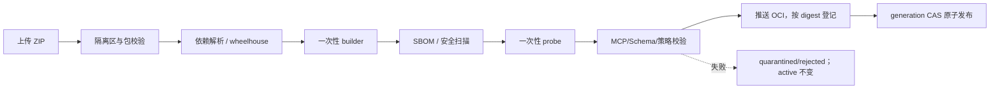
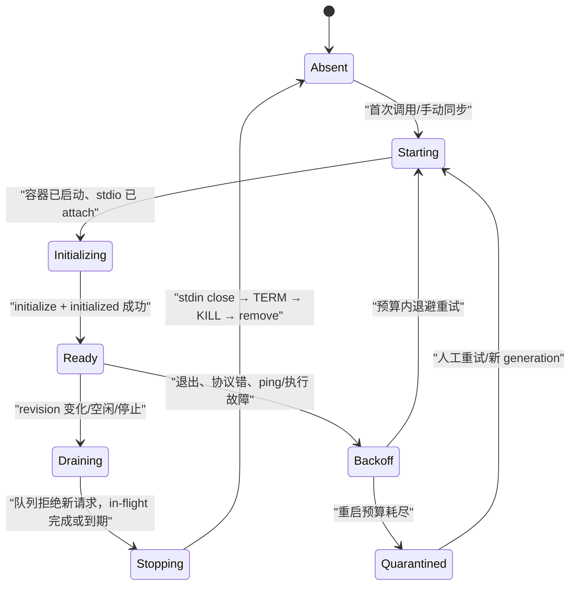

# 04 · STDIO 构建、沙箱与运行时

[← 返回索引](README.md)

本文定义 `sandbox/` 与 `gateway/connectors/stdio.py` 的可实施契约。它覆盖代码包接收、依赖构建、MCP 探测、运行容器、stdio 桥接、限额、故障恢复和验收；领域状态和原子发布仍以 [01-data-model.md](01-data-model.md) 为准，Agent 入口的鉴权、限流和对外错误以 [05-agent-gateway.md](05-agent-gateway.md) 为准。

## 1. 决策标记、目标与边界

本文使用以下标记，避免把方向性建议误当成已经承诺的第一版能力：

- **[决定]**：第一版实现和验收必须满足。
- **[建议]**：推荐的生产增强；没有启用时必须在启动自检和管理 UI 中明确显示风险。
- **[后续]**：不进入第一版，不得提前出现在 capability 或 UI 承诺中。

### 1.1 第一版目标

- **[决定]** 一个上传包对应一个 `stdio` service，可暴露多个 MCP Tool；用户代码必须使用 FastMCP，并通过约定入口启动。
- **[决定]** 只执行由不可变 source artifact 和已验证 build artifact 产生的 Linux 容器；不在 backend/worker 宿主进程中 `exec` 用户命令。
- **[决定]** 构建、协议探测和正式运行是三个隔离阶段；任何阶段失败都不能改变当前 active config/toolset 指针。
- **[决定]** 使用 MCP 官方 SDK 的 stdio client transport，遵守 MCP `2025-11-25` 初始化、能力协商、取消和关闭语义，不自创 framing。
- **[决定]** 同一运行实例一次只执行一个 `tools/call`；有界队列提供背压。通知、响应匹配和控制消息仍由 bridge 持续读取，不能因业务串行而停止读 stdout。
- **[决定]** Linux 是正式运行平台。Windows/macOS 开发通过 Docker Desktop 的 Linux VM 运行同一 Linux 镜像；第一版不支持 Windows container，也不承诺在三种宿主上生成相同 image digest。

### 1.2 非目标

- 不接受任意 Python 项目、宿主脚本、原生可执行文件或用户自定义 Dockerfile。
- 不允许 privileged、host network/PID/IPC namespace、宿主目录读写挂载或将 Docker socket 暴露给用户容器。
- 不保证恶意代码在普通容器内达到虚拟机级隔离。容器共享宿主内核；高对抗、多租户公网场景应采用专用 sandbox node，并评估 gVisor/Kata 等 sandboxed runtime（**[建议]**）。
- 第一版不做同一 service 多副本、请求迁移、热升级或 durable stdio queue；MCP Tasks 若开启，遵循 [01-data-model.md](01-data-model.md) 的独立持久化模型。

## 2. 方案比较与选择

| 方案 | 隔离与可移植性 | 运维成本 | 本项目结论 |
|---|---|---:|---|
| 宿主子进程/venv | 弱；用户代码与网关共享宿主边界，清理进程树跨平台困难 | 低 | 拒绝 |
| 单一共享容器 + 挂载每个 service 源码 | 依赖污染、状态串扰、难以证明产物不可变 | 中 | 拒绝 |
| 每 revision 构建不可变 OCI image，按 digest 运行 | 边界清晰、可扫描、可回退；占用 registry/缓存 | 中 | **[决定] 生产方案** |
| microVM/sandboxed container | 隔离更强 | 高 | **[建议] 高风险部署增强** |

**[决定] 构建产物搬运方案**：生产将成功产物推送到受控 OCI Registry，`service_artifact(kind=container_image)` 保存 manifest digest（`sha256:...`）和平台；runner 只按 digest 拉取并运行，禁止按可变 tag 运行。单机开发可以把同一 image 保存在专用 rootless Docker daemon 的本地 image store，但数据库仍保存 image ID/digest，且节点迁移前必须重新构建或推送 Registry。共享 volume 只用于构建临时目录，不能作为可发布产物真源。

公共 base image 锁定为 digest。缓存 key 至少包含 `base_image_digest + python_abi + target_platform + dependency_lock_digest + builder_version`；`service_id + requirements hash` 只可作为人类可读 tag，不能作为安全身份。这样既复用 Docker layer，又避免不同架构、builder 或基础镜像错误复用。

## 3. 信任边界与威胁模型

### 3.1 资产和主体

受保护资产包括 Docker 宿主及其内核、rootless daemon socket、其他 service 容器、源包和构建产物、Registry 凭据、运行秘密、Agent 请求/结果、active toolset、审计记录和宿主资源可用性。

用户代码、上传包、依赖包、MCP stdout/stderr、工具参数、工具结果、出网响应和对象存储 key 一律不可信。只有管理 API、经过授权的 worker/runner、受控 base image、允许的私有依赖源和 Registry 属于受信控制面。

### 3.2 必须覆盖的攻击

| 威胁 | 控制 | 失败语义 |
|---|---|---|
| Zip Slip、符号链接/硬链接、压缩炸弹、Unicode 路径混淆 | 流式校验、规范路径、白名单、数量/展开大小/压缩比上限 | `PACKAGE_REJECTED`，artifact 进入 `quarantined` |
| 依赖安装脚本执行恶意代码、依赖混淆/投毒 | 构建阶段隔离；批准的 index/wheelhouse；锁版本和 hash；保存 SBOM/扫描摘要 | 构建失败，不产生 runnable artifact |
| 容器逃逸或横向移动 | rootless daemon、非 root、drop ALL capabilities、no-new-privileges、seccomp、只读根、无 host namespace/socket/device | 启动自检不满足则 fail-closed |
| 数据外泄/SSRF | 默认无网络；只经 egress proxy；域名与解析后 IP 双重校验；禁止 metadata、环回、私网和重绑定 | 请求拒绝并告警，不自动全网降级 |
| fork bomb、内存/CPU/磁盘/FD 耗尽 | cgroup v2 CPU/内存/PID、tmpfs/quota、ulimit、队列和输出上限 | 杀容器，稳定 reason code，有限重启 |
| stdout 注入、超大 JSON、错误 request ID | 严格 UTF-8/newline/JSON-RPC framing、长度/深度限制、pending ID 表 | 当前请求失败并隔离实例 |
| stderr/异常泄密 | 有界采集、统一 redaction、访问控制、秘密值不进入容器配置日志 | 截断且记录计数，不阻塞协议流 |
| 超时后代码继续执行、孤儿孙进程 | 协议取消 + grace；无法确认停止时终止整个容器/cgroup | 实例重建后才接收下一请求 |
| runner 崩溃遗留容器 | owner/instance/revision labels、启动 reconcile、租约和 TTL、幂等 stop/kill/remove | 回收非当前实例，保留诊断摘要 |

Docker socket 即使只读挂载也等价于高权限控制接口。因此 **[决定]** 用户容器永远看不到 daemon socket；backend/worker 仅连接专用 rootless daemon，并通过一个窄职责 `SandboxRuntime` 适配层创建带强制 policy 的容器。生产建议把 sandbox daemon 放在独立节点，管理面不与用户工作负载共享故障域。该取舍参考 [OWASP Docker Security Cheat Sheet](https://cheatsheetseries.owasp.org/cheatsheets/Docker_Security_Cheat_Sheet.html) 和 [Docker Rootless mode](https://docs.docker.com/engine/security/rootless/)。

## 4. 上传包与配置契约

### 4.1 包格式

**[决定]** 第一版只接收 ZIP，单包默认限制如下；部署可向下收紧，向上调整必须有平台管理员策略而非 service editor 任意覆盖。

| 项目 | 默认上限 |
|---|---:|
| 压缩包字节数 | 10 MiB |
| 解压后总字节数 | 50 MiB |
| 文件数 | 500 |
| 单文件展开字节数 | 5 MiB |
| 单文件压缩比 | 100:1 |
| 路径 UTF-8 字节数 / 路径层级 | 240 / 20 |

允许的文件为 `.py`、`requirements.txt`、`pyproject.toml`（只读取允许字段，不构建用户项目）、`.json`、`.yaml`、`.yml`、`.toml`、`.txt`、`.md`。拒绝 `.so/.dll/.dylib/.exe/.bat/.cmd/.ps1/.sh`、wheel/sdist、设备文件、FIFO、socket、符号链接、硬链接、加密条目、绝对/UNC/盘符路径、NUL、控制字符、`..` 路径段和规范化后重名。入口固定为 `server.py:mcp`；不接受 shell 字符串，最终 argv 固定由 runner 生成。

`package_validator.py` 必须先读 central directory，再对每个 local header 复核名称、大小和类型；使用流式解压并在写入前执行 `resolve` 后的 containment check，不能依赖字符串前缀。临时目录由系统创建、权限 `0700`、不跟随链接；校验完成后计算整个原始 ZIP 和逐文件 SHA-256，写不可变 manifest。失败或进程崩溃的临时目录由 TTL janitor 清理。

### 4.2 依赖契约

**[决定]** 用户不能提交自定义 index URL、`--trusted-host`、`-e`、本地路径、VCS/direct URL、嵌套 `-r/-c` 或 pip 全局 option。`requirements.txt` 只接受规范化的 name + exact `==` version + environment marker；FastMCP 版本由 base image/平台约束提供，用户不能覆盖。

生产依赖分两步：resolver 在批准的 index 下载 wheel，生成包含全部传递依赖和 SHA-256 的 lock manifest；builder 随后使用 `--no-index --find-links=<readonly-wheelhouse> --require-hashes --only-binary=:all:` 离线安装。若批准源没有目标平台 wheel，构建明确失败，不回退到 sdist。此设计依据 pip 官方的 [Secure installs](https://pip.pypa.io/en/stable/topics/secure-installs/) 与 [Repeatable installs](https://pip.pypa.io/en/stable/topics/repeatable-installs/)；它牺牲部分包兼容性，换取可复现与避免 build backend 任意联网。

**[建议]** resolver/Registry 接入恶意包与漏洞扫描、生成 CycloneDX/SPDX SBOM，并按部署策略阻断严重漏洞。扫描器不可用时生产默认不发布新 artifact；现有 active artifact 可继续运行但 condition 标为 `Degraded`，避免供应链服务故障导致全站中断。

### 4.3 revision 配置

stdio 的 `public_config` 至少包含：

```json
{
  "entrypoint": "server.py:mcp",
  "runtime": {"python": "3.11", "platform": "linux/amd64"},
  "env": {"LOG_LEVEL": "INFO"},
  "limits": {
    "cpu": 0.5,
    "memory_bytes": 268435456,
    "pids": 64,
    "tmpfs_bytes": 67108864,
    "nofile": 256,
    "call_timeout_ms": 60000,
    "result_bytes": 4194304
  },
  "health": {"ping_interval_ms": 30000, "ping_timeout_ms": 5000},
  "egress_policy": {"mode": "none", "allowed_destinations": []}
}
```

队列覆盖继续使用 `mcp_service.queue_max_depth/queue_timeout_ms`（NULL 分别取 50/30000），与 [01-data-model.md](01-data-model.md) 一致。所有数值由 Pydantic 和 policy engine 限定上下界；客户端不能提交 Docker 原生参数、mount、capability、seccomp 路径、container name 或 argv。

公开 env key 只允许 `[A-Z_][A-Z0-9_]{0,63}`，值默认最多 4 KiB，并拒绝 `PATH/PYTHONPATH/PYTHONHOME/LD_*/DYLD_*/HOME/HOSTNAME/SSLKEYLOGFILE` 等平台保留项。私密 env 位于 `service_secret`，API 只返回 key 名和“已设置”状态。

## 5. 构建、探测与发布流水线



1. API 流式写 `source_package` staging object，同时计算摘要；不得把整个 ZIP 读进内存。
2. worker 领取带 `service_id/config_revision_id/generation` 的幂等 build job；同 revision 重试复用同一 job key，但产生独立 attempt 日志。
3. validator 输出规范 manifest；不合格 artifact 进入 `quarantined`。
4. resolver 产生锁定 wheelhouse 和 `dependency_digest`。
5. builder 以只读 source/wheelhouse、无秘密、无通用网络运行，生成只读应用层；base image 必须锁 digest。
6. 对镜像/SBOM 执行策略校验。镜像中不得包含 source ZIP、resolver/Registry 凭据、pip cache 或构建日志。
7. probe 使用与正式运行相同的加固 profile，但使用假/最小探测配置，不注入生产秘密；完成 `initialize` → `notifications/initialized` → `tools/list`，保存 protocol version、capabilities、serverInfo、instructions 和完整 tools。
8. probe 还必须验证入口在启动 deadline 内就绪、tool 数量/名称/Schema/总描述大小上限、无非法 stdout、关闭流程可完成。探测只调用 `tools/list`，不调用任意业务 tool。
9. 成功镜像推送 Registry 并读取远端 digest；数据库 artifact 从 staging 转 available。tag 仅便于 GC，不参与运行选择。
10. publication service 按 [01-data-model.md](01-data-model.md) 校验 generation 并原子切换 config/toolset；旧运行实例进入 drain，新请求只使用新 revision。晚完成任务标 `superseded`。

构建日志采用流式有界采集：单行 64 KiB、完整 artifact 默认 10 MiB，超过后保留头尾并标 `truncated=true/dropped_bytes`。日志实时 redaction 之后才可写对象存储；完整日志仅 editor/admin 可读。

## 6. 运行时沙箱基线

### 6.1 强制 profile

每个 build/probe/run 容器都由 policy engine 合成最终配置，并在创建后 inspect 校验。正式 run 的最低基线：

- 专用 rootless Docker daemon；宿主必须是 cgroup v2 + systemd，使 CPU/memory/PID 限制真正生效。Docker 文档说明 rootless 在不满足条件时可能忽略相关限制，因此启动自检失败必须拒绝启用 stdio，而不是只打 warning（见 [Rootless limitations](https://docs.docker.com/engine/security/rootless/troubleshoot/)）。
- `User=65532:65532`（或镜像中固定无特权 UID/GID）、`Privileged=false`、`CapDrop=ALL`、`no-new-privileges`；不允许 device、host namespace、额外 group 和 setuid/setgid 文件。
- Docker default seccomp 或经版本控制且测试过的更严格 profile，禁止 `seccomp=unconfined`。Docker 默认 profile 是 allowlist 风格并阻断多类高风险 syscall，参见 [Docker seccomp](https://docs.docker.com/engine/security/seccomp/)。
- 只读 root filesystem；应用镜像只读；仅 `/tmp` 和明确 runtime dir 使用 `tmpfs`，带 `noexec,nosuid,nodev,size=`；不挂载 source、宿主路径或共享可写 volume。
- `init=true` 或受控 PID 1 wrapper 负责转发信号和回收僵尸进程；`StopSignal=SIGTERM`。
- 硬限制 CPU、memory、memory-swap（默认等于 memory，禁止 swap）、PIDs、`nofile`、`nproc`、进程 core size=0 和 tmpfs/可写字节。Docker 默认并无限额，必须显式设置，参见 [Docker resource constraints](https://docs.docker.com/engine/containers/resource_constraints/)。
- 不发布端口；不挂宿主时钟、`/proc` 写接口、cloud credential 或 service account token；镜像以 digest 拉取且本地 pull policy 不允许被同名 tag 替换。

默认运行限额为 0.5 CPU、256 MiB memory、64 PIDs、64 MiB tmpfs、256 FDs；build 为 1 CPU、1 GiB、256 PIDs、1 GiB 临时磁盘、10 分钟；probe 为 0.5 CPU、256 MiB、64 PIDs、60 秒。部署必须为全局 stdio 容器数、build 并发数、聚合 CPU/memory 和 Registry/本地 image 占用另设节点级预算，避免逐容器限额之和压垮宿主。

**[建议]** 对来自互不信任组织或暴露公网的环境，使用独立 sandbox node pool + gVisor/Kata runtime。Kubernetes 部署至少对齐 Restricted Pod Security Standard：禁止提权、drop `ALL` capabilities、runAsNonRoot、RuntimeDefault/Localhost seccomp（见 [Kubernetes Pod Security Standards](https://kubernetes.io/docs/concepts/security/pod-security-standards/)）。

### 6.2 出网

运行默认 `network=none`。需要联网的 service 必须在不可变 config revision 中保存显式 `egress_policy` allowlist，由 editor 配置并二次确认；平台管理员可把审批设为强制。策略随 revision 版本化，不另设未定义的可变引用，也不存在“允许全部公网”。

允许出网时，容器仍不能直连外网，只连接认证的 egress proxy。策略按 `scheme + hostname + port` allowlist，默认只允许 HTTPS/443；代理对每次 DNS 解析和重定向重新校验最终 IP，拒绝 loopback、link-local、RFC1918/ULA、multicast、保留地址、宿主/daemon/Registry/对象存储控制面以及云 metadata 地址。禁止用户自定义代理 env、DNS server、HTTP CONNECT 任意目标和跨 allowlist redirect。IP allowlist 是显式高风险例外，并需固定 CIDR。

代理记录 service/revision、目标分类、结果和字节数，但不记录 query、Authorization 或 body。代理不可用时该调用 fail-closed；不得绕过代理恢复联网。配置变更产生新 generation 并重建运行实例。

### 6.3 秘密与环境变量

私密 env 在容器即将启动时从 `service_secret` 解密，通过内存中的 Docker API 请求注入，禁止拼接进 shell/argv、镜像层、label、普通日志、artifact 或审计 changes。只有白名单 key 可注入；平台保留 env 不能被覆盖。runner 的异常对象、inspect 输出和 debug 日志必须经过统一 redaction，redactor 同时覆盖精确值、常见 URL/header 编码和 key 名模式。

必须明确容器 env 对拥有 daemon 控制权的运维者可见；rootless daemon 隔离的是用户代码而不是平台管理员。**[建议]** 支持文件型 secret 的 SDK/应用优先以只读 tmpfs 文件注入，并只传文件路径。秘密轮换创建新 revision/secret，drain 旧实例后启动新实例；不在活跃容器中原地修改。

探测默认不使用真实秘密。若 server 在无秘密时不能完成 initialize/list，editor 必须为该 key 提供独立、最小权限、短期 probe secret；不得复用生产写权限 token。

## 7. MCP stdio 协议桥

### 7.1 framing 与流隔离

MCP stdio 规定消息是 UTF-8 JSON-RPC、以换行分隔且消息内部不能含换行；stdout 不得出现非 MCP 内容，日志可以写 stderr（见 [MCP Transports 2025-11-25](https://modelcontextprotocol.io/specification/2025-11-25/basic/transports)）。据此：

- `bridge.py` 使用 bytes buffer 增量读取 stdout，先执行单行字节上限，再做严格 UTF-8 和 JSON/JSON-RPC 校验；兼容 `LF` 和 `CRLF`，拒绝 NUL、BOM、空行、嵌入换行、非 object 顶层和超深 JSON。
- **不得“跳过非法 stdout 后继续”**。这会隐藏协议污染并可能造成响应错配。probe 阶段出现一次即构建验证失败；run 阶段出现一次则 `PROTOCOL_STDOUT_INVALID`，终止/隔离实例并失败当前请求。
- stdout 单消息默认 4 MiB、JSON 最大深度 64；`tools/list` 总定义默认 4 MiB/1000 tools；tool result 默认 4 MiB。超过上限不把部分 JSON 交给 SDK，而是终止实例并返回稳定错误。
- stdin 写入必须由一个 writer task 串行化并尊重 transport `drain`/Docker attach 背压；待写队列按消息数和字节数双重有界。客户端断开或容器退出时停止接收新写入并唤醒全部 waiter。
- 每个 outbound request ID 在实例内唯一，pending map 记录 deadline/owner。未知、重复或已完成 ID 的 response 视为协议错误；合法 notification 和 server-to-client request 只能在已协商 capability 内处理，否则返回标准 JSON-RPC 错误或按规范忽略。
- stderr 独立 reader 持续排空，不能因日志洪泛阻塞子进程。单行默认 64 KiB、每实例 1 MiB/min、10 MiB 生命周期预算；超额丢弃并计数，不杀健康实例，也不把任意 stderr 误判为失败。

所有 Docker SDK 阻塞调用通过专用、有界 executor；MCP session 的 async reader/writer 不进入该 executor。executor 饱和必须形成背压并有指标，不能无限创建线程。

### 7.2 初始化和能力

启动顺序固定为：create/start container → attach 三流 → 在 `startup_timeout_ms`（默认 15 秒）内发送 `initialize` → 验证服务端选择的 protocol version 是平台 allowlist → 保存 capability/serverInfo → 发送 `notifications/initialized` → 状态转 `Ready`。初始化是连接的第一次协议交互，除 ping 外不能提前发送其他请求；细节见 [MCP Lifecycle](https://modelcontextprotocol.io/specification/2025-11-25/basic/lifecycle)。

bridge 只声明网关真正能代理的 client capability。第一版不向用户 server 暴露 roots、sampling、elicitation 和 task-augmented call，除非对应 gateway 功能已经端到端实现；收到未协商的反向请求返回 `-32601`。server 宣称 capability 不代表网关自动支持，toolset 保存完整快照供诊断。

健康检查使用协议 `ping`，不周期性调用 `tools/list`，避免昂贵枚举或错误地把动态工具变化直接发布。server 宣称 `tools.listChanged` 时，只触发去抖后的新 sync job；仍走 staging、完整校验和 CAS 发布。MCP ping 的响应和故障规则见 [MCP Ping](https://modelcontextprotocol.io/specification/2025-11-25/basic/utilities/ping)。

## 8. 并发、背压、超时与取消

### 8.1 队列模型

`runner.py` 以 `(service_id, active_config_revision_id)` 为实例 key。第一版每个 key 最多一个 ready 实例、一个 FIFO 调用队列和一个 in-flight `tools/call`；启动/停止另有实例级锁。读 stdout、ping、取消和容器退出监听不受业务互斥锁阻塞。

请求在进入队列前已通过 [05-agent-gateway.md](05-agent-gateway.md) 的鉴权和两级限流。队列深度达到 `queue_max_depth` 时立即返回 503 `STDIO_QUEUE_FULL` 和有界 `Retry-After`；入队后超过 `queue_timeout_ms` 返回 503 `STDIO_QUEUE_TIMEOUT` 并原子移除。取消/客户端断开也必须从队列移除，不能让“幽灵请求”以后执行。

此模式选择了隔离和可预测性而非吞吐。一个 service 实例内的内存状态会在所有获准调用该 service 的 Agent 间共享；LiteMCP 不能把该状态视为用户会话隔离。需要调用方隔离的 server 必须把主体显式纳入 tool 参数并自行授权，或等待 **[后续]** 按安全主体分池。

### 8.2 deadline 与取消

每次调用有两个独立 deadline：队列等待 deadline 和执行绝对 deadline。执行默认 60 秒，service 可在平台允许范围内覆盖，第一版硬上限 5 分钟；progress notification 可以更新“无进展超时”指标，但不能延长绝对 deadline。MCP 生命周期也要求每个请求设置超时并始终保留最大超时。

执行超时或 Agent 断开时：

1. 若请求尚在队列，移除并结束。
2. 若已发送，发 `notifications/cancelled`，reason 只用稳定枚举，不包含秘密或原始参数；等待 `cancel_grace_ms`（默认 2 秒）。MCP 取消可能被 receiver 忽略，且取消后不应再等待普通响应，见 [MCP Cancellation](https://modelcontextprotocol.io/specification/2025-11-25/basic/utilities/cancellation)。
3. 因第一版单 in-flight，grace 后仍无法证明工作停止时终止整个容器，失败所有 pending，重建成功后才处理下一请求；绝不在同一实例中假定超时任务已停止。
4. `initialize` 不发送取消；初始化超时直接执行关闭流程。task-augmented request 若未来启用，必须使用 `tasks/cancel` 而不是普通 cancellation notification。

成功响应先验证 JSON-RPC、request ID、MCP result Schema 和字节上限，再返回 gateway。超限结果返回 `STDIO_RESULT_TOO_LARGE`，不得在 JSON 中静默截断；后续大结果应使用 MCP Resource/Task artifact，不在第一版私自改写 Tool result。

## 9. 生命周期、关闭和进程树清理



状态只在 runner 内存/协调存储中维护；`service_condition` 是持久诊断真源，`mcp_service.runtime_status` 只是摘要。重要规则：

- 懒启动由第一个调用或手动 sync 触发；并发调用共享同一 startup future，不能重复建容器。空闲默认 10 分钟进入 drain，忙实例不因 idle timer 被杀。
- revision 切换后旧实例不再接收新请求；给 in-flight 最多 30 秒 drain，之后按取消流程停止。新 revision 独立启动，失败不会重新发布旧配置；是否继续为旧 active revision 提供服务由 publication 时序保证。
- 正常关闭遵循 MCP stdio 生命周期：先关闭 child stdin，等待 2 秒；未退出则 Docker stop/SIGTERM 等待 5 秒；仍未退出则 kill/SIGKILL；最后 remove。container/cgroup 是进程树边界，不能只杀入口 PID。
- PID 1 wrapper 必须转发 TERM 并回收子进程。任何 stop/kill/remove 可重复调用；“not found”视为成功。
- 容器 label 至少含 `managed-by=litemcp`、service/revision/artifact/instance/owner 和创建时间。runner 启动时 reconcile：保留租约仍有效且数据库引用匹配的实例；其余先 stop/kill 再 remove。绝不按宽泛 name prefix 删除未知容器。
- 30 秒 ping、5 秒 ping timeout，连续 3 次失败进入 Backoff；单次工具执行期间延后主动 ping，避免与 server 串行实现竞争，但 stdout 读和容器存活检查继续。
- 自动重启采用 full-jitter 指数退避（1、2、4、8、16 秒，上限 30 秒），5 分钟内最多 5 次。预算耗尽进入 Quarantined，`RuntimeHealthy=false/reason=RESTART_BUDGET_EXHAUSTED`，需人工重试或新 generation 才清零；禁止 restart storm。

容器 OOM、PID limit、exit code、signal、health timeout、协议错误必须映射为不同 reason code。不要用 `last_error` 覆盖 build/sync/runtime；分别写 `build_run`、`tool_sync_run` 和 condition。

## 10. 内部接口契约

建议的模块边界（名称可随实现微调，语义不可弱化）：

```python
class PackageValidator:
    async def validate(self, source_artifact_id: UUID) -> ValidatedPackage: ...

class SandboxBuilder:
    async def build(self, *, service_id: UUID, revision_id: UUID,
                    generation: int, source_artifact_id: UUID) -> BuildArtifact: ...

class SandboxRuntime:
    async def create(self, spec: EnforcedContainerSpec) -> ContainerHandle: ...
    async def inspect_limits(self, handle: ContainerHandle) -> AppliedPolicy: ...
    async def stop_tree(self, handle: ContainerHandle, reason: str) -> None: ...

class StdioRunner:
    async def call_tool(self, *, service: ServiceSnapshot, tool_name: str,
                        arguments: dict, deadline: float,
                        cancellation: CancellationToken) -> CallToolResult: ...
    async def probe(self, build_artifact_id: UUID) -> DiscoveredServer: ...
    async def drain_revision(self, service_id: UUID, revision_id: UUID) -> None: ...
```

`ServiceSnapshot` 必须在入队时冻结 service ID、generation、active revision/toolset、artifact digest、限制和 config revision 中的 egress policy 摘要；执行前再次确认 desired status 和 active revision 未变化。connector 不得自己切换 toolset；builder/runner 不得反向修改 desired config。

多 backend 副本第一版若没有实现分布式 owner lease，部署必须强制 `stdio_runner_replicas=1`；不能依赖数据库轮询队列或“碰巧粘性路由”。**[后续]** 多副本使用具备 fencing token 的 lease，所有生命周期操作校验 owner epoch，防止两个 runner 同时接管同一 service。

## 11. 错误、降级与恢复

| reason code | 对外语义 | 实例动作 | active 发布 |
|---|---|---|---|
| `PACKAGE_REJECTED` / `DEPENDENCY_POLICY_DENIED` | 管理 API 422，展示脱敏 validation report | 无运行实例 | 不变 |
| `BUILD_TIMEOUT` / `BUILD_RESOURCE_EXHAUSTED` | build failed | 清理 builder | 不变 |
| `PROBE_INITIALIZE_FAILED` / `PROTOCOL_STDOUT_INVALID` | sync/build failed | 隔离 probe | 不变 |
| `STDIO_QUEUE_FULL` / `STDIO_QUEUE_TIMEOUT` | Agent 503 + `Retry-After` | Ready 实例不重启 | 不变 |
| `STDIO_CALL_TIMEOUT` / `STDIO_CLIENT_CANCELLED` | gateway 按 [05] 统一映射 | cancel，必要时重建 | 不变 |
| `STDIO_RESULT_TOO_LARGE` | Agent 协议错误/502 | 丢弃完整响应但实例可复用；若同时触发消息/framing 上限才重建 | 不变 |
| `SANDBOX_POLICY_UNAVAILABLE` | 503 fail-closed | 禁止创建容器 | 不变 |
| `CONTAINER_OOM` / `PID_LIMIT` / `PROCESS_EXITED` | 502/503，可重试性由 connector 标记 | 预算内 backoff | 不变 |
| `RESTART_BUDGET_EXHAUSTED` | 503 + 有界 Retry-After | Quarantined | 不变 |

返回给 Agent 的错误不得包含容器 ID、镜像 URI、宿主路径、stderr、tool 参数、env、堆栈或 Docker daemon 错误原文。管理端可查看脱敏 reason、时间、revision 和受权限保护的日志引用。重试只允许发生在“确认 tool 未开始执行”的启动/排队阶段；`tools/call` 一旦写入 stdin，网关不能自动重试非幂等工具。

依赖故障的降级规则：Registry 暂时不可用但所需 digest 已在节点本地且校验匹配时可以启动；digest 不在本地则 fail-closed。Redis 不可用不改变本地单实例队列上限；若部署依赖 Redis owner lease，则禁止新接管，现有 lease 到期后 drain。可观测系统故障不能阻塞协议数据面，但审计写入仍按 [01-data-model.md](01-data-model.md) 的 outbox 策略处理。

## 12. 可观测性与审计

日志字段至少包含 `request_id/correlation_id/service_id/revision_id/artifact_digest/instance_id/build_run_id/tool_sync_run_id/phase/reason_code`；tool 名可记录，arguments/result、secret、Authorization、完整 stdout 和未经清洗的 stderr 不记录。instance/container ID 只在受限诊断日志中保留短 ID。

核心指标：

- build/probe success、duration、queue、timeout、resource failure、scan denial；
- running/starting/backoff/quarantined 实例数，startup/initialize/ping/stop latency，restart/OOM/PID-limit 次数；
- per-service queue depth、queue wait、in-flight、queue reject、call duration/cancel/timeout；
- stdout protocol error/oversize、stderr dropped bytes、result oversize、executor queue depth；
- image/cache/temporary storage bytes、GC result、egress allow/deny/bytes。

service ID 是受控规模标签；revision、instance、request、container、tool 参数和目标 URL 不得作为 Prometheus label。审计至少记录 stdio policy/config/secret 变更、build/probe/publish/rollback、人工 retry、quarantine、egress policy 变更和 GC；只记录字段变化与摘要，不记录秘密明文。

## 13. 验证与验收

### 13.1 单元与性质测试

- ZIP validator 用 property-based/fuzz 覆盖 `../`、绝对/UNC/盘符、混合分隔符、Unicode 规范化重名、NUL、symlink/hardlink、central/local header 不一致、加密条目、超大 size、压缩比和中途磁盘写失败。
- framing parser 用随机 chunk 边界覆盖 UTF-8 拆分、CRLF、超长无换行、非法 JSON、重复/未知 ID、notification 混排、stdout 日志污染和深层 JSON；断言内存始终有界。
- runner 的状态机做模型测试：并发 lazy start 只创建一个实例；队列 FIFO/满/超时/取消无泄漏；deadline/cancel race 不双重完成；revision drain 不接收旧请求；restart budget 不产生风暴。
- secret redaction 对原值、header、URL 编码和异常链做回归；任何 snapshot/log fixture 不含 canary secret。

### 13.2 集成与故障注入

- 在 PostgreSQL/MySQL 两套领域契约上验证 build/sync generation CAS；旧 build 晚完成不能覆盖新 revision。
- 使用恶意 FastMCP fixture：stdout `print`、stderr flood、fork bomb、内存/磁盘/FD 耗尽、忽略取消/TERM、产生孙进程、超大 result、启动挂起、异常退出、访问 Docker socket/宿主路径/metadata；逐项验证限制和 reason code。
- inspect 每个容器，断言非 root、cap drop、no-new-privileges、seccomp、read-only root、network policy、tmpfs、cgroup/ulimit、无 host mount/device/socket；在不支持 cgroup v2 的节点验证 stdio 启动 fail-closed。
- 关闭 runner 进程后重启，验证 reconcile 只回收带正确 labels 且租约失效的 LiteMCP 容器，孙进程不残留。
- 断开 Agent、执行超时和取消竞态分别验证：未发送请求不执行；已发送请求先取消；不响应取消时整个 cgroup 被清理；非幂等 tool 不自动重试。
- Registry outage、resolver outage、egress proxy outage、Docker daemon 重启、磁盘逼近阈值和观测后端故障均进行故障注入，行为符合第 11 节。

### 13.3 跨平台矩阵

- Linux rootless Docker 是发布阻断矩阵，覆盖 `linux/amd64`；支持 ARM 时增加独立 `linux/arm64` build/probe/run，不跨架构复用 artifact。
- Windows 11 + Docker Desktop/WSL2、macOS + Docker Desktop 只作为开发 smoke test：上传、构建、initialize/list_tools、call、timeout、stop tree。Windows/macOS 路径不能进入 Linux 容器配置。
- runtime capability report 必须显示 rootless、cgroup、seccomp、storage quota 和 egress proxy 是否有效；生产 profile 有任一强制项缺失即拒绝启动 stdio 功能。

### 13.4 完成定义

- 从上传 FastMCP ZIP 到按 digest 运行、发现完整 Tool Schema、CAS 发布、Agent 调用和回退全链路可重复执行。
- active revision/toolset 在所有 build/probe/scan/Registry/协议失败下保持不变。
- 协议严格符合 newline-delimited UTF-8 JSON-RPC；非法 stdout 不被静默跳过，stderr 洪泛不阻塞 stdout。
- 队列、stdin、stdout、stderr、result、CPU、memory、PID、FD、tmpfs、构建时间和节点聚合资源均有硬上限和可观测拒绝。
- 超时/取消后不存在仍运行的未知工具进程；正常关闭和 crash reconcile 都清理完整容器进程树。
- 生产秘密不进入 source/build image、artifact、普通日志、审计、metrics、trace 或错误响应。
- 默认无网络；启用出网也不能访问未批准目标、私网/metadata 或绕过 proxy。
- PostgreSQL/MySQL generation 状态契约与 [01-data-model.md](01-data-model.md) 一致；端到端用例并入 [09-verification.md](09-verification.md)。

## 14. 配置默认值与运维门槛

| 配置 | 默认 | 约束 |
|---|---:|---|
| `STDIO_QUEUE_MAX_DEPTH` | 50 | service 可向 policy 范围内覆盖 |
| `STDIO_QUEUE_TIMEOUT_MS` | 30000 | 与 `mcp_service.queue_timeout_ms` 同单位 |
| `STDIO_STARTUP_TIMEOUT_MS` | 15000 | initialize 前总 deadline |
| `STDIO_CALL_TIMEOUT_MS` | 60000 | service 可覆盖；硬上限 300000 |
| `STDIO_CANCEL_GRACE_MS` | 2000 | 到期终止实例 |
| `STDIO_DRAIN_TIMEOUT_MS` | 30000 | revision/idle 关闭 |
| `STDIO_IDLE_TTL_MS` | 600000 | 忙实例不回收 |
| `STDIO_PING_INTERVAL_MS` / `TIMEOUT_MS` | 30000 / 5000 | 连续 3 次失败重建 |
| `STDIO_MAX_MESSAGE_BYTES` | 4194304 | stdout 单消息与默认 result 上限 |
| `STDIO_STDERR_BUDGET_BYTES` | 10485760 | 每实例生命周期；另有限速 |
| `STDIO_RESTART_MAX_ATTEMPTS` | 5 / 5 min | full-jitter backoff，耗尽 quarantine |
| `STDIO_BUILD_CONCURRENCY` | 1 | 由节点聚合预算限制 |

启动时必须打印不含秘密的 capability report，并验证 Docker API/daemon 是允许版本、rootless、cgroup v2 限制可观测、seccomp 启用、Registry digest pull 可用、临时存储水位安全。生产模式不得用配置开关关闭 mandatory profile；确需弱化只能使用明确的 development profile，UI 持续显示风险，且 `RuntimeHealthy=unknown/reason=SANDBOX_DEVELOPMENT_PROFILE`，不能对公网声明为安全部署。

## 15. 权威参考

- [MCP 2025-11-25 · Transports](https://modelcontextprotocol.io/specification/2025-11-25/basic/transports)
- [MCP 2025-11-25 · Lifecycle](https://modelcontextprotocol.io/specification/2025-11-25/basic/lifecycle)
- [MCP 2025-11-25 · Cancellation](https://modelcontextprotocol.io/specification/2025-11-25/basic/utilities/cancellation)
- [MCP 2025-11-25 · Ping](https://modelcontextprotocol.io/specification/2025-11-25/basic/utilities/ping)
- [Docker · Rootless mode](https://docs.docker.com/engine/security/rootless/)
- [Docker · Resource constraints](https://docs.docker.com/engine/containers/resource_constraints/)
- [Docker · Seccomp security profiles](https://docs.docker.com/engine/security/seccomp/)
- [Kubernetes · Pod Security Standards](https://kubernetes.io/docs/concepts/security/pod-security-standards/)
- [OWASP · Docker Security Cheat Sheet](https://cheatsheetseries.owasp.org/cheatsheets/Docker_Security_Cheat_Sheet.html)
- [pip · Secure installs](https://pip.pypa.io/en/stable/topics/secure-installs/)
