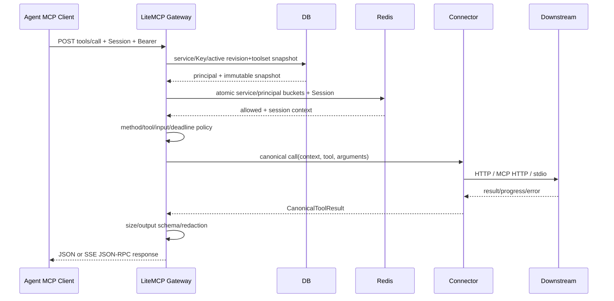
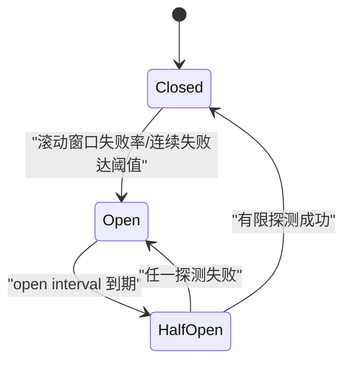

# 05 · Agent 侧网关

[← 返回索引](README.md)

本文定义 LiteMCP Agent 数据面的可实施契约。网关对 Agent 表现为 MCP Server，对 `mcp_http` / `stdio` 下游表现为 MCP Client，对 `http_api` 下游表现为受策略约束的 HTTP Client。它是协议终结点和安全边界，不是透明反向代理。

> **状态说明**：标为“首期决策”的内容是当前方案必须实现和验收的基线；标为“后续建议”的内容不得在首期对外宣称已支持。仓库目前只有架构文档、尚无实现代码，以下目录和接口均为目标设计。

## 1. 范围、非目标与需求映射

### 1.1 首期职责

`gateway/router.py` 使用 MCP 官方 Python SDK 的低阶 server/transport 能力挂载统一端点 `/mcp/{service_id}`，负责：

1. 终结 Streamable HTTP 和 JSON-RPC，完成 MCP 生命周期、版本及能力协商。
2. 执行服务可用性、Agent 鉴权、限流、并发/背压和安全策略。
3. 只从已发布的 `active_config_revision_id`、`active_toolset_id` 读取定义，并提供 `tools/list`、`tools/call`。
4. 把规范 MCP Tool 调用路由到 `http_api`、`mcp_http` 或 `stdio` connector。
5. 统一超时、取消、受控重试、熔断、错误模型和响应大小限制。
6. 产生可关联的访问日志、指标、trace 和安全审计事件。

| 需求 | 首期落点 | 验收证据 |
|---|---|---|
| 网关职责边界 | 第 2 节 | connector 不可切换 active 指针；管理 JWT 不能调用 Agent 端点 |
| 认证鉴权 | 第 4 节 | Key 创建/吊销/过期、`none` 风险确认、OAuth fail-closed 测试 |
| 会话与路由 | 第 3、5 节 | 初始化、跨实例 Session、DELETE、三类 connector 契约测试 |
| 协议转换和流式传输 | 第 3、6、7 节 | JSON/SSE、断线续传、取消、三类返回映射测试 |
| 工具发现与调用 | 第 6 节 | 分页、Schema 无损、输入/输出校验、发布竞态测试 |
| 限流、重试、熔断、幂等 | 第 8 节 | 双桶原子性、重试边界、半开探测、重复副作用测试 |
| 安全与错误 | 第 9、10 节 | Origin/SSRF/尺寸/秘密扫描及稳定错误码测试 |
| 可观测性、兼容性和测试 | 第 11～13 节 | metrics/log/trace、协议矩阵、故障注入 |

### 1.2 明确非目标

- 首期只暴露 MCP `tools` 能力；不伪造 `resources`、`prompts`、`sampling`、`elicitation` 等下游并不一致支持的能力。
- OpenAI/Claude/Gemini tool projection 属于 provider adapter，不在 Agent 网关请求链路中做；MCP Tool 仍是规范真源。
- 网关不把 Agent 入站凭据透传给下游，不代替下游业务做细粒度数据授权，也不相信 Tool annotations 能授予权限。
- 首期不兼容已废弃的 2024-11-05 HTTP+SSE 双端点；如有真实客户需求，另建兼容端点和测试矩阵，不让旧协议分支污染主路由。
- MCP Tasks 在 2025-11-25 中仍是实验能力。首期默认关闭，见第 6.4 节。

### 1.3 协议版本决策

**首期决策**：外部端点固定支持 MCP `2025-11-25`，实现使用官方 SDK 类型，不复制一套私有 MCP Schema。`initialize` 记录协商版本；后续请求必须携带与会话一致的 `MCP-Protocol-Version`，缺失时可从已建立 Session 恢复，冲突或不支持则 HTTP 400。`pyproject.toml` 和 lockfile 必须固定一组通过本篇契约测试的 SDK 版本，不能在生产镜像中浮动升级。

2026-07-28 版本移除了协议级 Session，属于破坏性变化。**后续建议**：把 transport/session 实现放在版本 adapter 后面，通过契约测试新增版本，而不是用条件分支改变 2025-11-25 的既有语义；升级前必须同步修改 [01-data-model.md](01-data-model.md) 的 Session/Task 模型和 [09-verification.md](09-verification.md) 的矩阵。参见 [MCP 2025-11-25 Streamable HTTP](https://modelcontextprotocol.io/specification/2025-11-25/basic/transports) 与 [后续版本变更说明](https://modelcontextprotocol.io/specification/draft/changelog)。

## 2. 组件边界与请求管线

```text
backend/src/litemcp/
├── middleware/
│   ├── auth_agent.py        # api_key / none / oauth2 Resource Server
│   └── rate_limit.py        # Redis 原子多桶 + 限流专用降级状态机
├── gateway/
│   ├── router.py            # ASGI 挂载、HTTP/MCP 校验、方法注册
│   ├── sessions.py          # Session、SSE stream/event replay、取消注册表
│   ├── context.py           # 不可变 RequestContext、deadline、principal
│   ├── errors.py            # HTTP/JSON-RPC/ToolResult 错误映射
│   ├── resilience.py        # 并发舱壁、重试预算、熔断
│   └── connectors/
│       ├── base.py          # Connector 协议与规范结果类型
│       ├── http_api.py
│       ├── mcp_http.py
│       └── stdio.py
└── services/
    └── publication.py       # 唯一允许发布/回退 toolset 的领域服务
```

每个请求的固定执行顺序如下；不得由某个 connector 绕开：

```mermaid
flowchart LR
    A["HTTP method / path / body size"] --> B["Origin / Content-Type / Accept"]
    B --> C["加载 service + active pointers"]
    C --> D["Agent 鉴权"]
    D --> E["service + principal 原子限流"]
    E --> F["MCP version / session / JSON-RPC"]
    F --> G["method + tool + input Schema"]
    G --> H["deadline / bulkhead / circuit"]
    H --> I["connector.call"]
    I --> J["结果大小 / output Schema / 脱敏"]
    J --> K["JSON 或 SSE 响应"]
```



边缘反向代理应在应用前提供 TLS、总连接数、每 IP 粗粒度速率和请求体上限，抵挡未认证洪泛；应用内顺序仍以本图为准，才能保持现有“服务可用性 → 鉴权 → service/key 限流 → connector”决策。`auth_agent` 每请求查数据库，不使用 Redis 鉴权缓存，因此 Key 吊销、过期、服务禁用在下一请求生效。Redis 限流故障不能绕过数据库鉴权。

`GatewayRequestContext` 在鉴权后一次创建并只读传递，至少包含：`request_id`、`service_id`、`service_type`、`config_revision_id`、`toolset_id`、`generation`、`protocol_version`、`session_hash`、`principal_type`、`principal_id`、`deadline`、trace context。connector 不得自行重新选择 service/revision/toolset，避免同一调用读到两个版本。

典型工具调用序列：



## 3. Streamable HTTP、生命周期与 Session

### 3.1 HTTP 契约

单一资源端点为 `/mcp/{service_id}`：

| 方法 | 用途 | 首期行为 |
|---|---|---|
| `POST` | 每次提交一个 JSON-RPC request/notification/response | 支持 `application/json` 单对象；拒绝 batch 数组；请求可返回 JSON 或 SSE |
| `GET` | 建立独立 SSE stream 或用 `Last-Event-ID` 恢复旧 stream | 要求有效 Session、鉴权和 `Accept: text/event-stream` |
| `DELETE` | 客户端主动结束 Session | 要求有效 Session；清理 Session、stream 和取消注册表，成功返回 204 |
| 其他 | 不支持 | 405 + `Allow: POST, GET, DELETE` |

传输规则：

- 所有连接都校验 `Origin`；存在但不在精确 allowlist 中时返回 403。无 `Origin` 的非浏览器客户端允许继续，但仍须鉴权。不得用宽泛后缀或请求 `Host` 动态生成 allowlist。
- POST 必须声明 `Content-Type: application/json`，`Accept` 同时包含 `application/json` 和 `text/event-stream`；GET 必须接受 `text/event-stream`。
- request/notification/response 每次 POST 只允许一个 JSON-RPC 对象。合法 notification/response 被接受后返回 202 空响应。
- JSON-RPC request 可返回 `application/json` 单响应，也可返回 `text/event-stream`。SSE 第一条事件发送唯一 `id` 和空 `data` 以支持恢复；最终响应发送后关闭该 POST stream。
- HTTP 或 SSE 断开不等于取消下游调用；只有同一 Session 的 `notifications/cancelled` 或到达 deadline 才触发取消。
- 禁止代理缓存 MCP 响应；返回 `Cache-Control: no-store`、`X-Content-Type-Options: nosniff`。反向代理必须关闭 SSE buffering，读超时大于应用最大调用时间，并传递客户端断线信号。
- JSON-RPC `id` 只用于协议相关性，不作为数据库 ID、鉴权主体或全局幂等键；限制字符串 ID 长度和数值范围。

以上是 MCP 2025-11-25 的传输要求，不应由普通 FastAPI REST handler 近似实现；`router.py` 应挂载 SDK transport/session manager，再在其上下游插入 LiteMCP policy hook。官方 Python SDK 支持把 Streamable HTTP ASGI app 挂到现有应用，参见 [Python SDK Server 文档](https://py.sdk.modelcontextprotocol.io/server/)。

### 3.2 生命周期与能力协商

首个协议交互必须是 `initialize`。网关校验 `protocolVersion/clientInfo/capabilities`，响应：

- `protocolVersion: "2025-11-25"`；
- `serverInfo.name: "LiteMCP"` 和部署版本；
- `capabilities.tools.listChanged: false`；首期发布切换不主动推送通知，客户端下次 `tools/list` 读取新 active toolset；
- 仅在 Tasks 真正启用且当前 service/tool 均可支持时声明 `tasks`；
- `instructions` 来自 active toolset，但先做大小限制和控制字符清洗；它是模型提示信息，不是可信策略。

收到客户端 `notifications/initialized` 后 Session 进入 `ready`。初始化前调用其他 MCP method 返回 `-32002 SERVER_NOT_INITIALIZED`。服务器不能根据客户端声称的 capabilities 提升权限；不支持的 capability 只是不协商。

### 3.3 Session 模型

**首期决策**：2025-11-25 Session 存 Redis，以便 backend 多副本无需 sticky session。初始化成功时生成至少 256 bit CSPRNG、URL-safe 且仅含可见 ASCII 的 `MCP-Session-Id`。明文只发给客户端；Redis key 使用带版本 pepper 的 HMAC，日志、指标和 trace 仅记录截断 HMAC。

Session value 至少保存：

```json
{
  "service_id": "...",
  "protocol_version": "2025-11-25",
  "state": "initialized|ready|closing",
  "principal_type": "api_key|oauth_subject|anonymous",
  "principal_id": "non-secret stable id",
  "auth_mode": "api_key|none|oauth2",
  "client_info": {"name": "bounded", "version": "bounded"},
  "client_capabilities": {},
  "created_at": "UTC",
  "last_seen_at": "UTC",
  "absolute_expires_at": "UTC"
}
```

关键不变量：

- Session 只是协议状态，不是认证凭据。每个 POST/GET/DELETE 都先重新鉴权，再比较当前 `service_id + principal + auth_mode` 与 Session 绑定；Key 吊销后即使持有 Session ID 也返回 401。
- `none` 模式没有可靠主体，Session 只能绑定 service 和匿名上下文；这是该模式不可避免的弱隔离，必须依靠网络边界、高熵 ID、短 TTL 和限流。
- Session 不固定 active toolset。每个 JSON-RPC request 在同一数据库读快照中取得 active revision/toolset，保证单次调用一致；发布后新请求立即使用新版本。若分页 cursor 中的 toolset 已不再 active，则要求客户端从第一页重列，不能继续读取 retired 集合。
- 默认空闲 TTL 30 分钟、绝对 TTL 24 小时；每次有效请求滑动空闲 TTL但不越过绝对 TTL。过期/不存在返回 HTTP 404，提示客户端重新 initialize。
- Redis 不可用时不能可靠验证或创建有状态 Session，返回 503 `SESSION_STORE_UNAVAILABLE`，不得回退到进程内 Session 造成跨实例随机失败。它与“限流 Redis 故障时放行”是两套独立故障策略。
- `DELETE` 原子删除 Session 及 SSE 索引；重复 DELETE 返回 404。服务删除、禁用、鉴权模式改变时，无需扫描删除全部 Session，因为下一请求的 service/auth 检查会 fail-closed；后台可异步清理。

### 3.4 SSE、多连接与恢复

每个 Session 最多 2 条并行 SSE stream；每条 stream 的事件 ID 在该 Session 内全局唯一且能定位所属 stream。Redis 保存有界 replay buffer，建议默认每 stream 最多 256 个事件、1 MiB、5 分钟，任一上限达到即淘汰最旧事件并记录 metric。

客户端用 GET + `Last-Event-ID` 恢复时：

1. 重新执行服务检查、鉴权和 Session 绑定检查。
2. 只重放该 event ID 所属 stream 后续事件，不能把其他并行 stream 的消息混入。
3. event 已过期/未知时返回 409 `SSE_RESUME_POINT_EXPIRED`，客户端应重新发起业务请求；网关不能假装已完整重放。
4. 每 15 秒发送无业务含义的注释 heartbeat；它不进入 JSON-RPC，也不计作可重放业务事件。

## 4. Agent 鉴权与授权

### 4.1 服务可见性和顺序

加载 `mcp_service` 时遵循 [01-data-model.md](01-data-model.md) 6.2：

1. 不存在或 `deleted_at != NULL`：404，不泄漏曾存在的服务。
2. `desired_status=disabled`：503 `SERVICE_DISABLED`。
3. active config/toolset 缺失：503 `SERVICE_NOT_READY`。
4. stdio `BuildReady=false` 或 `RuntimeHealthy=false`：503，并带 `Retry-After`。
5. 再执行 Agent 鉴权和限流，进入协议方法。

管理后台 JWT 的 issuer/audience/权限不适用于 Agent 入口。`Authorization` header 中出现管理 token 时按无效 Agent 凭据处理，不做“方便兼容”。

### 4.2 `api_key` 模式（首期）

Key 格式为 `litemcp_<public_id>_<random_secret>`。验证流程：严格解析格式及长度 → 用 `public_id` 单行查询 → 检查 service 归属、`active/revoked` 和 `expires_at` → 按记录的 `hash_algorithm/pepper_version` 计算完整 Key 摘要 → 常量时间比较。

- 缺失、畸形、不存在、摘要不符、吊销、过期统一返回 401，body 不区分原因；`WWW-Authenticate: Bearer realm="litemcp"`。
- 新 Key 优先用带独立 pepper 的 HMAC-SHA-256；兼容已有 `sha256-v1` 记录。随机 secret 已要求至少 256 bit，但 pepper 仍可降低数据库快照离线分析风险。
- `last_used_at` 和可选 IP HMAC 异步、节流更新，不阻塞调用；验证失败按 public selector/IP 聚合审计和限速，不保存 Key、摘要输入或 Authorization。
- API Key 授权范围固定为所属 service 的 MCP 调用；它不能调用管理 API，也不能跨 service 使用。首期不增加 per-tool ACL，避免未经数据模型评审的隐式权限语义。

### 4.3 `none` 模式（首期受限）

跳过凭据校验，但仍执行 Origin、service 级限流、并发/尺寸限制、出网策略和访问日志。只有受信内网/VPN 部署可启用；管理端保存时必须 step-up + 二次确认，并产生 `service.agent_auth_disabled` 审计事件。生产启动可配置 `AGENT_ALLOW_NONE_AUTH=false` 全局禁止该模式；配置禁止而 service 仍为 `none` 时 fail-closed 返回 503，不得静默放开。

### 4.4 `oauth2` 模式（后续建议，首期 fail-closed）

数据模型仅预留枚举并不等于能力已实现。首期管理 API/UI 不允许激活 `oauth2`；若数据库被直接写成该值，网关返回 503 `AUTH_MODE_NOT_IMPLEMENTED`，绝不能当作 `none`。

实现时 LiteMCP 是 OAuth 2.1 Resource Server，而不是把第三方 token 原样转发给下游。必须一次性交付：

- RFC 9728 Protected Resource Metadata well-known 端点；401 的 `WWW-Authenticate` 提供 `resource_metadata` 和最小 scope。
- 固定允许的 issuer/authorization server；验证签名算法 allowlist、`iss`、`aud/resource`、`exp/nbf`、scope，不接受给其他资源签发的 token。
- 授权服务器按 RFC 8414 或 OIDC Discovery 暴露元数据；公网 client 使用 Authorization Code + PKCE S256。DCR/CIMD 是否开放需单独信任策略，不能默认允许任意注册。
- scope 至少按 service/capability 建模；scope 不替代 service 当前状态、安全策略和 per-tool 后续授权。
- OAuth subject/tenant 绑定到 Session/Task；token 变化后重新检查 subject，不能依赖 `MCP-Session-Id` 推断身份。
- 入站 token 不进入下游 Header、URL、日志、trace、错误或普通审计 changes。下游凭据来自独立 `service_secret`。

这与 [MCP Authorization 2025-11-25](https://modelcontextprotocol.io/specification/2025-11-25/basic/authorization)、[RFC 9728](https://www.rfc-editor.org/rfc/rfc9728.html) 和 [OAuth 2.0 Security BCP · RFC 9700](https://www.rfc-editor.org/rfc/rfc9700.html) 对齐。

## 5. 路由和 Connector 契约

### 5.1 统一接口

connector 接收规范调用，不接触 ASGI Request：

```python
class Connector(Protocol):
    async def call(
        self,
        *,
        context: GatewayRequestContext,
        tool: PublishedTool,
        arguments: dict[str, object],
        progress: ProgressSink,
        cancellation: CancellationToken,
    ) -> CanonicalToolResult: ...
```

`CanonicalToolResult` 保存 MCP `content`、`structuredContent`、`isError`、`_meta`，不得把结果先转成纯文本再重建。异常统一归类为 `ProtocolFault`、`PolicyFault`、`UpstreamTransportFault`、`ToolExecutionFault`，由第 9 节映射，connector 不直接拼 HTTP/JSON-RPC 响应。

Router 只按数据库 `service.type` 选择注册表中的 connector，未知类型 fail-closed。实现禁止动态 import 用户指定类名。connector 可读取 context 指定 revision 的解密 secret，但不得持久化明文、改变 service/toolset、写审计业务事实或自行重试超出 policy 的调用。

### 5.2 `http_api` connector

调用步骤：

1. 再次以发布时验证过的 `http_binding` 做确定性映射：path/query/header/cookie/body 未声明的位置一律不得注入。
2. 对 MCP `arguments` 先按 `input_schema` 校验。path 参数逐段 URL encode；query 使用库编码；Header 名和值拒绝 CR/LF。
3. 合成 URL 后执行 SSRF 策略：只允许 revision 中的 base URL/出网 allowlist；拒绝 loopback、link-local、私网、云 metadata 和非批准 scheme/port；DNS 每次连接前解析并校验所有地址，防止 DNS rebinding/TOCTOU。
4. 默认不跟随重定向；显式允许时每一跳重新做 SSRF/TLS/credential 策略，限制最多 3 跳且跨 origin 删除敏感 Header。
5. 从 `service_secret` 注入下游认证；屏蔽 `Authorization`、`Proxy-Authorization`、`Host`、`Connection`、`Transfer-Encoding` 等客户端/逐跳 Header。Agent 无法覆盖 secret Header。
6. 按 binding 把允许的状态码/content-type/body 映射为 MCP result；响应解压后再检查大小，防止压缩炸弹。若声明 `output_schema`，`structuredContent` 必须校验；失败返回工具执行错误并记录 schema mismatch metric。

URL policy 应复用管理侧保存/同步时的校验器，但请求时仍需重新解析 DNS，因为域名解析会变化。SSRF 基线参见 [MCP Security Best Practices](https://modelcontextprotocol.io/docs/tutorials/security/security_best_practices) 与 [OWASP SSRF Prevention Cheat Sheet](https://cheatsheetseries.owasp.org/cheatsheets/Server_Side_Request_Forgery_Prevention_Cheat_Sheet.html)。

### 5.3 `mcp_http` connector

它是协议桥，不是字节级透传：

- 用官方 SDK `ClientSession` 连接 active revision 的远端 URL，独立完成下游 initialize/version/capability 协商；连接池 key 至少包含 `service_id + config_revision_id + secret_version`，revision/secret 改变后旧池 drain，不被新请求复用。
- 每个入站 request ID 映射为独立下游 request；`MCP-Session-Id`、Authorization、Cookie、Origin、trace 和 hop-by-hop Header均不盲目透传。下游 Session 由 connector 管理。
- `tools/list` 不实时穿透远端，始终返回本地 active toolset；远端工具变化必须走 `sync_tools → staging → validate → publish`。`tools/call` 只允许调用当前 active toolset 中启用的名字，防止同步后远端新增工具绕过发布审查。
- 转发 `content/structuredContent/isError/_meta` 和支持的 progress/cancel 语义；保留未知字段前先应用大小/秘密过滤。不向上游宣称远端独有但网关无法端到端兑现的 capability。
- 远端返回的 Tool annotations、instructions 和内容均是不可信数据，只作为内容返回，不能改变网关鉴权、重试、出网或审批策略。
- 下游 session 过期可重新 initialize 并重试 `tools/list/ping`；进行中的 `tools/call` 不能因 session 404 自动重放，除非满足第 8.3 节明确幂等条件。

### 5.4 `stdio` connector

只通过 [04-stdio-sandbox.md](04-stdio-sandbox.md) 的 `runner.py` 队列和 `bridge.py` 调用：

- 同一 service 是一个实例池（默认大小 1，可配置到 `stdio_instance_max`），单实例内允许最多 `stdio_concurrency_per_instance` 个并发在途请求，二者均由 [04-stdio-sandbox.md](04-stdio-sandbox.md) 8.1 的 runner 编排；连接器先获得舱壁/池内并发席位，再写 stdin，避免同一实例的 JSON-RPC 交错（跨实例天然不交错，因为各自独立的 stdin/stdout）。
- 池整体饱和（所有实例的并发槽位都满且已达 `stdio_instance_max`）时才排队；队列深度满或等待超过 `queue_timeout_ms` 返回 503 + `Retry-After`，不进入容器；总 deadline 必须扣除排队时间。
- stdout 仅承载 MCP；stderr 进入已脱敏运行日志。非法 stdout frame 计协议错误并隔离当前调用，达到阈值触发健康状态/重启，而不是把杂音返回给 Agent。
- 客户端取消时：尚未入队则移除；已执行则尽力发送 MCP cancel。若下游不支持取消，继续排空并丢弃结果，不能让晚到响应匹配下一请求。
- 容器重启后 SDK 重新 initialize；未知执行结果不自动重放。

## 6. 工具发现、调用、取消与 Tasks

### 6.1 `tools/list`

- 只读取 request snapshot 中的 active toolset 和 `enabled=true` 工具；禁止读取 staging/rejected/半写入集合。
- 返回完整 `name/title/description/inputSchema/outputSchema/annotations/execution/icons/_meta`；未识别扩展按发布时保存结果保留，不能静默删除。Tool annotations 不可信。
- 按 tool name 的 UTF-8 byte order 确定性排序，默认每页 100、最大 200。cursor 是签名的不透明值，含 `service_id/toolset_id/last_name/expiry`，不能用客户端输入直接拼 SQL。
- cursor 对应 toolset 已不再 active、签名错误或过期时返回 `-32602 INVALID_CURSOR`，客户端从第一页重试。这样既保证分页不混版本，也遵守 Agent 只读 active toolset 的不变量。
- `_meta.io.litemcp/toolsetDigest` 可返回 `source_digest` 供客户端诊断缓存；它是 namespaced hint，不替代 MCP 协议字段。

### 6.2 `tools/call`

执行顺序为：解析 `name/arguments` → 在 request snapshot 中精确查找启用工具 → JSON Schema 校验 → 获取并发席位 → connector call → 结果大小/Schema 校验 → 返回。

- 工具名大小写敏感；未知/禁用工具是 JSON-RPC `-32602`，不把相似名字或完整工具清单放进错误，避免枚举和 prompt 膨胀。
- `arguments` 必须是 object。Schema 结构错误是 `-32602`；值不符合工具约束时返回 `CallToolResult(isError=true)`，带简短、可操作且已脱敏的信息，便于模型修正。
- 如果工具声明 `outputSchema` 且有 `structuredContent`，网关必须验证。下游只返回非结构化 content 是允许的；声称 structured 却不符合 Schema 则转换为 `isError=true`，原始响应只进入受限脱敏诊断。
- 工具发布切换与调用并发时，单次调用使用开始时读取的 active toolset/revision snapshot；connector 资源在 in-flight 引用归零后 drain。调用不会中途切到新 revision。

MCP 对工具错误和协议错误的区分见 [Tools · Error Handling](https://modelcontextprotocol.io/specification/2025-11-25/server/tools#error-handling)。

### 6.3 progress 与取消

- 客户端提供 `_meta.progressToken` 且下游支持时，progress notification 通过原 POST SSE stream 传回；token 作为不透明值原样关联但限制长度，不写 metrics label。
- HTTP API 无原生 MCP progress 时不伪造百分比，可只在队列/执行阶段记录内部 span event。
- `notifications/cancelled` 必须与同 Session 的 in-flight request 匹配；跨 Session 或已完成 ID 静默忽略并计低基数指标。取消是 best-effort，不承诺副作用回滚。
- deadline、客户端取消和服务关闭统一触发 `CancellationToken`；任何路径都必须释放 semaphore、HTTP response、SDK session 和 stdio 队列席位。

### 6.4 MCP Tasks

**首期决策**：`MCP_TASKS_ENABLED=false`，initialize 不声明 Tasks。工具的 `execution.taskSupport=optional/required` 仍完整保存；若某工具为 `required`，首期 `tools/call` 返回 `-32601 TASKS_NOT_ENABLED`，不能降级成同步调用。

**后续建议**：启用时以 [01-data-model.md](01-data-model.md) 的 `mcp_task` 为真源，实现 `tasks/get/list/result/cancel` 全状态机，并满足：

- capability 和 tool-level `taskSupport` 双重协商；
- task 固定创建时的 service/toolset/tool，绑定 api_key ID 或 OAuth subject/tenant；`none` 模式不声明 `tasks.list`；
- `tasks/get/result/cancel/list` 每次重新鉴权、隔离主体并限流，不能凭 task ID 越权；task ID 使用 CSPRNG；
- 限制每主体并发 task、最大 TTL、结果大小和轮询频率，遵守 `pollInterval`；终态不可回转；
- 远端 task ID 只存 `downstream_task_id`，不直接暴露；本地 task 过期后清理 artifact 并保留审计摘要。

参见 [MCP Tasks 2025-11-25](https://modelcontextprotocol.io/specification/2025-11-25/basic/utilities/tasks)。

## 7. 流式传输和协议转换约束

网关只有三种合法转换：

| 入站 MCP | 下游 | 转换边界 |
|---|---|---|
| `tools/call` | HTTP API | Schema + `http_binding` → HTTP request；HTTP response → MCP result |
| `tools/call` | 远程 MCP HTTP | 独立 MCP client session；重写相关 ID/Session，保留规范结果 |
| `tools/call` | MCP stdio | HTTP/SSE ↔ SDK message streams ↔ stdin/stdout frame |

实现不得对任意 JSON 做“字段猜测式”转换。所有转换都由已发布 tool/binding 和 SDK 类型驱动。流式限制：

- 单 SSE event 解码后默认最大 1 MiB，单工具累计输出默认最大 10 MiB；超限立即取消下游并返回稳定错误。
- 对 SSE 设置有界 channel；客户端消费慢导致 buffer 达阈值时取消该 stream，避免每连接无限内存。不能通过无限排队“保证不丢”。
- 只有 JSON-RPC 消息进入 SSE `data`；日志、heartbeat 和内部状态不得混入。
- 在向客户端发送第一个业务 event 后，HTTP 状态已不可更改；后续故障必须用对应 JSON-RPC error/ToolResult 结束 stream并记录 transport outcome。
- SSE event replay 可能导致客户端重复收到消息，因此 response/request ID 和 event ID 必须稳定；重放传输消息不等于重新执行工具。

## 8. 限流、舱壁、超时、重试、熔断与幂等

### 8.1 原子双层限流

Redis Lua token bucket 同时检查并消费所有适用桶：

- service 桶始终存在；`rate_limit_qps/burst` 为空取全局默认。
- `api_key`/OAuth principal 桶仅在配置了独立额度时存在；API Key 两字段都为空则不加 key 桶。
- 两桶必须在**同一个 Lua script** 中计算；任一桶不足则任何桶都不扣 token，避免“key 桶拒绝却白耗 service token”。Redis Cluster 部署时 key 使用同一 hash tag（如 `{service_id}`）保证同 slot。
- token 依据 Redis server time 和单调计算补充，配置参数每请求传入；配置改变后立即生效，不缓存旧速率。
- 429 带整数秒 `Retry-After`，同时可在已解析 JSON-RPC body 中带相同 request id 和稳定 `RATE_LIMITED` data。拒绝响应不泄漏剩余额度或 Key 是否存在。

Redis 限流连续失败 3 次后进入 30 秒降级窗口：**限流 fail-open**，请求仍经过鉴权、Session、舱壁和 connector circuit；打 warning、`litemcp_rate_limit_degraded` gauge 和进入次数 counter。窗口结束只允许一个 half-open Redis probe，成功立即恢复，失败续窗。多实例的降级状态可以本地保存，因为 Redis 已不可协调；因此告警按 instance 聚合。不要把这一策略复用到 Session、鉴权或 OAuth token validation。

### 8.2 舱壁和 deadline

限流控制速率，舱壁控制在途资源，两者都要有。首期至少设置：全局 in-flight、每 service in-flight、每 principal in-flight、每 service SSE 连接上限；stdio 另受其队列深度约束。拿不到席位快速返回 503 `CONCURRENCY_LIMITED` + `Retry-After`。

统一 deadline 由 `min(服务/工具配置 timeout, 全局最大值, 客户端允许的受信 hint)` 得出，排队、连接、TLS、首字节、读取和重试共用同一预算，不能每次 retry 重置完整 timeout。建议默认：connect 3s、普通工具总时限 60s、最大 300s；stdio 的 30s 排队时间包含在总预算内。具体值集中配置并在启动日志输出非敏感生效值。

### 8.3 重试与幂等

**默认不自动重试 `tools/call`**。网络超时只说明响应未知，不说明下游没有执行副作用；MCP Tool annotations 也不能作为可信幂等依据。

允许自动重试的白名单：

1. 内部 `ping`、同步阶段的 `tools/list` 等只读协议操作。
2. `http_api` binding 明确标为可重试，且 HTTP method 按 RFC 9110 为安全/幂等，或下游明确支持配置的 idempotency key。
3. `mcp_http`/`stdio tools/call` 只有 descriptor 明确的幂等契约、请求稳定幂等键和服务端去重能力同时存在时；首期不提供该配置，因此不重试。

重试仅针对 connect reset、连接超时、502/503/504 及明确可重试的 429；不重试参数错误、401/403/404、普通业务 `isError=true`、已开始输出的 stream 或调用方取消。默认最多 2 次额外尝试，指数退避加 full jitter，尊重有上限的 `Retry-After`，且受总 deadline 和全局 retry budget 限制。

若 HTTP POST 需要幂等，binding 必须声明下游幂等 Header 和去重窗口。网关生成的 key 至少绑定 `service + principal + tool + toolset + session + JSON-RPC id + canonical arguments digest`；同 key 不同 digest 是冲突并拒绝。幂等记录与副作用是否原子最终由下游保证，LiteMCP 不能仅缓存响应就声称 exactly-once。HTTP 幂等和安全重试依据见 [RFC 9110 §9.2.2](https://www.rfc-editor.org/rfc/rfc9110.html#section-9.2.2)；工程取舍可参考 [AWS Making retries safe with idempotent APIs](https://aws.amazon.com/builders-library/making-retries-safe-with-idempotent-APIs/)。

### 8.4 下游熔断

每个 `service_id + config_revision_id` 一个 breaker，状态放 Redis 以协调多实例；Redis 不可用时退化为每进程本地 breaker，仍保护本实例。状态机：



建议默认滚动窗口 20 次、至少 10 次样本、transport/timeout/502/503/504 失败率 50% 或连续 5 次失败打开 30s；half-open 只放 1 个探测。业务 `isError=true`、输入错误、认证错误不计 breaker 失败。打开时快速返回 503 `UPSTREAM_CIRCUIT_OPEN`，不排队；revision 改变使用新 breaker key，旧状态自然 TTL。还需限制最大连接、pending request 和并发 retry，防止重试风暴；成熟实现的对应原则见 [Envoy Circuit Breaking](https://www.envoyproxy.io/docs/envoy/latest/intro/arch_overview/upstream/circuit_breaking)。

## 9. 错误模型

错误分三层，不能全部压成 HTTP 500，也不能把所有下游失败都做 JSON-RPC error：

### 9.1 HTTP/传输层

在无法进入或安全处理 JSON-RPC 前返回 HTTP 状态：400（Header/content-type/version/session 格式）、401（Agent 凭据）、403（Origin/scope）、404（service/session 不存在）、413（请求过大）、429（限流）、503（服务/Session store/舱壁不可用）。401/429/503 按语义带 `WWW-Authenticate` / `Retry-After`。

若 body 已成功解析且有 request id，可附 JSON-RPC error；否则返回最小通用错误，不伪造 id。响应统一包含 `X-Request-Id`，错误不得含堆栈、URL secret、Redis key、容器 ID 或下游原文。

### 9.2 JSON-RPC 协议层

| JSON-RPC code | 场景 |
|---|---|
| `-32700` | 非法 JSON |
| `-32600` | 不是合法单个 JSON-RPC message/batch 被拒绝 |
| `-32601` | 未实现的方法或 capability（含首期 required Task） |
| `-32602` | params 结构错误、未知/禁用 tool、无效 cursor |
| `-32603` | 网关在执行前/协议处理中的非预期内部错误 |
| `-32002` | Session 尚未 initialized/ready |

`error.data` 只放稳定 `reasonCode`、`requestId`、`retryable` 和可选 `retryAfterMs`；`message` 保持短且无敏感细节。JSON-RPC code 保持标准语义，LiteMCP 细分由 `reasonCode` 完成。

### 9.3 Tool 执行层

下游 API 失败、业务拒绝、值域校验、输出 Schema 不符通常返回：

```json
{
  "content": [{"type": "text", "text": "Upstream temporarily unavailable; retry later."}],
  "isError": true,
  "_meta": {
    "io.litemcp/error": {
      "reasonCode": "UPSTREAM_UNAVAILABLE",
      "retryable": true,
      "requestId": "..."
    }
  }
}
```

不要把 HTML 错误页、异常堆栈、SQL/SDK exception 或完整下游 body返回模型。若下游 MCP 已给合规 `isError=true`，原则上保留内容和 `_meta`，但仍执行大小、内容类型和秘密过滤。稳定 reason code 至少包括：`SERVICE_DISABLED`、`SERVICE_NOT_READY`、`AUTH_MODE_NOT_IMPLEMENTED`、`RATE_LIMITED`、`CONCURRENCY_LIMITED`、`QUEUE_TIMEOUT`、`UPSTREAM_TIMEOUT`、`UPSTREAM_UNAVAILABLE`、`UPSTREAM_CIRCUIT_OPEN`、`OUTPUT_TOO_LARGE`、`OUTPUT_SCHEMA_MISMATCH`、`SSE_RESUME_POINT_EXPIRED`。

## 10. 安全策略

### 10.1 输入和资源限制

所有限制在流式读取时执行，不能先完整载入内存后检查。建议初始默认值：HTTP body 1 MiB、arguments 256 KiB、JSON 最大深度 64、字符串 256 KiB、单 content item 2 MiB、总结果 10 MiB、每 Session 2 条 SSE、每条 SSE buffer 1 MiB。限制必须可配置但有硬上限；这与 [OWASP API4:2023 Unrestricted Resource Consumption](https://owasp.org/API-Security/editions/2023/en/0xa4-unrestricted-resource-consumption/) 一致。

输入 Schema 校验器必须设置 recursion/format/regex 执行预算，避免恶意 Schema 或 catastrophic regex 消耗 CPU。只有发布时已校验的 Schema 能进入 active toolset；运行时仍校验 arguments，形成纵深防御。

### 10.2 凭据、Header 和网络

- TLS 是生产前提；后端只信任来自显式 trusted proxy 网段的 forwarded IP/scheme，禁止任意客户端伪造 `X-Forwarded-For`。
- 入站 Authorization、Cookie、Session ID、Task ID、idempotency key、私密参数按统一 redaction 规则处理；query string 默认不记录。
- 下游 secret 只在调用前短暂解密，禁止进入 context repr、exception、metric label、trace attribute 和重试日志。
- `mcp_http/http_api` 都经过统一出网代理/SSRF/DNS/TLS 策略；证书校验默认开启。`verify=false` 仅限显式受控开发配置且持续告警，生产策略可完全禁止。
- 对下游响应只做结构/大小/秘密安全处理，不把来自工具的文字当成可信指令；客户端仍需对高风险工具做人机确认。MCP 官方也要求 Tool annotations 视为不可信。

### 10.3 审计边界

普通成功调用写结构化访问日志和 metrics，不为每次调用同步写 `audit_event`，避免审计表成为吞吐瓶颈。以下安全行为进入 append-only 审计：Key 验证异常聚合、Key 已吊销后尝试、鉴权模式变化、OAuth scope 越权、Session/Task 跨主体访问、持续 Origin/SSRF 拒绝、策略绕过尝试。审计只保存主体稳定 ID、service/tool、结果、reason code 和 request ID；arguments/result 默认不入审计。

## 11. 可观测性

详细约束以 [07-observability.md](07-observability.md) 为准，本模块必须产出：

- 日志：`gateway.request.completed`、`gateway.auth.denied`、`gateway.rate_limited`、`gateway.session.failed`、`connector.call.completed`、`connector.retry`、`connector.circuit.transition`、`gateway.sse.resume_failed`；都带 request/service/tool/connector/outcome/duration，禁止秘密。
- metrics：请求数/延迟/在途、鉴权拒绝、service/key 限流、限流降级、Session 创建/过期、SSE 连接/重放/丢弃、各 connector 调用/延迟/错误、retry attempts、breaker state/transitions、队列等待和输出超限。
- trace：入站 MCP request 一个 server span，policy、DB snapshot、queue 和 connector 为 child span；HTTP/MCP HTTP 下游注入标准 W3C Trace Context，stdio 用内部 span link。不得把 request/session/task/api_key/IP 当 metric label。

`service_id` 在小型部署可作为受控 label，但必须设置最大 service 数/采样和聚合策略；`request_id` 只能在日志/trace，不能进 Prometheus label。HTTP 状态、JSON-RPC outcome、tool `isError` 三者分别记录，避免“HTTP 200 看似成功但工具全失败”。

## 12. 配置和安全默认值

| 配置 | 建议默认 | 说明 |
|---|---:|---|
| `MCP_PROTOCOL_VERSIONS` | `2025-11-25` | 显式 allowlist |
| `MCP_REQUEST_MAX_BYTES` | 1 MiB | 流式执行 |
| `MCP_ARGUMENTS_MAX_BYTES` | 256 KiB | 序列化后限制 |
| `MCP_RESULT_MAX_BYTES` | 10 MiB | 解压/解码后累计 |
| `MCP_SESSION_IDLE_TTL_SECONDS` | 1800 | Redis sliding TTL |
| `MCP_SESSION_ABSOLUTE_TTL_SECONDS` | 86400 | 不可滑动越过 |
| `MCP_SSE_MAX_PER_SESSION` | 2 | 防连接耗尽 |
| `MCP_SSE_REPLAY_TTL_SECONDS` | 300 | 有界恢复窗口 |
| `MCP_SSE_HEARTBEAT_SECONDS` | 15 | SSE comment，不是 JSON-RPC |
| `AGENT_ALLOW_NONE_AUTH` | `false`（生产） | 显式开启才允许 none |
| `AGENT_RATE_LIMIT_REDIS_FAILURES` | 3 | 进入限流降级阈值 |
| `AGENT_RATE_LIMIT_DEGRADED_SECONDS` | 30 | fail-open 窗口 |
| `CONNECTOR_CONNECT_TIMEOUT_SECONDS` | 3 | 总 deadline 子预算 |
| `CONNECTOR_DEFAULT_DEADLINE_SECONDS` | 60 | 包含排队和 retry |
| `CONNECTOR_MAX_DEADLINE_SECONDS` | 300 | 硬上限 |
| `CONNECTOR_MAX_RETRIES` | 2 | 仅幂等白名单 |
| `CONNECTOR_CIRCUIT_OPEN_SECONDS` | 30 | 半开单探测 |
| `MCP_TASKS_ENABLED` | `false` | 实验能力默认关闭 |

生产配置必须在启动时校验：空/短 Session pepper、无 Origin allowlist、公网绑定且 `none` 开启、TLS/可信代理冲突、结果/超时硬上限被突破都应拒绝启动或明确 fail-closed，不能只打印 warning 后继续。

## 13. 失败模式和验收清单

### 13.1 失败模式矩阵

| 故障 | 对外行为 | 状态/恢复 | 必须观测 |
|---|---|---|---|
| DB 不可用 | 503，禁止调用 | fail-closed；不使用陈旧 service/auth 快照 | DB error + request ID |
| Redis 仅限流操作失败 | 请求放行但不限流 | 3 次后 30s 降级，single probe 恢复 | degraded gauge/counter |
| Redis Session 操作失败 | 503 | fail-closed，不回退内存 | session store error |
| 下游 connect/read timeout | tool error 或 503（执行前） | 仅幂等白名单 retry；计 breaker | attempt、deadline、outcome |
| breaker open | 503 + Retry-After | 到期单 half-open probe | state transition |
| stdio 队列满/超时 | 503 + Retry-After | 不写 stdin，不重试 | queue depth/wait |
| SSE 客户端断开 | 不视为取消 | 可恢复窗口内继续/缓存；超限取消 stream | disconnect/replay/drop |
| 发布与调用竞争 | 单调用固定旧快照 | 新请求读新 active；旧资源 drain | toolset/revision ID |
| Key 调用中被吊销 | 当前已进入的调用不强杀；下一请求 401 | 不通过 Session 延续权限 | revoke 与后续 deny |
| 响应过大/Schema 错误 | `isError=true`，不返回原文 | 取消/排空下游 | reason code、bytes |

### 13.2 单元/契约测试

- Streamable HTTP：Origin、Accept/Content-Type、单消息拒绝 batch、202 notification、JSON/SSE、版本 Header、initialize 顺序、GET/DELETE、404 重建 Session。
- Session：高熵 ID、Redis HMAC key、跨 service/principal 拒绝、TTL/绝对 TTL、跨实例、auth mode 改变、SSE 多连接和精确 stream 重放。
- 工具：完整 Schema/未知 `_meta`、确定排序/分页、cursor 篡改和发布失效、未知/禁用 tool、arguments/output 校验、结果大小。
- 鉴权：API Key 格式、常量时间比较、吊销/过期/跨 service、管理 JWT 拒绝、`none` 全局禁止、`oauth2` 未实现 fail-closed。
- 限流：Lua 双桶全成或全不成、并发原子性、配置即时生效、Redis 故障状态机、429/Retry-After；认证不可因 Redis 故障绕过。
- resilience：deadline 覆盖排队和所有 attempts；非幂等 call 绝不重试；幂等重试 jitter/budget；breaker closed/open/half-open 和 revision 隔离。
- connector：三类都跑同一 `Connector` contract suite；验证取消、资源释放、错误分类、秘密不透传和 active snapshot 不被 connector 改写。

### 13.3 集成与端到端

1. `http_api`：创建服务 → 发布工具 → initialize/list/call → Key 吊销 → 双桶 429 → Redis 限流降级 → 下游 503/超时/大响应/重定向 SSRF。
2. `mcp_http`：远端 initialize/list 同步发布 → call 保留结构化结果和 `_meta` → 下游 session 失效 → 非幂等不重放 → revision 切换时连接池 drain。
3. `stdio`：懒启动 → 并发排队 → progress/SSE → explicit cancel → 非法 stdout → 容器重启 → 晚到响应不能串到下一请求。
4. 多副本：两个 backend 轮询接收同一 Session 的请求，无 sticky session；SSE 在允许窗口内跨实例恢复；Redis Session 故障一致返回 503。
5. 安全：DNS rebinding、私网/metadata IP、重定向换 host、Header CRLF、压缩炸弹、畸形 JSON/深嵌套、Session/Task 猜测和跨主体访问。
6. 可观测：每种失败都能由 request ID 串起 access log、connector log 和 trace；metrics 无 Authorization、Session、request ID、IP 等高基数/秘密标签。

端到端入口和全项目矩阵还需与 [09-verification.md](09-verification.md) 保持一致。

## 14. 实施切片与取舍

与 [08-implementation-plan.md](08-implementation-plan.md) 对齐：

1. **切片一 `http_api`**：先完成 transport/lifecycle、API Key、原子双桶、active snapshot、tools/list/call、HTTP connector、基础 deadline/error/metrics。必须同时实现 Session Redis fail-closed 和限流 Redis fail-open，避免两者混淆。
2. **切片二 `mcp_http`**：增加下游 SDK client session pool、协议桥、同步/调用隔离、取消、受控连接重建和 breaker。
3. **切片三 `stdio`**：接入 sandbox queue/bridge，把背压、取消、晚到响应隔离和容器健康纳入相同 connector contract。
4. **强化项**：SSE replay、多副本故障注入、OAuth 2.1 和 Tasks。OAuth/Tasks 只有整套安全与测试完成后才允许 capability/config 激活。

核心取舍：使用协议终结代理而非透明代理，以获得统一发布、安全和错误语义；每请求读取 active snapshot 而非让 Session 长期固定旧工具集，以保证吊销/发布即时生效；对 `tools/call` 默认不重试，以正确性优先于表面可用性；限流可 fail-open，但 Session/鉴权 fail-closed；首期明确少声明 capability，不用无法端到端兑现的“兼容”制造错误预期。

## 15. 参考基线

- [MCP 2025-11-25 · Transports](https://modelcontextprotocol.io/specification/2025-11-25/basic/transports)
- [MCP 2025-11-25 · Authorization](https://modelcontextprotocol.io/specification/2025-11-25/basic/authorization)
- [MCP 2025-11-25 · Tools](https://modelcontextprotocol.io/specification/2025-11-25/server/tools)
- [MCP 2025-11-25 · Tasks](https://modelcontextprotocol.io/specification/2025-11-25/basic/utilities/tasks)
- [MCP Python SDK · Server](https://py.sdk.modelcontextprotocol.io/server/)
- [MCP Python SDK · Client](https://py.sdk.modelcontextprotocol.io/client/)
- [RFC 9700 · OAuth 2.0 Security Best Current Practice](https://www.rfc-editor.org/rfc/rfc9700.html)
- [RFC 9728 · OAuth 2.0 Protected Resource Metadata](https://www.rfc-editor.org/rfc/rfc9728.html)
- [RFC 9110 · HTTP Semantics](https://www.rfc-editor.org/rfc/rfc9110.html)
- [Envoy · Circuit Breaking](https://www.envoyproxy.io/docs/envoy/latest/intro/arch_overview/upstream/circuit_breaking)
- [OWASP API4:2023 · Unrestricted Resource Consumption](https://owasp.org/API-Security/editions/2023/en/0xa4-unrestricted-resource-consumption/)
- [OWASP SSRF Prevention Cheat Sheet](https://cheatsheetseries.owasp.org/cheatsheets/Server_Side_Request_Forgery_Prevention_Cheat_Sheet.html)
