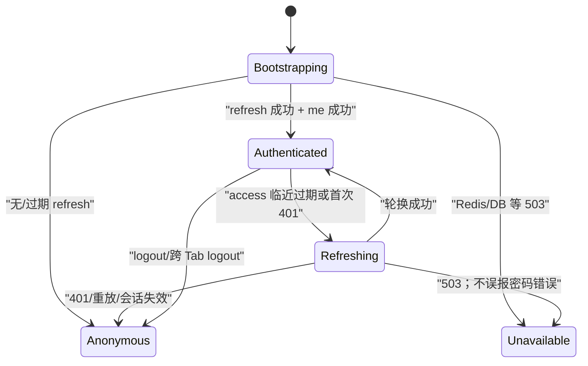

# 06 · 管理前端

[← 返回索引](README.md)

本文把 LiteMCP 管理后台定义为可实施、可测试的浏览器客户端。它只消费 `/api/v1/auth/*` 和 `/api/v1/admin/*`，不直接连接数据库、Redis、Docker、下游 MCP Server 或 Agent 数据面。领域状态、授权、秘密、版本发布和并发语义分别以 [01-data-model.md](01-data-model.md)、[02-admin-auth.md](02-admin-auth.md)、[03-service-crud.md](03-service-crud.md)、[04-stdio-sandbox.md](04-stdio-sandbox.md) 和 [05-agent-gateway.md](05-agent-gateway.md) 为真源；前端显示状态、收集意图和帮助恢复失败，但不复制或弱化后端不变量。

文中标记含义：

- **既定决策（MUST）**：第一版实现和验收必须满足。
- **建议（SHOULD）**：不改变领域/API 契约的增强项；暂缓时应记录原因。
- **后续可选（MAY）**：不进入第一版验收，UI 不得伪装成已支持。

## 1. 目标、边界与设计原则

### 1.1 第一版目标

- 覆盖登录、会话恢复、市场列表、三类服务的创建/查看/编辑、启停、删除/恢复、工具与版本状态、权限、API Key、构建/同步运行状态和 Agent 接入说明。
- 把 `desired_status`、`runtime_status`、`generation/observed_generation`、active revision/toolset 和 operation 状态分别呈现，不能用一个“启用”开关掩盖期望与实际状态的差异。
- 三类服务共享壳层、基础字段、状态、权限和 Agent 接入组件；类型专属配置使用 TypeScript discriminated union，禁止可选字段大杂烩。
- access JWT 仅驻留当前页面 JavaScript 内存；refresh token 仅由浏览器通过 HttpOnly Cookie 携带。多请求和多 Tab 刷新不得误触服务端重放检测。
- 完整、无损地编辑和预览 MCP 2025-11-25 Tool，默认 JSON Schema 2020-12；不认识的合法字段不能因 UI 往返而丢失。
- 达到 WCAG 2.2 AA 的键盘、焦点、错误识别、状态通知、对比度和响应式基线。

### 1.2 非目标

- 前端不是授权边界。隐藏按钮只改善体验；后端仍须逐请求检查当前用户、对象权限和 step-up。
- 第一版不在浏览器执行 MCP Tool、不提供通用 API 调试器、不展示原始 stdout/stderr、下游响应或未脱敏秘密。
- 第一版不做离线写入、跨设备草稿同步、实时多人编辑或乐观发布。服务配置使用后端 `row_version` 乐观锁和明确冲突处理。
- 第一版不实现 `oauth2` Agent 模式；读到该值时显示“当前版本不可配置/不可调用”，不得回退成 `none`。

### 1.3 成熟方案比较与取舍

| 方案/基线 | 可借鉴点 | LiteMCP 取舍 |
|---|---|---|
| React 声明式状态模型 | 先枚举 UI 状态，避免冗余、矛盾和深层重复状态 | **既定**：远端数据归 TanStack Query，URL 可分享状态归 Router，瞬时表单归表单层；不把 query 结果复制进全局 store |
| React Router Data Mode | 嵌套路由、路由级错误边界、lazy route | **既定**：负责页面/URL/权限入口和代码分割；API 缓存仍由 TanStack Query 统一管理，避免两套缓存失效规则 |
| TanStack Query | 稳定 query key、请求去重、失效和取消 | **既定**：读操作缓存；写操作默认不重试，成功后按资源精确失效；不对秘密和一次性 Key 明文建 query cache |
| HeroUI v3 + React Aria | compound components、语义交互、焦点和键盘基础能力 | **既定**：使用 HeroUI v3、Tailwind CSS v4 和语义 token；仍以 WCAG 验证结果而不是“组件库自带无障碍”作为验收证据 |
| Schema 驱动表单生成器 | 普通字段开发快 | **不作为唯一编辑器**：完整 JSON Schema、`_meta` 和 HTTP binding 的组合超出简单生成器安全范围；采用结构化编辑 + JSON 源码双视图和同一规范对象 |
| 浏览器持久化状态库 | 刷新后体验连续 | **禁止用于凭据/秘密**；第一版只允许持久化无敏感 UI 偏好（主题、表格密度），并做版本和 allowlist |

React 官方建议避免矛盾、冗余和重复状态；TanStack Query 的默认 stale/refetch/retry 行为需要显式理解和覆盖；HeroUI v3 基于 Tailwind CSS v4、React Aria 和 compound components。参考 [React · Choosing the State Structure](https://react.dev/learn/choosing-the-state-structure)、[TanStack Query · Important Defaults](https://tanstack.com/query/latest/docs/framework/react/guides/important-defaults) 和 [HeroUI v3 Introduction](https://heroui.com/docs/introduction)。

## 2. 技术栈与目录边界

### 2.1 依赖基线

**既定决策（MUST）**：

- React + TypeScript（`strict`）+ Vite。
- HeroUI **v3** + Tailwind CSS **v4**；不使用 v2 的 `HeroUIProvider`、旧主题包或 Framer Motion 组件模式。交互组件优先使用 HeroUI/React Aria 的 `onPress`、label、description、error slot 和 compound anatomy。
- React Router Data Mode；TanStack Query v5；axios 仅作为统一 HTTP transport。
- 表单采用 React Hook Form + 可表达 discriminated union 的运行时 Schema 校验器；具体校验器在实现前 ADR 锁定，前后端 OpenAPI 仍是网络契约真源。
- JSON Schema 2020-12 浏览器校验器必须显式加载 2020-12 dialect、禁用远程 `$ref` 自动获取并设置深度/大小预算；服务端校验是最终裁决。
- 测试使用 Vitest、React Testing Library、MSW、Playwright 和 axe-core（或等价可自动化无障碍检查器）。

所有版本以 lockfile 固定并由依赖更新 PR 单独验证。HeroUI v3 的包、导入顺序和 compound API 以其当期官方文档为准，禁止凭 v2 经验实现。

### 2.2 推荐目录

```text
frontend/src/
├── app/                    # providers、router、queryClient、ErrorBoundary
├── routes/                 # 路由模块；按页面 lazy import
│   ├── login/
│   ├── market/
│   └── services/
├── features/
│   ├── auth/               # 内存 token、refresh coordinator、guards
│   ├── services/           # list/detail/form/desired-status
│   ├── tools/              # ToolSchemaEditor、binding、只读详情
│   ├── operations/         # build/sync 状态与日志引用
│   ├── permissions/
│   └── api-keys/
├── components/             # 无领域含义的复用 UI
├── api/                    # axios、生成类型、Problem Details 映射
├── schemas/                # 前端表单 schema；不得手抄远端 read model
├── security/               # redaction、safe URL、clipboard policy
└── test/
```

依赖方向为 `routes -> features -> api/components`。`components` 不导入 feature；feature 不直接读取 axios singleton 内部 token；路由页面不手写 URL 字符串，统一经 typed path/query helper。禁止大而全的 `utils.ts` 和重新导出全部 UI 的 barrel file。

## 3. 信息架构与路由

### 3.1 路由表

| 路由 | 页面/权限 | 主内容 | 路由级失败 |
|---|---|---|---|
| `/login` | 匿名 | 登录表单；已认证则回到安全的内部 return path | 401 统一凭据错误；429 显示等待时间；503 显示依赖不可用 |
| `/market` | 已认证 | 可见 service 游标列表、筛选、排序、状态摘要 | 首屏 skeleton；空结果；可重试错误 |
| `/market/new?type=http_api\|mcp_http\|stdio` | editor 能力由提交裁决 | 创建向导 | type 非法回到类型选择；未保存离开确认 |
| `/market/:serviceId` | viewer | 概览、conditions、active revision/toolset 摘要 | 不可见/不存在统一 404；服务删除显示 tombstone |
| `/market/:serviceId/config` | editor 写，viewer 只读 | 分型配置、row_version、秘密 presence | 409 冲突恢复；422 字段定位 |
| `/market/:serviceId/tools` | viewer | active tools；editor 编辑 `http_api` 候选 | 无 active toolset、rejected 候选、超大列表分页 |
| `/market/:serviceId/activity` | viewer 摘要；日志按 02 权限 | build/sync/revision/toolset 历史、operation 详情 | 轮询失败与 operation 失败分开展示 |
| `/market/:serviceId/access` | viewer 读；editor 管 Key | Agent endpoint、鉴权模式、API Key、限流、配置片段 | `none` step-up、一次性 Key、复制失败 |
| `/market/:serviceId/permissions` | viewer 读；editor 写 | 成员角色和 creator 不变量 | 403、409、最后管理者/creator 拒绝 |
| `/teams` | 已认证 | 我所属团队 + 可加入的团队列表（全局 admin 见全部） | 空列表；无权限创建团队时隐藏入口 |
| `/teams/:teamId` | team member 读；team admin/全局 admin 写 | 团队信息、成员与角色、归属服务列表 | 403 保留只读信息；最后一个 team admin 保护 |
| `/users` | 全局 admin | 用户列表、创建、禁用/启用、角色变更 | 非 admin 404（不暴露路由存在） |
| `/audit` | 全局 admin；service 级摘要仍在 `/market/:serviceId/activity` | 跨服务、跨团队的全局审计事件浏览与筛选 | 非 admin 404；筛选为空态；导出/复制 request_id |
| `*` | 任意 | 404 页面 | 不泄露 service 是否存在 |

`/teams`、`/users`、`/audit` 是本文新增的一级路由，对应 [02-admin-auth.md](02-admin-auth.md) 12 章的团队角色模型和既有的全局用户管理、审计要求；它们与 `/market` 一起构成侧边导航的一级入口，具体布局见 [UI_UX_PLAN.md](../UI_UX_PLAN.md)。

父级 service layout 一次读取脱敏详情并渲染面包屑、类型、`desired_status`、`runtime_status`、权限角色和 tab outlet。tab 必须是可复制 URL，不能只存在组件 state。筛选、排序和分页游标放在 search params；编辑中的秘密、未提交 Schema 和弹窗状态绝不进入 URL。

React Router 采用嵌套路由、路由 `ErrorBoundary` 和 lazy module；不依赖服务端渲染专属 manifest。参考 [React Router · Data Mode](https://reactrouter.com/start/modes)、[React Router · Routing](https://reactrouter.com/start/data/routing) 和 [Route lazy/error boundary API](https://reactrouter.com/api/components/Route)。

### 3.2 市场列表

- 桌面（`>= 1024px`）为语义表格：名称、类型、期望状态、运行状态、鉴权、工具数、更新时间、动作。行展开只展示 conditions 和 active version 摘要；完整编辑进入详情 URL。
- 平板可隐藏低优先级列并保留“详情”动作；移动端（`< 640px`）切为卡片列表，不把宽表强塞入水平滚动。卡片字段顺序与桌面列语义一致。
- 类型和鉴权不能只靠图标/颜色：始终有 `HTTP API/STDIO/Remote MCP` 和 `API Key/无鉴权/OAuth2 未实现` 文本。
- 游标前进/后退历史保存在当前路由 state；刷新只保证当前 cursor 可恢复。筛选变化清空 cursor。列表项用 service ID 作 key，不用数组索引。
- `desired_status=enabled` 但 `runtime_status!=ready` 时同时显示“期望启用”和真实 condition/reason；不得显示绿色“已运行”。

### 3.3 创建与编辑不是一个假事务

原“五段式表单”保留为一致的信息结构：基础信息 → 类型专属配置 → 工具 → 权限 → Agent 接入，但不是单个巨型 POST：

1. 新建时，步骤 1–3 与 Agent 模式/服务级限流组成 service create command；`http_api` 可内嵌完整工具，`mcp_http/stdio` 分别产生 sync/build operation。
2. 新建“权限”步骤只说明 creator 自动获得不可移除的 editor；其他成员必须在 service 创建成功、有 `service_id` 后通过权限子资源修改。
3. API Key 也必须在 service 成功创建后生成。因此创建完成页引导进入“权限”和“Agent 接入”，不伪造跨资源原子提交。
4. 编辑时五个区块作为同一 detail workspace 的 tab/section 复用；配置 PUT、期望状态 PATCH、权限替换、Key 操作分别提交。

这样与 [03-service-crud.md](03-service-crud.md) 的 resource/operation 边界一致。只有后端未来提供经过设计的事务型复合端点，前端才可改成真正的一次提交。

## 4. 状态模型与 TanStack Query

### 4.1 状态所有权

| 状态 | 真源/容器 | 规则 |
|---|---|---|
| access/step-up token | auth module 内存 | 不进入 Query cache、Storage、URL、Redux DevTools、日志或错误对象 |
| 当前用户 | `['auth','me']` + 内存 token | refresh 后重取；登出清空整个用户私有 cache |
| service 列表 | `['services', normalizedFilters]` | 保留上页数据仅作视觉连续；新筛选清 cursor |
| service 详情 | `['services', serviceId]` | mutation 成功按响应更新并精确失效相关列表 |
| tools/history/operations/permissions/keys | 以 serviceId 和资源参数分层 query key | Key 查询只含 prefix/状态等脱敏元数据 |
| 表单草稿 | 表单实例 | 初值来自一次 snapshot；远端 refetch 不静默覆盖 dirty 字段 |
| dialog/toast/展开行 | 局部 state 或 URL | 可分享视图进 URL；短暂交互留局部 |

### 4.2 Query 默认值

- GET 可按资源设置 `staleTime`；service 列表/详情建议 15–30 秒，运行中的 operation 建议 2 秒轮询并按退避上限 10 秒，终态立即停止。窗口失焦时可暂停高频轮询，恢复时立即 refetch。
- 查询最多重试 2 次，只重试网络错误和明确可重试的 502/503；401、403、404、409、422、429 不走普通 query retry。429 尊重 `Retry-After`。
- mutation 默认 `retry: 0`。创建、更新、删除、Key 生成/吊销、权限替换和触发 build/sync 都不自动重放；只有后端明确提供幂等契约后才例外。
- 组件卸载、搜索条件变化和路由离开时把 `AbortSignal` 传给 axios；取消响应不弹错误 toast。
- mutation 成功优先使用响应中的 service/operation 更新对应 cache，再 `invalidateQueries`；不要 `invalidateQueries()` 全局刷新。TanStack 官方说明 mutation 成功后的精确 invalidation 以及等待 invalidation Promise 可保持 pending，见 [Invalidations from Mutations](https://tanstack.com/query/v5/docs/framework/react/guides/invalidations-from-mutations)。
- 不对服务 PUT 做乐观 UI。active revision/toolset、operation 终态和运行状态只能在服务端确认后显示。

### 4.3 异步 operation

`stdio`/`mcp_http` 创建或配置更新收到 `202 + operation` 后：

- 跳转详情并显示“期望配置已保存，正在构建/同步”，而不是“创建成功且可用”。
- 按服务端 `status_url` 轮询，不解析内部队列 ID；页面刷新后可从 activity 历史恢复观察。
- `queued/running` 用 progress/status；`succeeded` 后失效 service、tools、history；`failed/cancelled/superseded` 显示稳定 `error_code`、脱敏 summary、generation 和可执行下一步。
- operation 请求失败（例如轮询 503）与 operation 自身 `failed` 是两种状态：前者保留最后已知状态并重试，后者停止轮询且旧 active 版本仍明确可见。
- 对 `superseded` 文案使用“已有更新版本替代本次任务”，不诱导用户重复重试旧 generation。

## 5. API client、认证刷新与跨 Tab

### 5.1 Axios 边界

统一 client 固定 API base origin，并按 route family 分成 auth/admin 方法。请求拦截器仅对受信管理 API Origin附加 `Authorization`；login/refresh/logout 使用 `withCredentials` 和 `X-LiteMCP-Request: 1`。禁止接受业务数据提供的绝对 URL作为 axios 请求目标。

响应先解析 `application/problem+json` 兼容错误为：

```ts
type ApiProblem = {
  status: number;
  code: string;
  title?: string;
  detail?: string;
  request_id?: string;
  errors?: Array<{ pointer: string; code: string; message: string }>;
};
```

组件只依赖稳定 `code/status/pointer`，不得解析英文 `detail` 判断逻辑。错误遥测只记录 route template、status、code、request_id 和阶段；URL query、请求/响应 body、Authorization、Cookie、秘密字段和 Key 明文都不记录。

### 5.2 启动和刷新状态机



- app 启动时先进入阻塞式 `Bootstrapping`，在结果明确前不短暂渲染受保护页面或登录页。
- 同一 Tab 只有一个 module-level refresh Promise；并发 401 加入同一 Promise。原请求最多重放一次，并打内部 `_authRetried` 标记，防止循环。
- refresh/login/logout/reauth 请求本身、非管理 origin、AbortError、403 和业务 401 不进入 refresh interceptor。
- token 在过期前 30–60 秒可主动刷新；后台 Tab 不依赖 timer 准时，收到 401 仍走同一状态机。
- refresh 401：清 access/step-up、清用户私有 Query cache、广播 logout、导航 `/login` 并只显示“会话已结束”。refresh 503：保留当前页面的只读快照但禁止写入，显示“认证服务暂不可用”，提供重试；不得当作登出。

### 5.3 跨 Tab single-flight

**既定决策（MUST）**：优先使用同 Origin、HTTPS 下的 Web Locks API：

1. Tab 请求独占锁 `litemcp-admin-refresh-v1`；锁内再次检查最近一次 BroadcastChannel refresh 结果，避免无意义轮换。
2. 获锁 Tab 调用一次 refresh，把新 access token、绝对过期时间和随机事件 ID通过 `BroadcastChannel('litemcp-admin-auth-v1')` 发给等待 Tab；数据只赋给各 Tab 内存，绝不落盘。
3. 消息不含 refresh token/Cookie；接收方校验结构、时效和预期 issuer/audience（JWT 仍由服务端最终验证），重复事件 ID忽略。
4. logout、logout-all、密码变更、refresh reuse 通过同一 channel 广播 `session-ended`，所有 Tab 清内存和私有 cache。
5. Web Locks/BroadcastChannel 不可用的受支持浏览器，降级为进程内 single-flight；跨 Tab 会话刷新不满足安全基线时显示兼容性阻断，而不是用 `localStorage` 锁或存 token 冒险。

Web Locks 能在同 Origin tabs/workers 间排他协调，BroadcastChannel 能在同 Origin browsing contexts 间传递运行时消息，参考 [MDN · Web Locks API](https://developer.mozilla.org/en-US/docs/Web/API/Web_Locks_API) 和 [MDN · BroadcastChannel](https://developer.mozilla.org/en-US/docs/Web/API/BroadcastChannel)。该机制配合 [02-admin-auth.md](02-admin-auth.md) 的服务端 Redis 原子轮换；前端锁不能替代服务端重放检测。

### 5.4 Step-up

- 删除/恢复服务、批量替换权限、关闭 Agent 鉴权等动作先打开 reauth dialog，成功得到的 step-up JWT 只存内存并通过 `X-LiteMCP-Step-Up` 发送。
- 组件根据后端 action policy 请求 step-up，不能维护一份容易漂移的“敏感动作白名单”并绕过服务端挑战。
- step-up 过期只重开 reauth，不刷新普通 access；取消后回到原页面且不提交 mutation。密码字段在 dialog 关闭、失败或成功后立即清空。

## 6. 分型表单与提交语义

### 6.1 TypeScript 模型

```ts
type CommonFields = {
  name: string;
  description?: string;
  tags: string[];
  desired_status: "enabled" | "disabled";
  agent_auth_mode: "api_key" | "none" | "oauth2";
  rate_limit_qps: number | null;
  rate_limit_burst: number | null;
};

type ServiceDraft =
  | (CommonFields & { type: "http_api"; config: HttpApiConfig; tools: HttpToolDraft[] })
  | (CommonFields & { type: "mcp_http"; config: McpHttpConfig })
  | (CommonFields & { type: "stdio"; config: StdioConfig; sourcePackage: FileRef });

type SecretPatch =
  | { action: "keep" }
  | { action: "set"; value: string }
  | { action: "clear" };
```

- `type` 创建后不可修改。切换创建类型要重置类型专属字段并二次确认已输入内容会丢失。
- 只读字段（`runtime_status`、conditions、generation、observed_generation、active 指针、审计字段）不进入 command type。
- secret presence 只映射为 `keep`，绝不把掩码字符串当真实值；`set/clear` 使用 [03-service-crud.md](03-service-crud.md) 规定的三态契约。提交后立即从表单内存清除 secret value。
- `queue_max_depth/queue_timeout_ms` 只在 `stdio` 分支存在；跨类型字段在类型级和运行时级都拒绝。
- 表单状态使用 `idle/dirty/validating/submitting/succeeded/conflict/failed` 判别联合，避免多个 boolean 产生“不合法组合”。

### 6.2 类型专属内容

| 类型 | 可编辑 | 工具区 | 成功语义 |
|---|---|---|---|
| `http_api` | base URL、TLS/timeout、上游鉴权秘密、完整工具与 HTTP binding | 结构化 + JSON 双视图，可增删排序 | 合法请求可 201/同步更新；active toolset 原子可见 |
| `mcp_http` | server URL、transport/protocol preference、timeouts、TLS、上游秘密 | discovered toolset 只读；editor 可手动触发 sync | 202 仅表示排队；旧 active 在失败时继续服务 |
| `stdio` | 包、入口、runtime、公开/私密 env、资源/队列、健康检查、egress | probe 后工具只读；editor 可重建 | 202 仅表示排队；展示 build/probe/publish 分阶段状态 |

stdio 出网默认 `none`。改为 allowlist 时逐项填写协议/主机/端口，禁止把自由文本当 shell/network rule；明确提示仍禁止私网、metadata、DNS rebinding 和绕过 proxy。上传区显示文件名、大小、SHA-256 计算进度（仅用于用户确认，服务端摘要为准），并展示包格式/大小/文件类型限制；拒绝后只显示脱敏 reason code。

### 6.3 校验、提交和离开保护

- 输入级校验用于即时反馈，step 级校验用于导航，提交前运行完整 command 校验；后端 422 仍是最终结果。
- 后端字段错误以 JSON Pointer 映射到控件；未知 pointer 放入表单顶部错误摘要并保留 `request_id`。第一个错误获得焦点，摘要链接可定位到每一字段。
- 提交期间禁用重复提交但不锁死阅读/复制；按钮文案说明具体动作，如“保存并触发同步”，不统一写“确定”。
- 只有 dirty 且包含未提交更改时拦截站内导航/页面关闭；成功、reset 或仅远端 refetch 不误报。
- PUT 必须带当前 `row_version`。409 `CONCURRENT_MODIFICATION` 时保留本地草稿，展示当前服务器版本的非秘密摘要，提供“重新加载（丢弃本地）”和“以最新版本为基线重新应用”；不得自动覆盖或静默重试。
- `agent_auth_mode=none` 显示持续 danger banner、影响说明和 step-up；后端拒绝时保持原值。`oauth2` 第一版 disabled 并标为后续，不发送到创建 API。

## 7. Tool Schema 与 HTTP Binding 编辑器

### 7.1 规范对象与双视图

MCP Tool 的规范真源是一个完整 JSON 对象：`name/title/description/inputSchema/outputSchema/annotations/execution/icons/_meta` 加 LiteMCP 的 `http_binding`。MCP 2025-11-25 要求 input/output Schema 根为 object，未声明 `$schema` 时默认 2020-12，并要求未知 `_meta` 得以保留；详见 [MCP Schema Reference](https://modelcontextprotocol.io/specification/2025-11-25/schema) 和 [JSON Schema 2020-12](https://json-schema.org/draft/2020-12)。

编辑器提供：

- “结构化”视图：基本元数据、annotations 提示、task support、输入/输出 Schema 常见节点、HTTP method/path/参数位置/body/response mapping/timeout。
- “JSON 源码”视图：完整对象，支持格式化、折叠、JSON Pointer 错误和只读 diff；大型代码编辑器按路由动态加载。
- 两个视图操作同一个 canonical document。切换前先 parse + validate；失败则留在当前视图并定位错误。结构化视图不支持的合法关键字以“高级字段保留”显示，保存时原样 round-trip。
- `annotations` 明确标注为不可信提示，不能据此授予权限、跳过确认或决定网关重试。

### 7.2 校验层次

1. JSON syntax、文档字节数和深度。
2. MCP Tool 形状、名称唯一性、input/output 根 `type: object`、声明/默认 dialect。
3. JSON Schema 2020-12 meta-schema；禁止浏览器自动解析远程 `$ref`，不认识的 dialect 显示不支持而非降级解释。
4. HTTP binding 的每个参数引用都必须指向 input Schema 可达字段；path placeholder 一一对应；secret header/cookie 不能由工具参数覆盖。
5. 整套工具交叉校验后才允许提交；客户端 validation report 仅用于反馈，服务器必须重复全部校验并原子发布。

复杂 schema 的树节点使用稳定内部 ID而非 JSON Pointer 作 React key；数组重排后重新计算 pointer。递归渲染有最大展开深度和虚拟化阈值，超出时默认进入源码视图，防止恶意/误操作 Schema 卡死浏览器。

### 7.3 敏感与不可信展示

- description、title、`_meta`、远端 server instructions 和错误摘要默认以纯文本渲染；禁止 `dangerouslySetInnerHTML`。若后续支持 Markdown，必须先独立威胁建模、sanitize 并启用严格 CSP。
- 远程 icon 不直接以任意 URL/SVG 插入 DOM；只展示后端代理、校验并给出允许 MIME/尺寸的安全对象 URL，否则使用本地图标占位。
- JSON 预览有深度/长度上限、可取消格式化和“复制已脱敏内容”；不把整个 document 送入 analytics/error reporting。

## 8. 权限、API Key 与 Agent 接入

### 8.1 权限

- 页面显示后端返回的当前对象角色；viewer 看得到只读内容但所有写动作不可用，并说明原因。收到 403 后立即失效 detail/permission query，防止旧 UI 继续显示可写。
- 权限批量替换展示变更摘要，保留 creator editor 标记；提交需要 step-up。服务端拒绝 creator/最后管理者不变量时按稳定 code 给出可操作提示。
- 对不可见 service 的 404 使用统一页面，不区分不存在、已删除或无权访问。

### 8.2 API Key 一次性明文

- 生成 Key 的响应不进入 TanStack Query cache、全局 store、toast、日志或崩溃报告；mutation handler 直接把明文交给一次性 modal 的局部 state。
- modal 标题和正文说明“关闭后无法再次查看”。提供“复制”按钮和手动选中文本；Clipboard API 失败时不声称成功。复制成功使用 `role=status` 通知。
- 关闭 modal 立即把 React state 置空并卸载节点；不能承诺 JavaScript 垃圾回收或剪贴板绝对擦除，因此文案只承诺 LiteMCP 不会再次返回明文。
- 列表只显示 prefix、状态、创建/过期/最后使用时间和 key 级限流；吊销要求明确确认，成功后失效 key list。Key 值不得出现在 DOM data attribute、URL、测试 snapshot 或 analytics。

### 8.3 Agent 接入配置

- 显示从部署基址和 service ID生成的 `/mcp/{service_id}` URL、鉴权模式、MCP client `mcpServers` 示例和 curl 结构示例。
- `api_key` 模式用 `<YOUR_API_KEY>` 占位，只有一次性 modal 可选择“用刚生成的 Key 复制完整片段”；页面后续读取永远回到占位符。
- `none` 模式不显示 Authorization header，并持续显示“仅可信内网”的危险状态；关闭鉴权需要 step-up。
- 示例由结构化数据序列化，不使用字符串拼接把 service name/description 注入 JSON。复制前再次确认不会包含上游 secret、refresh/access token 或 step-up token。

OWASP 明确不应把 session identifier 放入 Web Storage；前端把 access/step-up 和 Key 明文限制在内存也与 [OWASP HTML5 Security Cheat Sheet](https://cheatsheetseries.owasp.org/cheatsheets/HTML5_Security_Cheat_Sheet.html) 一致。

## 9. 加载、空、错误与恢复状态

### 9.1 统一显示规则

| 场景 | UI | 可恢复动作 |
|---|---|---|
| 首次页面加载 | 与最终布局同尺寸 skeleton；保留页面标题 | 可取消的自动请求 |
| 后台 refetch | 保留旧数据，局部显示“正在更新” | 失败不清空旧数据，提供重试 |
| 真空列表 | 解释筛选结果或尚无 service | 清筛选/创建（有权限时） |
| 401 管理认证 | 仅首次进入 refresh；失败后登录 | 保留安全内部 return path，不含 query secret |
| 403 | 保留对象可见信息，禁用动作 | 刷新当前权限；不建议反复登录 |
| 404 | 统一不存在/不可见 | 回市场列表 |
| 409 | 保留草稿，显示并发冲突 | reload 或 rebase，不自动覆盖 |
| 422 | 顶部摘要 + 字段错误 | 聚焦、修正、再次提交 |
| 429 | 显示 Retry-After 倒计时 | 到期再允许操作；不自动重放 mutation |
| 502/503 | 区分上游/平台暂不可用 | 对安全关键 503 禁止写，手动重试 |
| operation failed | 旧 active 仍单独显示 | 按类型给重建/重同步/编辑配置动作 |
| 前端异常 | 最近路由级 ErrorBoundary | 重新渲染该路由；上报脱敏错误 ID |

toast 只用于不需要用户立即处理且另有持久结果的成功反馈；表单错误、Key 明文、构建失败、鉴权风险和删除结果必须在内容区/modal 内持久显示。所有错误展示 `request_id` 的复制按钮，但不展示堆栈、内部 URL、容器 ID、原始下游 body 或秘密。

## 10. 可访问性、国际化与响应式

### 10.1 WCAG 2.2 AA 基线

- 文档根 `lang=zh-CN`；每页一个可识别的 `h1`，提供 skip link、landmark、面包屑和一致 tab 名称。
- 所有动作可用键盘完成；焦点始终可见且不被 sticky header/modal 遮挡。打开 modal 后焦点进入，关闭后回触发器；删除行后焦点落到合理相邻项或页面标题。
- 每个字段有持久 label 和必要说明；placeholder 不能替代 label。错误用文本说明并通过 `aria-describedby` 关联，不只使用红色。
- 保存、复制、轮询成功/失败等非焦点变化用 `role=status`；阻断错误用节制的 `role=alert`。异步更新不得无故抢焦点。
- 状态 badge 同时包含文本/图标/形状；正常文本和控件对比度满足 WCAG，支持 `prefers-reduced-motion`、200% zoom/reflow 和系统高对比模式。
- pointer target 至少 24×24 CSS px；行点击不能是唯一入口，提供真正的 link/button。拖拽排序必须有键盘上移/下移替代。
- 超时、自动消失提示和一次性 Key modal 不能在用户阅读时自动关闭。

验收以 [WCAG 2.2](https://www.w3.org/TR/WCAG22/) 的 Focus Visible、Focus Not Obscured、Error Identification、Labels or Instructions 和 Status Messages 等成功准则为基线。自动 axe 扫描不能代替键盘和屏幕阅读器人工检查。

### 10.2 响应式和文案

- 断点遵循内容而非设备型号；320 CSS px 宽度仍可完成登录、查看 service、生成/吊销 Key和编辑常规字段。Schema 源码编辑器允许内部水平滚动，但页面本身不产生双向滚动。
- 破坏性动作不放在仅 hover 可见区；tooltip 只作补充，内容可用 Escape 关闭、可 hover 且可保持，符合 WCAG 的 hover/focus 内容规则。
- 第一版界面语言为简体中文，程序枚举/reason code 保持英文稳定值并配中文解释。日期以用户 locale 展示并可查看 UTC 原值；数字/持续时间统一格式化，不拼接难翻译碎片。

## 11. 安全与隐私实现清单

- 生产构建启用严格 CSP（无 `unsafe-inline`/`unsafe-eval`）、`frame-ancestors`、`nosniff`、Referrer-Policy；Vite source map 只上传到受控错误系统且不公开部署。
- 所有外部导航使用 allowlist；必须新窗口时添加 `noopener,noreferrer`。管理 API 返回的 URL 先按类型处理，不能直接变成可点击 `javascript:`/`data:` URL。
- 禁止在代码、环境注入、Vite `VITE_*`、静态资产或 source map 中包含服务端秘密。Vite 构建时变量视为公开信息。
- 禁止第三方 analytics/session replay 捕获表单、JSON editor、API Key modal、Authorization、URL query 或错误 body。若以后接入监控，采用 allowlist telemetry 和 `beforeSend` 二次脱敏。
- 敏感输入禁用 spellcheck 和不必要的 autocomplete；登录密码允许密码管理器，不能为“安全”禁用粘贴。
- 主题、列密度等无敏感偏好可存 `localStorage`，key 带版本且值经过 allowlist 校验；任何用户/service/tool/URL/凭据/草稿均不持久化。
- 所有后端文本当作不可信纯文本。React 默认转义不能成为使用 `dangerouslySetInnerHTML` 的免责理由。

## 12. 性能与可运维性

### 12.1 加载和渲染

- 按 `/login`、market、service detail、Schema editor 分 route chunk；代码编辑器、diff、JSON Schema validator 和图标预览按意图动态加载。不要在 app shell import 大型 editor。
- HeroUI 使用 v3 可 tree-shake 的组件/子路径导入；Tailwind 扫描范围只包含 frontend source。避免为了一个 icon 引入整套动态图标库。
- 列表 API 坚持游标分页；tool/history 大列表分页或虚拟化。低量 service 表优先语义 table，不为几十行过早引入虚拟化而破坏可访问性。
- 独立首屏请求并行启动；detail layout 的 service snapshot 供子页面复用，避免父子瀑布。输入驱动的大型 Schema 预览使用 debounce、`useDeferredValue` 或 worker，但保存校验不依赖被延迟的旧结果。
- 只 memoize 有测量证据的昂贵节点；派生值在 render 计算，不用 effect 复制状态。全局事件和 BroadcastChannel 每 app 只注册一次并在卸载时清理。

### 12.2 预算和测量

**既定验收预算**（正常生产 profile、冷缓存、中端桌面实验室环境，CI 记录趋势）：

- `/login` 与 `/market` 首屏关键 JS 各自 gzip 不超过 250 KiB；Schema editor 不进入两者初始 chunk。
- 单个 lazy editor chunk gzip 不超过 500 KiB；超过时必须有 bundle report 和拆分决策。
- 10,000 行/深层恶意 JSON 不允许同步格式化锁死主线程；达到文档预算时在解析前拒绝并提示大小上限。
- Lighthouse CI 的 Accessibility 不低于 95；Performance 趋势下降超过 5 分需人工审查。最终无障碍合规仍以第 10/13 节功能验收为准。

这些数字是项目预算，不是库的性能承诺；实施后根据真实 bundle baseline 可以收紧，放宽必须通过 ADR并附测量证据。

## 13. 测试与验收矩阵

### 13.1 单元/组件

- discriminated union：三类合法 command、跨类型字段、type 切换重置、secret `keep/set/clear`、只读字段不提交。
- auth state machine：boot、主动刷新、并发 401 单 promise、只重放一次、refresh 401/503 分流、logout 清 cache、step-up 过期。
- Problem Details：pointer 定位、未知 pointer 摘要、request_id、409 草稿保留、429 `Retry-After`。
- Tool editor：结构化↔源码无损 round-trip；`_meta`/未知扩展、2020-12 关键字、嵌套 object/array、enum、outputSchema、annotations、execution、icons；远程 `$ref` 不获取。
- Key modal：响应不进入 query cache/snapshot，关闭清 state，复制成功/失败状态准确。

### 13.2 集成（MSW/契约）

- OpenAPI 生成类型和 fixture 与后端 03 的 discriminator、状态码、operation、错误 code 一致；CI 做 breaking-change diff。
- PUT 带 `row_version`；409 后不丢草稿。202 不显示 ready；operation failed/superseded 后旧 active 仍可见。
- viewer/editor/admin 组合只影响可发现性和禁用状态；伪造请求仍由 mock/backend 403/404 验证。
- query key/失效范围：保存配置不会清空无关 service；权限丢失会失效对象详情；mutation 不自动 retry。

### 13.3 浏览器端到端

1. CLI 管理员登录 → 页面刷新由 refresh 恢复 → access 不出现在 Local/Session Storage、IndexedDB、Cookie 或 URL。
2. 同 Tab 10 个并发 401 只发 1 个 refresh；两个 Tab 同时过期不触发 `auth.refresh_reuse_detected`，logout 在所有 Tab 生效。
3. 市场筛选/游标/展开 → 深链详情 → 320px、200% zoom、键盘完成主要流程。
4. 创建 `http_api` + 完整工具 → 生成 Key → 一次性查看/复制 → 刷新后只见 prefix → 吊销。
5. 创建 `mcp_http`/`stdio` 收到 202 → 观察 queued/running/succeeded；注入 failed/superseded 时文案与旧 active 行为正确。
6. 两个页面编辑同一 service 触发 409；后提交页保留草稿并可重新应用。
7. `none` 模式要求 step-up、显示风险且配置片段无 Authorization；`oauth2` 不可提交。
8. axe 自动检查 + 键盘顺序、焦点回归、NVDA/VoiceOver 至少一种人工 smoke；状态变化由 live region 可感知。
9. canary secret/Key 扫描 DOM、Storage、console、network error、telemetry、截图/snapshot，均不得泄漏；一次性响应所在 Network 面板是浏览器固有限制，生产禁止共享调试会话。

### 13.4 完成定义

- [08-implementation-plan.md](08-implementation-plan.md) 第 8 步完成脚手架、auth/client/router 和错误边界；第 9 步完成三类业务页；第 10 步通过本节与 [09-verification.md](09-verification.md) 的联调路径。
- 所有路由都有 loading/empty/error/forbidden/not-found 状态；所有 mutation 有重复提交、失败和恢复路径。
- 页面不会把 desired、runtime、operation 和 active version 合并成虚假单一状态。
- 前端无 Token/Key/secret 持久化；跨 Tab 刷新、step-up、权限变化和服务端 fail-closed 语义与 02 一致。
- Tool document 无损往返、提交整套校验，未知扩展不丢失，失败不污染 active toolset。
- 桌面/移动端、键盘、屏幕阅读器和自动化测试均有可复现证据。

## 14. 分阶段实施、建议与后续

### 14.1 与总体计划的交付映射

1. **阶段 8（既定）**：Vite/React/HeroUI/Tailwind、Router、QueryClient、axios、Problem Details、内存 token、single-flight refresh、跨 Tab 协调、route ErrorBoundary、测试基础设施。
2. **阶段 9A（既定）**：market 列表、service layout、`http_api` 创建/编辑、ToolSchemaEditor、权限和 API Key；随 http_api 纵向链路验收。
3. **阶段 9B（既定）**：`mcp_http` 配置、sync operation/activity、discovered tools 只读视图。
4. **阶段 9C（既定）**：`stdio` 上传、资源/队列/egress、build/probe operation 和受限日志链接。
5. **阶段 10（既定）**：真实后端联调、跨 Tab/并发/故障注入、a11y 和 bundle budgets。

### 14.2 建议（SHOULD）

- 从后端 OpenAPI 生成只读/command/problem 类型和 API 函数，生成代码与手写 domain adapter 分目录；CI 检查未提交生成差异。
- 为 service/config/toolset 提供后端脱敏 diff 端点后，再增强 409 rebase 和发布前 review；前端不要自行 diff secret。
- 浏览器错误监控只发送 allowlist 字段并提供 request_id/correlation_id；默认关闭 session replay。
- 真实用户量和 Schema 大小出现前先采集 Web Vitals、route chunk 和 editor long task，再决定虚拟化/worker 优化。

### 14.3 后续可选（MAY）

- `oauth2` Agent 配置向导、MFA/WebAuthn/OIDC 登录，仅在 02/05 补齐后端契约后开放。
- 草稿/审批/四眼发布、版本图形 diff、批量 CRUD、OpenAPI importer、实时 operation 推送（SSE/WebSocket）。
- 多语言、可保存的无敏感视图偏好、命令面板和高级 schema 可视化；均不能改变 canonical document 或授权真源。

## 15. 权威参考

- [React · Managing State](https://react.dev/learn/managing-state)
- [React · Choosing the State Structure](https://react.dev/learn/choosing-the-state-structure)
- [React Router · Data Mode](https://reactrouter.com/start/modes)
- [React Router · Routing](https://reactrouter.com/start/data/routing)
- [TanStack Query v5 · Important Defaults](https://tanstack.com/query/latest/docs/framework/react/guides/important-defaults)
- [TanStack Query v5 · Invalidations from Mutations](https://tanstack.com/query/v5/docs/framework/react/guides/invalidations-from-mutations)
- [HeroUI v3 · Introduction](https://heroui.com/docs/introduction)
- [HeroUI v3 · 3.0 release architecture](https://heroui.com/en/docs/react/releases/v3-0-0)
- [W3C · Web Content Accessibility Guidelines 2.2](https://www.w3.org/TR/WCAG22/)
- [OWASP · HTML5 Security Cheat Sheet](https://cheatsheetseries.owasp.org/cheatsheets/HTML5_Security_Cheat_Sheet.html)
- [OWASP · AJAX Security Cheat Sheet](https://cheatsheetseries.owasp.org/cheatsheets/AJAX_Security_Cheat_Sheet.html)
- [MDN · Web Locks API](https://developer.mozilla.org/en-US/docs/Web/API/Web_Locks_API)
- [MDN · BroadcastChannel](https://developer.mozilla.org/en-US/docs/Web/API/BroadcastChannel)
- [MCP 2025-11-25 · Schema Reference](https://modelcontextprotocol.io/specification/2025-11-25/schema)
- [JSON Schema · Draft 2020-12](https://json-schema.org/draft/2020-12)
