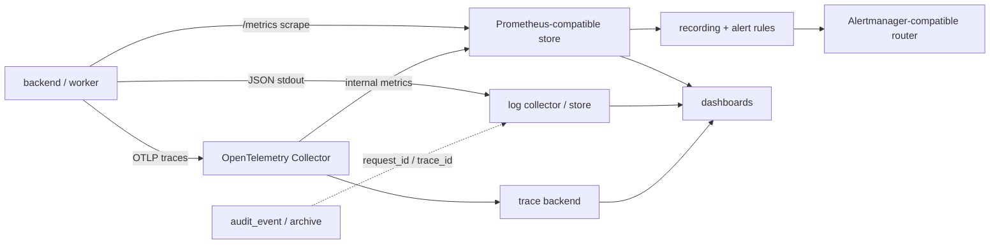

# 07 · 可观测性

[← 返回索引](README.md)

本文定义 LiteMCP 的 metrics、结构化日志、distributed trace、SLO、告警、仪表盘和运行手册契约。它覆盖管理控制面、Agent 数据面、build/sync/GC worker、stdio sandbox、关系数据库、Redis、StorageBackend 和遥测管道本身。普通运行日志与 [01-data-model.md](01-data-model.md) 的追加写 `audit_event` 是两个真源：前者用于诊断，后者用于归责，二者只能通过 `request_id/trace_id` 关联，不能互相替代。

文中承诺级别如下：

- **既定决策（MUST）**：第一版实现、部署和 [09-verification.md](09-verification.md) 验收必须满足。
- **建议（SHOULD）**：生产基线；若暂缓，必须记录原因、风险、负责人和补齐时间。
- **后续可选（MAY）**：不进入第一版能力声明，不得被 UI 或部署文档描述成已交付。

## 1. 目标、边界与方案取舍

### 1.1 目标

- 从用户症状出发回答：请求是否成功、是否变慢、流量如何、哪里饱和；Agent 请求同时区分 HTTP、JSON-RPC 和 MCP Tool 三层结果。
- 从资源出发回答：backend/worker CPU、内存、event loop、DB pool、Redis、stdio queue/container、storage 和 telemetry pipeline 是否利用过高、排队或出错。
- 每个告警必须能从仪表盘下钻到脱敏日志或 trace，并链接可执行 runbook。
- 所有信号有稳定名称、单位、低基数维度、保留/采样策略和容量预算；遥测故障不阻塞业务请求，但必须自监控。
- secrets、Token、Cookie、arguments/result、原始请求体和未经清洗的 stdout/stderr 不进入任何遥测信号。

### 1.2 不承担的职责

- metrics/logs/traces 最终一致，不承载配置、Session、限流桶或审计真源。
- `/livez` 只判断进程是否需要重启；`/readyz` 判断实例能否安全接流量。它们不能替代 SLO、synthetic probe 或依赖告警。
- MCP Tool 返回 `isError=true` 不必然表示 LiteMCP 网关故障；同理 HTTP 200 不代表 JSON-RPC/MCP 调用成功。
- 第一版不保存 tool arguments/result 以提供“调用回放”。若未来增加受控 payload capture，必须另做隐私、加密、授权、保留和审计设计。

### 1.3 成熟方案比较

| 方法/规范 | 适用点 | LiteMCP 取舍 |
|---|---|---|
| Google SRE 四个黄金信号 / RED | latency、traffic、errors、saturation 适合在线请求 | **既定**：管理 API、Agent gateway、connector 和 worker task 都至少有 rate/error/duration；成功与失败 latency 分开看 |
| USE | utilization、saturation、errors 适合资源排障 | **既定**：DB pool、executor、stdio queue/container、disk 和 OTel Collector 必须覆盖 USE，而不是只看 CPU |
| Prometheus/OpenMetrics | 可聚合 counter/gauge/histogram、recording/alert rules、exemplar | **既定**：Prometheus text/OpenMetrics 暴露；采用 base unit、`_total/_seconds/_bytes` 命名和 server-side quantile；不使用客户端 Summary |
| OpenTelemetry semantic conventions | 跨语言的 resource、HTTP span/metric、log correlation 和 W3C context | **既定**：HTTP 自动埋点服从当前锁定的 semconv 版本；LiteMCP 域属性放在 `litemcp.*`；升级 semconv 必须显式迁移，禁止静默改名 |
| Google SRE SLO burn-rate alert | 以用户影响和 error budget 消耗告警 | **既定**：page 使用 multi-window multi-burn-rate；低流量服务增加最小事件数/synthetic probe，避免单个失败直接 page |
| OWASP Logging | 安全事件、日志注入和敏感数据排除 | **既定**：统一 allowlist schema + redaction；未知字段和控制字符在 sink 前处理；审计独立 |

依据：[Google SRE 四个黄金信号](https://sre.google/sre-book/monitoring-distributed-systems/)、[USE Method](https://www.brendangregg.com/usemethod.html)、[Prometheus naming](https://prometheus.io/docs/practices/naming/)、[OpenTelemetry semantic conventions](https://opentelemetry.io/docs/concepts/semantic-conventions/)、[Google SRE SLO alerting](https://sre.google/workbook/alerting-on-slos/)、[OWASP Logging Cheat Sheet](https://cheatsheetseries.owasp.org/cheatsheets/Logging_Cheat_Sheet.html)。

## 2. 总体架构与信号所有权



**既定**：

1. `prometheus-client` 在独立运维 listener 暴露 `/metrics`；开发环境可与业务 listener 共端口，生产 SHOULD 分端口或由反向代理/NetworkPolicy 只允许 scraper。它不挂管理 JWT，但绝不能公网匿名可达。
2. `structlog` 向 stdout 输出单行 UTF-8 JSON，由运行环境采集；应用不自行轮转共享文件。
3. backend、worker 和 sandbox control-plane 使用 OpenTelemetry API/SDK，默认 W3C `tracecontext` propagator，通过 OTLP 发送 Collector；Exporter/Collector 失败不得增加业务路径 deadline 或使请求失败。
4. Prometheus pull 是 metrics 真源；禁止同时从同一进程以 OTLP 和 `/metrics` 导出同名应用指标造成重复序列。OTel Collector 负责 trace 的 batch/retry/filter，日志是否经 OTLP 由部署选择。
5. `service.name` 固定为 `litemcp-backend`、`litemcp-worker`、`litemcp-sandbox-controller`；resource 至少含 `service.namespace=litemcp`、`service.version`、`deployment.environment.name`、`service.instance.id`。`service.instance.id` 只作为 resource/target label，不复制到每个业务 metric label。

若使用 Gunicorn/多 worker，必须启用并测试 `prometheus-client` multiprocess mode，清理退出 worker 的 gauge shard；或为每进程提供独立 scrape target。禁止多个 worker 竞争写同一个普通 registry 文件。Collector 生产部署 SHOULD 启用 sending queue、指数退避；无法接受 Collector 重启丢失时使用 file-backed WAL，并监控 queue/drop 指标，参见 [OTel Collector resiliency](https://opentelemetry.io/docs/collector/resiliency/) 和 [internal telemetry](https://opentelemetry.io/docs/collector/internal-telemetry/)。

## 3. 关联标识与传播规则

| 标识 | 生成与可信度 | 允许出现 | 禁止出现 |
|---|---|---|---|
| `trace_id/span_id` | OTel SDK 生成或从合法 `traceparent` 提取；外部值只用于关联，不作为身份/授权证据 | trace、同上下文日志、histogram exemplar | 普通 Prometheus label、审计主体字段 |
| `request_id` | ingress 校验 `X-Request-ID`：仅 `[A-Za-z0-9._-]`、1–128 字节；不合法则重生；响应回显 | 日志、错误响应、审计；trace attribute | metric label、span name |
| `correlation_id` | 一个业务 workflow 的稳定 ID，如 build/sync/GC；服务端生成 | 日志、审计、trace attribute | metric label |
| `service_id` | 数据库稳定 UUID，非秘密但可枚举租户资源 | 受控 metrics、日志、trace、审计 | span name、URL route label |
| `build_run_id/tool_sync_run_id/task_id/session_id/api_key_id` | 运行实体标识，潜在高基数/敏感 | 受限日志/trace；审计按 01/05 的规则 | 所有 metric label；Session/Key 原值不进普通日志 |

- HTTP 入站提取有效 W3C `traceparent`，始终生成独立 `request_id`。`tracestate` 只交给合规 propagator 处理；不接受或转发任意客户端 `baggage`，因为 baggage 会跨信任边界传播且没有内建完整性保护，参见 [OTel Baggage security](https://opentelemetry.io/docs/concepts/signals/baggage/)。
- `http_api/mcp_http` 下游请求注入 `traceparent/tracestate`；不得传播 Agent 的 Authorization、Cookie 或 baggage。若目标出网策略显式禁止诊断 Header，则保留本地 CLIENT span，不注入。
- stdio MCP wire 不能增加私有 JSON-RPC 字段。controller 的 logical connector span 包含 queue/write/read；runner/process 侧 span 通过受控内部 envelope 的 span context 建立 **link**，不得把 trace context 塞进 tool arguments 或环境变量。
- 异步 build/sync/GC：提交短事务的 PRODUCER span 结束后，worker 的 CONSUMER root span 使用 stored task context/link；不伪造跨数分钟/小时的父子 span。stored context 有 TTL，不能成为任务授权凭据。
- OpenMetrics exemplar MAY 把采样 trace 的 `trace_id/span_id` 附到 duration histogram，绝不把 ID 变成常规 series label；参见 [OpenMetrics exemplar](https://prometheus.io/docs/specs/om/open_metrics_spec/)。

## 4. Metrics 契约

### 4.1 通用规则和基数预算

所有应用 metric 以 `litemcp_` 开头；Counter 使用 `_total`，时间只用 seconds，容量只用 bytes，ratio 为 0–1。Histogram 由 Prometheus 端计算 quantile，不在客户端发 p95/p99 gauge。`HELP/TYPE` 必须存在，metric/label 的含义变更视为 breaking change。

**允许的有界 label**：`plane=admin|agent|worker|sandbox`、路由模板 `route`、`method`、`operation`、`connector_type=http_api|mcp_http|stdio`、`outcome`、稳定 `reason_code/error_type`、`auth_mode`、`limit_scope`、`phase`、`state`、`worker_type`、`dependency`、`db_system`。HTTP status 使用 `status_code` 或 `status_class`，同一 metric 固定一种。

**禁止 label**：`request_id/trace_id/span_id`、IP、username/user_id、API Key/public_id、Session/Task/build/revision/toolset/container ID、User-Agent、完整 URL/host、query、exception message、tool arguments/result、secret、任意客户端值。`route` 必须是 `/mcp/{service_id}` 这类模板，不能是实际 path；`tool_name` 不进入基线指标。

`service_id` 是项目明确要求的受控维度，只允许出现在下表标记为 `service_id*` 的 service-scoped 指标。部署配置 `OBS_METRICS_MAX_SERVICE_LABELS`（默认 500）定义同时暴露的 active service 上限：超限服务统一写 `service_id="__overflow__"` 并增加 `litemcp_observability_cardinality_overflow_total{dimension="service_id"}`，具体服务仍由日志/trace 定位。禁止动态 LRU 删除 label 造成时间序列抖动。生产每 scrape target 默认总 series budget 为 50,000，达到 80% warning、100% critical；扩容前用 `promtool tsdb analyze` 或等价工具验证。

### 4.2 稳定指标名

以下为第一版稳定 public contract；实现可增加 process/runtime 标准指标，但增加新的高基数维度须评审。

#### HTTP、Gateway 与鉴权

| Metric | 类型 | Labels | 含义 |
|---|---|---|---|
| `litemcp_http_server_requests_total` | Counter | `plane,route,method,status_class,outcome` | 管理/Agent HTTP 请求总数 |
| `litemcp_http_server_request_duration_seconds` | Histogram | `plane,route,method,outcome` | 从首字节解析到响应完成；SSE 只量握手，连接寿命另记 |
| `litemcp_http_server_requests_in_flight` | Gauge | `plane,route` | 当前 HTTP 请求数 |
| `litemcp_mcp_requests_total` | Counter | `service_id*,operation,connector_type,outcome,reason_code` | MCP operation；`reason_code="none"` 表示无错误 |
| `litemcp_mcp_request_duration_seconds` | Histogram | `service_id*,operation,connector_type,outcome` | MCP logical request，含排队和所有 connector attempt |
| `litemcp_mcp_requests_in_flight` | Gauge | `service_id*,operation,connector_type` | 当前 MCP 请求数 |
| `litemcp_mcp_tool_results_total` | Counter | `service_id*,connector_type,result` | `result=success|is_error|gateway_error|cancelled`，与 HTTP outcome 分离 |
| `litemcp_agent_auth_attempts_total` | Counter | `auth_mode,outcome,reason_code` | Agent 鉴权结果；不带 key/user |
| `litemcp_admin_auth_attempts_total` | Counter | `operation,outcome,reason_code` | login/refresh/reauth/JWT 验证 |
| `litemcp_rate_limit_decisions_total` | Counter | `scope,outcome` | `scope=service|key`，`outcome=allow|deny|degraded_allow` |
| `litemcp_rate_limit_degraded` | Gauge | `dependency` | Redis 限流 fail-open 窗口为 1 |
| `litemcp_rate_limit_degraded_transitions_total` | Counter | `transition,reason_code` | enter/recover；与 Session Redis fail-closed 分开 |
| `litemcp_mcp_session_operations_total` | Counter | `operation,outcome,reason_code` | create/read/delete/expire/resume；不带 session ID |
| `litemcp_mcp_sse_connections` | Gauge | `state` | active/buffered stream 数 |
| `litemcp_mcp_sse_events_total` | Counter | `outcome` | sent/replayed/dropped/oversize |

`outcome` 固定枚举：`success|client_error|denied|rate_limited|tool_error|dependency_error|internal_error|cancelled`。HTTP status、JSON-RPC error、MCP `isError` 分别在 HTTP、MCP request、tool result metric 中表达，禁止只用 status code 推断工具成功率。

#### Connector、resilience 与依赖

| Metric | 类型 | Labels | 含义 |
|---|---|---|---|
| `litemcp_connector_calls_total` | Counter | `service_id*,connector_type,outcome,reason_code` | logical connector 调用 |
| `litemcp_connector_call_duration_seconds` | Histogram | `service_id*,connector_type,outcome` | connector 全程 |
| `litemcp_connector_attempts_total` | Counter | `connector_type,outcome` | 物理 attempt，验证“默认不 retry tools/call” |
| `litemcp_connector_retry_total` | Counter | `connector_type,reason_code` | 受控重试次数 |
| `litemcp_connector_circuit_breaker_state` | Gauge | `service_id*,connector_type,state` | one-hot `closed|open|half_open` |
| `litemcp_connector_circuit_breaker_transitions_total` | Counter | `connector_type,from_state,to_state,reason_code` | 状态迁移 |
| `litemcp_dependency_operations_total` | Counter | `dependency,operation,outcome,reason_code` | `postgres|mysql|redis_session|redis_rate_limit|storage|docker` |
| `litemcp_dependency_operation_duration_seconds` | Histogram | `dependency,operation,outcome` | 依赖延迟 |
| `litemcp_db_pool_connections` | Gauge | `db_system,state` | `idle|in_use|overflow` |
| `litemcp_db_pool_wait_duration_seconds` | Histogram | `db_system,outcome` | pool saturation |
| `litemcp_executor_queue_depth` | Gauge | `executor` | docker-py/阻塞 I/O executor 排队 |
| `litemcp_executor_tasks_total` | Counter | `executor,outcome` | executor success/error/rejected |

#### Worker、发布、stdio 与存储

| Metric | 类型 | Labels | 含义 |
|---|---|---|---|
| `litemcp_worker_tasks_total` | Counter | `worker_type,outcome,reason_code` | build/sync/gc/key_rotation/outbox task |
| `litemcp_worker_task_duration_seconds` | Histogram | `worker_type,outcome` | worker task 执行时间 |
| `litemcp_worker_tasks_queued` | Gauge | `worker_type` | 等待任务数 |
| `litemcp_worker_oldest_task_age_seconds` | Gauge | `worker_type` | 最老 queued/running task 年龄 |
| `litemcp_toolset_publications_total` | Counter | `source_kind,outcome,reason_code` | validate/activate/reject/supersede/rollback 结果 |
| `litemcp_toolset_publication_duration_seconds` | Histogram | `source_kind,outcome` | 候选产生至终态，网络/构建不在 DB 锁内 |
| `litemcp_stdio_instances` | Gauge | `service_id*,state` | `starting|running|backoff|quarantined|stopping` |
| `litemcp_stdio_pool_size` | Gauge | `service_id*` | 当前实例池大小（不超过 `stdio_instance_max`） |
| `litemcp_stdio_instance_inflight` | Gauge | `service_id*` | 池内全部实例当前在途 `tools/call` 总数（不超过 池大小 × `stdio_concurrency_per_instance`） |
| `litemcp_stdio_instance_start_duration_seconds` | Histogram | `outcome` | create 到 initialize 成功/失败 |
| `litemcp_stdio_instance_restarts_total` | Counter | `reason_code` | crash/health/OOM/PID 等重启 |
| `litemcp_stdio_resource_limit_events_total` | Counter | `resource,action` | cpu/memory/pids/disk/output；throttle/kill/reject |
| `litemcp_stdio_queue_depth` | Gauge | `service_id*` | 当前服务 queue depth |
| `litemcp_stdio_queue_wait_duration_seconds` | Histogram | `service_id*,outcome` | 入队到开始/超时/拒绝 |
| `litemcp_stdio_queue_rejections_total` | Counter | `reason_code` | full/timeout/shutdown/quarantined |
| `litemcp_stdio_protocol_errors_total` | Counter | `phase,reason_code` | invalid_json/stdout_pollution/oversize/late_response |
| `litemcp_stdio_stderr_dropped_bytes_total` | Counter | `reason_code` | stderr 有界缓冲丢弃字节 |
| `litemcp_sandbox_egress_decisions_total` | Counter | `phase,outcome,reason_code` | build/runtime allow/deny；不带 host/IP |
| `litemcp_storage_bytes` | Gauge | `backend,kind,state` | artifact/image/cache/temp 逻辑占用；宿主物理磁盘另用 node exporter |
| `litemcp_storage_gc_objects_total` | Counter | `backend,kind,outcome,reason_code` | GC 结果 |

#### 审计与遥测自监控

| Metric | 类型 | Labels | 含义 |
|---|---|---|---|
| `litemcp_audit_events_total` | Counter | `action_group,result` | 审计写入/分发结果，不替代 audit_event |
| `litemcp_audit_outbox_pending` | Gauge | — | 待分发条数 |
| `litemcp_audit_outbox_oldest_age_seconds` | Gauge | — | 最老未分发事件年龄 |
| `litemcp_observability_redactions_total` | Counter | `signal,rule` | 被 mask/drop 的敏感字段数；不保存值 |
| `litemcp_observability_export_failures_total` | Counter | `signal,reason_code` | 应用 exporter/handler 失败 |
| `litemcp_observability_cardinality_overflow_total` | Counter | `dimension` | 超过 label budget 的观测数 |
| `litemcp_build_info` | Gauge | `version,commit,python_version` | 恒为 1；commit 不得包含分支/用户名 |

### 4.3 Histogram buckets

所有实例使用相同显式 bucket，保证可聚合；SLO threshold 必须恰好是 bucket boundary。变更 bucket 会改变 series，必须走兼容迁移。

| Bucket profile | Seconds/bytes boundaries | 使用者 |
|---|---|---|
| `http` | `0.005,0.01,0.025,0.05,0.1,0.25,0.5,1,2.5,5,10,30` | HTTP server、auth、依赖短操作 |
| `mcp_call` | `0.01,0.025,0.05,0.1,0.25,0.5,1,2.5,5,10,30,60,120,300` | MCP/connector logical call |
| `queue_wait` | `0.001,0.005,0.01,0.05,0.1,0.25,0.5,1,2.5,5,10,30` | stdio/executor/DB pool wait |
| `worker` | `1,5,10,30,60,120,300,600,1200,1800,3600` | build/sync/GC/publication |
| `payload_bytes` | `1024,4096,16384,65536,262144,1048576,4194304,10485760` | 仅未来确需 payload size histogram；不按 tool/service 再拆 |

Prometheus 新部署 MAY 使用 native histogram，但在双方言/compose 基线和 dashboard/alert rules 全部验证前，classic histogram 是兼容真源；不要同时查询二者导致重复。参考 [Prometheus histograms](https://prometheus.io/docs/practices/histograms/)。

## 5. 结构化日志契约

### 5.1 Envelope schema

所有日志是单行 JSON，字段使用 snake_case；遵循 OTel Log Data Model 的 timestamp/severity/body/resource/attributes/trace context 语义，参见 [OTel Logs Data Model](https://opentelemetry.io/docs/specs/otel/logs/data-model/)。最低 schema：

```json
{
  "timestamp": "2026-08-09T12:34:56.123456Z",
  "observed_timestamp": "2026-08-09T12:34:56.123789Z",
  "severity_text": "INFO",
  "event_name": "gateway.request.completed",
  "message": "MCP request completed",
  "schema_version": 1,
  "service_name": "litemcp-backend",
  "service_version": "1.0.0",
  "deployment_environment": "prod",
  "instance_id": "backend-7c9d",
  "trace_id": "4bf92f3577b34da6a3ce929d0e0e4736",
  "span_id": "00f067aa0ba902b7",
  "request_id": "req_01J...",
  "correlation_id": null,
  "plane": "agent",
  "service_id": "...",
  "operation": "tools/call",
  "connector_type": "stdio",
  "outcome": "success",
  "reason_code": "none",
  "duration_ms": 23.4
}
```

要求：

- `timestamp` 为事件发生 UTC；collector 添加 `observed_timestamp`。`event_name + schema_version` 唯一确定字段结构。
- 有 active span 时必须写 `trace_id/span_id`；没有 trace 时仍写 `request_id/correlation_id`。日志关联依赖 ID 字段，而不是把 ID拼进 message。
- `message` 是稳定、简短的人读摘要；查询和告警只依赖 `event_name/outcome/reason_code`，不解析 message。
- exception 仅在 ERROR/DEBUG 受限 sink 使用 `exception.type`、脱敏 `exception.message` 和采样 stack；普通客户端错误不打印 stack。控制字符、换行和 ANSI escape 在序列化前清洗，防日志注入。
- `duration_ms` 是日志可读字段；metric/trace 的规范单位仍为 seconds/nanoseconds。所有字段有长度/深度上限，超限截断并写 `truncated_fields`，不能让 logging exception 反向打断业务。

### 5.2 稳定事件目录

| Event name | Level | 必备附加字段 |
|---|---:|---|
| `http.request.completed` / `gateway.request.completed` | INFO；5xx ERROR | `route,method,status_code,operation,outcome,reason_code,duration_ms,response_bytes` |
| `gateway.auth.denied` | WARN | `auth_mode,reason_code`；只记录 key selector 的短 HMAC（若安全调查确需） |
| `gateway.rate_limited` / `gateway.rate_limit.degraded` | WARN/ERROR | `limit_scope,transition,reason_code` |
| `gateway.session.failed` / `gateway.sse.resume_failed` | WARN | `operation,reason_code`；禁止 session ID 原值 |
| `connector.call.completed` / `connector.retry` | INFO/WARN | `connector_type,attempt,outcome,reason_code,duration_ms` |
| `connector.circuit.transition` | WARN | `from_state,to_state,reason_code` |
| `worker.task.started/completed` | INFO/ERROR | `worker_type,correlation_id,generation,outcome,duration_ms` |
| `publication.completed` | INFO/WARN | `source_kind,generation,outcome,reason_code`；revision/toolset ID 仅日志 |
| `sandbox.build.phase` | INFO/ERROR | `build_run_id,phase,artifact_digest,outcome,duration_ms` |
| `sandbox.instance.transition` | INFO/WARN | `instance_id,state,reason_code,restart_count`；container short ID 仅受限 sink |
| `sandbox.protocol.failed` | ERROR | `phase,reason_code,bytes_seen`；不附 stdout/result |
| `sandbox.egress.denied` | WARN | `phase,policy_rule,reason_code`；host/IP 默认 HMAC 或网段分类 |
| `audit.write.failed` / `audit.outbox.lagging` | ERROR | `action_group,reason_code,pending,oldest_age_seconds` |
| `observability.export.failed` | ERROR（本地限频） | `signal,reason_code,dropped_count`；防递归写同一失败 exporter |

高频成功事件可按 event 单独采样，但 `WARN/ERROR`、security event、build/publish state transition、circuit transition 和 audit failure 不采样。重复错误使用 token-bucket 限频并周期输出 suppressed count，不能完全静默。

## 6. Trace 与 span 拓扑

### 6.1 命名和属性

Span name 必须低基数：HTTP 自动 span 使用 `POST /mcp/{service_id}`；领域 span 使用 `mcp tools/call`、`connector call`、`worker build`，绝不嵌入 service/tool/request ID。HTTP CLIENT span 服从锁定的 [OTel HTTP span conventions](https://opentelemetry.io/docs/specs/semconv/http/http-spans/)；业务属性使用：

- `litemcp.plane`、`litemcp.service.id`、`litemcp.mcp.operation`、`litemcp.connector.type`；
- `litemcp.outcome`、`litemcp.reason_code`、`litemcp.tool.result`；
- `litemcp.config.generation`、`litemcp.toolset.version`（数字版本，不写原始 Schema）；
- `litemcp.queue.wait_seconds`、`litemcp.retry.attempt`、`litemcp.circuit.state`。

禁止 span attribute/event：Authorization/Cookie/token/API Key、arguments/result、request/response body、query string、stdio stdout/stderr、decrypted env、完整 downstream URL、exception local variables。`service_id/tool_name/build_run_id` 可在 trace attribute 中用于单 trace 排障，但受 attribute 数量/长度和 backend retention 限制；tool name 不进入 span name。

### 6.2 Agent 同步调用

```text
POST /mcp/{service_id}                         SERVER
├─ litemcp gateway policy                     INTERNAL
│  ├─ db service snapshot                     CLIENT (自动 DB span，statement 清洗)
│  ├─ agent authenticate                      INTERNAL
│  ├─ rate limit service/key                  CLIENT/INTERNAL
│  └─ session load/update                     CLIENT
├─ mcp tools/call                             INTERNAL
│  ├─ stdio queue wait                        INTERNAL
│  └─ connector call                          INTERNAL
│     ├─ HTTP/MCP HTTP physical attempt        CLIENT（每 attempt 一个）
│     └─ stdio bridge write/read               INTERNAL
└─ stream response / SSE handshake             INTERNAL
```

logical call span 覆盖 queue、retry 和 result validation；每个实际 HTTP resend/redirect 是独立 CLIENT span并写 `http.request.resend_count`。显式客户端取消不标 Error；deadline、dependency、schema 和 internal failure 标 Error，并写稳定 `error.type/reason_code`。MCP `isError=true` 写 `litemcp.tool.result=is_error`，但若网关正确转发，SERVER span 不自动标 internal error。

### 6.3 后台任务、sandbox 与 MCP Tasks

```text
admin trigger / config publish                 SERVER
└─ enqueue build|sync                          PRODUCER

worker build|sync                              CONSUMER root (link enqueue context)
├─ load immutable revision                     CLIENT
├─ sandbox build                               INTERNAL
│  ├─ docker create/start/wait                  CLIENT
│  ├─ package scan / dependency install         INTERNAL
│  └─ artifact upload                           CLIENT
├─ sandbox probe                               INTERNAL
│  ├─ initialize                               INTERNAL
│  └─ tools/list + schema validate              INTERNAL
└─ toolset publication CAS                      CLIENT/INTERNAL

stdio connector call                          INTERNAL
└─ sandbox process operation                    INTERNAL (link，不修改 MCP payload)

MCP task create                                INTERNAL
└─ task execute                                 CONSUMER root (link task-create context)
```

任务跨进程 context 只用于 link/parent reference；worker 必须用自身当前 DB 状态重新授权并校验 generation。GC、密钥轮换和 audit outbox 同样各任务一个 CONSUMER root，不为轮询循环创建永不结束的 span。

## 7. SLI、SLO 与 error budget

### 7.1 事件分类

Agent availability 同时维护两个视角，避免把“代理正确返回下游错误”混成 LiteMCP 故障：

1. **Gateway SLI**：eligible 为语法合法且完成鉴权的 MCP 请求；good 为 LiteMCP 成功完成协议处理，或正确转发下游合规 `isError`。排除 malformed、auth denied、客户端取消；`internal_error`、Session store fail-closed、gateway 生成的 dependency error、queue/concurrency reject、无法 resume 的有效 SSE 计 bad。`rate_limited` 单列 capacity SLI，不混入 software availability。
2. **End-to-end Tool SLI**：eligible 为实际开始的 `tools/call`；只有 `tool result=success` 为 good。`is_error/dependency_error/timeout` 都 bad，用于 service owner 看用户真实成功率，但不能直接给 LiteMCP on-call 归责。

管理 API availability 排除 4xx（429 单列 saturation），5xx/timeout 为 bad。Build/sync 是 workflow：good 是在 deadline 内到达 `succeeded|rejected|superseded` 等确定终态；worker crash 后丢任务、无限 queued/running 或状态无法写回为 bad；用户包校验被拒绝不是平台 failure。

### 7.2 第一版目标

| SLO | Window | 初始目标 | SLI |
|---|---:|---:|---|
| Agent gateway availability | rolling 30d | 99.9% | `good gateway requests / eligible gateway requests` |
| Agent non-call latency | rolling 30d | 99% ≤ 500 ms | initialize/list/ping 成功请求 histogram；不含 SSE 生命周期 |
| Gateway overhead | rolling 30d | 99% ≤ 100 ms | policy+snapshot+auth+rate/session，不含 queue/downstream/tool execution |
| Management API availability | rolling 30d | 99.9% | 非 4xx 请求中非 5xx/timeout 比例 |
| Management read latency | rolling 30d | 99% ≤ 500 ms | 成功 GET/列表；批量下载另分 route |
| Build/sync terminalization | rolling 30d | 99% ≤ 15 min | 平台可处理任务在 15 min 内达确定终态；构建 hard timeout 仍服从 04 |
| Audit delivery freshness | rolling 30d | 99.9% ≤ 60 s | committed outbox 在 60 s 内写入/归档；同事务 audit_event 不受异步 sink 影响 |

这是自托管默认目标，不是对所有下游服务的商业承诺。部署可按容量测试收紧；降低目标必须有变更记录。低流量环境需 synthetic initialize/list probe（不调用有副作用 tool）并在 error-rate 告警加最小 eligible count。

### 7.3 Recording rules 与 burn rate

必须提供版本化 `deploy/observability/prometheus/rules/*.yaml`，至少预计算：

```text
litemcp:sli_gateway_eligible:rate5m
litemcp:sli_gateway_bad:rate5m
litemcp:sli_gateway_error_ratio:rate5m
litemcp:sli_gateway_error_ratio:rate30m
litemcp:sli_gateway_error_ratio:rate1h
litemcp:sli_gateway_error_ratio:rate6h
litemcp:sli_gateway_error_ratio:rate3d
litemcp:sli_gateway_latency_good_ratio:rate5m
```

`error_budget = 1 - objective`；`burn_rate = observed_bad_ratio / error_budget`。对 99.9%/30d SLO，page 条件采用 `(1h > 14.4x AND 5m > 14.4x) OR (6h > 6x AND 30m > 6x)`；ticket 采用 `(3d > 1x AND 6h > 1x)`。page 同时要求短窗 eligible ≥ 100，低流量由 synthetic probe/连续失败条件补足。该起点来自 [Google SRE multi-window multi-burn-rate](https://sre.google/workbook/alerting-on-slos/)，上线两周后依据流量和误报复盘，不能凭感觉频繁调阈值。

## 8. 告警、仪表盘和 Runbook

### 8.1 告警分级原则

- `page`：用户正在受影响或安全/审计证据可能丢失，值班人员现在有明确动作。
- `ticket`：缓慢耗尽、重复降级、容量接近边界或非紧急修复；有 owner 和截止时间。
- `info`：状态变化供看板/事件流，不通知人。

告警应尽量对症状而不是每个可能原因 page，并附 `summary,description,service,environment,severity,runbook_url,dashboard_url`；参考 [Prometheus alerting practices](https://prometheus.io/docs/practices/alerting/)。禁止 alert label 携带 service_id 以外的运行实体 ID；高服务数量时按 environment/connector 聚合 page，service 明细在 dashboard 展开。

### 8.2 必须规则

| Alert | Severity | 触发摘要 | Runbook |
|---|---|---|---|
| `LiteMCPGatewaySLOBurnFast` | page | 14.4x/6x 双窗口 burn | `RB-001-gateway-slo` |
| `LiteMCPGatewaySLOBurnSlow` | ticket | 3d/6h 1x burn | `RB-001-gateway-slo` |
| `LiteMCPValidTrafficAbsent` | ticket | 有 synthetic probe 但 eligible traffic/成功均消失 15m | `RB-001-gateway-slo` |
| `LiteMCPDatabaseUnavailable` | page | DB dependency errors 持续且 readiness 失败 | `RB-002-database` |
| `LiteMCPSessionStoreUnavailable` | page | `redis_session` failure 导致有效 Agent 请求 fail-closed | `RB-003-redis` |
| `LiteMCPRateLimitDegraded` | ticket；持续/滥用时 page | Redis rate-limit fail-open >5m | `RB-003-redis` |
| `LiteMCPStdioQueueSaturated` | page | queue reject/timeout + depth 接近 max，持续 10m | `RB-004-stdio-runtime` |
| `LiteMCPStdioRestartLoop` | page | restart/OOM/PID-limit 快速增长或 quarantine | `RB-004-stdio-runtime` |
| `LiteMCPBuildBacklogStuck` | ticket | oldest queued/running 超 workflow deadline | `RB-005-build-sync` |
| `LiteMCPPublicationFailureBurst` | ticket | 平台原因 failed 上升；用户 schema rejection 排除 | `RB-005-build-sync` |
| `LiteMCPAuditDeliveryLag` | page | outbox oldest >60s 或 audit write failed | `RB-006-audit` |
| `LiteMCPTelemetryDropping` | ticket；全盲时 page | app/Collector enqueue/export drops 持续 | `RB-007-telemetry` |
| `LiteMCPMetricCardinalityNearLimit` | ticket | series/service label budget >80% 或 overflow >0 | `RB-007-telemetry` |
| `LiteMCPStorageCapacityLow` | ticket/page | artifact/image/temp 磁盘预测 24h/4h 内耗尽 | `RB-008-storage-gc` |

规则仓库中的每个 alert 必须通过 `promtool check rules` 和 unit test；`runbook_url` 对应 `docs/runbooks/RB-*.md`，至少包含影响、确认查询、最近变更、依赖检查、安全的缓解/回退、升级联系人、恢复验证和事后动作。第一版 **必须交付规则与 runbook**；Alertmanager/外部 Pager 集成可按部署替换，但生产不能以“只暴露 metrics”宣称完成告警能力。

### 8.3 必须仪表盘

1. **Service overview**：SLO/error budget、QPS、success/tool error/gateway error、p50/p95/p99、in-flight、rate limit、top service（受控）、版本发布 annotation。
2. **Connector/dependencies**：按 connector 的 logical/attempt error、retry、breaker、DB pool wait、Redis session/rate-limit 分离、storage/docker latency。
3. **stdio sandbox**：instance states、startup、queue depth/wait/reject、restart/OOM/PID、protocol error、stderr drop、egress、CPU/memory/disk（node/container exporter）。
4. **Build/sync/publication**：queued/oldest age、phase duration、terminal outcome、superseded、CAS/publication、artifact/cache/GC。
5. **Security/audit**：auth denied/refresh reuse/Origin/SSRF/egress deny 聚合、audit write/outbox；无 username/key/IP 明细。
6. **Telemetry health**：scrape up、series cardinality、Collector queue/capacity/enqueue/send failure、log drop、trace sample rate/export failure。

每张图注明单位、query、数据源、空数据含义、SLO threshold 和 dashboard version；p99 使用 histogram quantile 且 `sum by (le,...)` 保留 `le`。发布/配置变更通过 annotation 关联 correlation ID，不作为 time-series label。

## 9. 安全、隐私、审计与脱敏

### 9.1 统一 allowlist 与 redaction

所有 signal 在 instrumentation 层只添加 schema allowlist 字段，sink/exporter 再做第二层 denylist/redaction。至少 drop/mask：

- `authorization,proxy-authorization,cookie,set-cookie,x-api-key` 及大小写/变体；
- password、access/refresh/step-up token、API Key、Fernet key/ciphertext、DB DSN、OAuth secret、私密 env；
- MCP arguments/result、HTTP body/query、完整 upstream error body、stdio stdout、未经清洗 stderr；
- Session/Task ID、原始 IP/User-Agent（安全审计按政策单独保存或 HMAC）。

redaction 在 exception serialization、structlog processor、OTel span processor/log exporter、build log collector 和 audit writer 共用同一规则包和 corpus test；顺序是 normalize key → exact/pattern match → value detector → size/depth truncate。检测到疑似 secret 时删除值而不是只替换固定前后缀，并增加 `litemcp_observability_redactions_total`。redactor 自身异常采取 fail-closed：丢弃可疑事件，输出不含原事件的本地最小错误。

### 9.2 Audit 边界

- 普通成功 MCP call 只写 log/metric/trace，不同步写 `audit_event`。
- 配置/权限/Key/secret/Agent auth mode/egress policy 变更、发布/回退/删除恢复、人工 retry/quarantine/GC、refresh reuse、跨主体 Session/Task、持续 SSRF/Origin/已吊销 Key 尝试按 01/02/04/05 写 append-only audit。
- audit 成功必须遵守同事务/outbox；普通日志“写成功”不能证明审计成功。audit sink failure page，业务事务是否 fail 按 [01-data-model.md](01-data-model.md) 的同事务语义，而非由 logging handler 决定。
- audit `changes` 对 secret 只写 `changed=true`；arguments/result 不入 audit。审计保留、归档和应用账号无 UPDATE/DELETE 权限独立于普通日志策略。

### 9.3 运维端点

- `/metrics`、`/livez`、`/readyz`、debug/profile endpoint 使用独立内网 listener 或 mTLS/NetworkPolicy；不能复用管理 JWT，也不能被 Agent API Key 访问。
- `/livez` 不访问外部依赖；event loop 卡死/进程不可恢复才失败。
- backend `/readyz` 检查 DB、必要的 Redis Session 能力和本地配置/密钥可用；Redis 仅 rate-limit 失败保持 ready 但进入 degraded。worker readiness 检查 DB、StorageBackend、rootless Docker socket/executor；不因某个远程 service 下游失败而整体 not-ready。
- health 响应只给 component/status/reason code，不给 DSN、host、stack、版本漏洞信息或服务清单。

## 10. 采样、保留与成本控制

| Signal | 开发默认 | 生产默认/最低要求 |
|---|---|---|
| Metrics | 15s scrape，7d | 15–30s scrape；raw 30d，5m recording/downsample 13mo；SLO 窗口不得长于可查询保留 |
| 普通 INFO log | 全量 3d | gateway completed 可确定性采样 10%，其余 INFO 14d；counter 仍全量 |
| WARN/ERROR/security log | 全量 14d | 不采样，在线 30d；security 按组织政策 90d+ |
| Trace | 100%，24h | parent-based ratio 10%，在线 7d；error/slow trace 30d（使用 tail sampling 时） |
| Audit | 依 01 | 独立至少 1 年或组织/法规要求；不可因日志到期删除 |
| Build log artifact | 依 artifact policy | 失败 30d、成功 7d 建议值；active/调查 hold 按引用和合规延长 |

**既定**：metrics counters/histograms 不采样；日志采样不得影响 audit/security transition；sampling decision 对相同 trace 一致。低流量环境先全量 trace，避免为了省小成本丢诊断性。生产无 tail sampler 时使用 `ParentBased(TraceIdRatioBased(0.10))`，但不能声称“所有 error trace 保留”；需要保证 error/slow 全保留时启用 Collector tail sampling，并监控其内存、queue 和 drop。官方对 head/tail trade-off 见 [OpenTelemetry Sampling](https://opentelemetry.io/docs/concepts/sampling/)。

保留期必须是配置和数据治理决策，按部署法律要求调整。删除/导出请求若涉及日志中的个人数据，由部署的数据控制方执行；LiteMCP 默认不把个人标识写入普通遥测以降低此负担。成本保护按 signal 分开限额，绝不能通过静默关闭 error/security/audit 信号解决超支。

## 11. 依赖故障与降级可观测性

| 故障 | 业务语义 | 必须信号 |
|---|---|---|
| DB 不可用 | 管理/Agent snapshot/auth fail-closed；readiness 失败 | dependency counter/duration、HTTP 503、ERROR log+trace、page |
| Redis rate-limit 不可用 | 05 的短期 fail-open，不影响 Agent 鉴权 | degraded gauge/transition、`degraded_allow`、持续告警 |
| Redis Session/auth store 不可用 | Session、login/refresh fail-closed | 独立 `redis_session` reason、503、page；不得与 rate-limit 聚合 |
| 下游 HTTP/MCP timeout/5xx | connector error；仅安全幂等白名单 retry | logical vs attempt、deadline、retry、breaker；Tool SLI bad |
| stdio queue/full/hung/crash | reject/timeout、kill/backoff/quarantine | queue USE、instance transition、resource limit、protocol reason、page |
| Docker daemon/executor 饱和 | build/runtime controller 降级 | dependency + executor queue、oldest task、readiness（worker） |
| Storage/Registry unavailable/full | build/GC/artifact 失败；active 已加载服务尽量继续 | bytes/capacity forecast、operation error、GC、ticket/page |
| OTel/log backend 不可用 | 业务继续；有界 queue 后允许丢普通 telemetry | local export/drop counter、Collector internal telemetry；不能递归日志风暴 |
| Prometheus scrape/rule/Alertmanager 失败 | 监控盲区 | 独立 blackbox/HA monitoring 检查 `up`, rule evaluation, notification |
| Audit store/outbox lag | 按 01 保证业务证据，不得伪装成功 | audit failure/pending/age、不可采样 ERROR、page |

## 12. 配置基线

| 配置 | 默认 | 约束 |
|---|---:|---|
| `OBS_METRICS_ENABLED` | `true` | 生产不允许关闭核心指标 |
| `OBS_METRICS_LISTEN` | `127.0.0.1:9464` | compose 可用内部 service network；禁止公网 bind |
| `OBS_METRICS_MAX_SERVICE_LABELS` | `500` | 超限进入 `__overflow__` 并告警 |
| `OBS_METRICS_SERIES_BUDGET` | `50000` | 每 target；80% warning |
| `OBS_LOG_LEVEL` | `INFO` | 运行时临时 DEBUG 有最长 30min TTL 和审计 |
| `OBS_LOG_SCHEMA_VERSION` | `1` | breaking field change 升版本 |
| `OTEL_SERVICE_NAME` | 按 component 固定 | 不允许客户端覆盖 |
| `OTEL_PROPAGATORS` | `tracecontext` | 第一版不启用 baggage |
| `OTEL_TRACES_SAMPLER` | `parentbased_traceidratio` | 开发 `always_on` |
| `OTEL_TRACES_SAMPLER_ARG` | `0.10` | 低流量可 1.0；配合 tail sampler调整 |
| `OTEL_EXPORTER_OTLP_TIMEOUT` | `3s` | exporter 异步有界，不能占业务 deadline |
| `OBS_REDACTION_RULESET_VERSION` | 部署显式 | backend/worker/build/audit 使用同版 |
| `OBS_SLO_WINDOW_DAYS` | `30` | metrics retention 必须覆盖 |

启动时校验 listener、service name、采样范围、label/series budget、redaction ruleset 和 OTLP endpoint TLS。非敏感生效配置写一次 `observability.config.loaded`；秘密、DSN、collector credential 不输出。

## 13. 验证与完成定义

### 13.1 单元与契约

- metric registry snapshot 检查本文所有名称、type、HELP、labels 和 buckets；Counter reset、Gauge one-hot/清理、histogram seconds 单位正确。
- outcome truth table 覆盖 HTTP 200 + Tool `isError`、JSON-RPC error、429、auth deny、client cancel、dependency timeout、queue reject；三层结果不会相互覆盖。
- label fuzz 证明实际 path/URL、request/trace/session/key/user/tool argument 不成为 label；创建超过 service label cap 后只出现 `__overflow__` 和 overflow counter。
- log JSON Schema contract 检查 event 必填字段、UTC、severity、trace correlation、控制字符清洗、truncate 和 logging failure 不影响请求。
- redaction corpus 至少包含大小写 Header、Bearer/Basic、JWT、`litemcp_` key、Cookie、DSN、Fernet、嵌套 dict/list、exception repr、CRLF/ANSI、stdio stdout/stderr；对 logs/traces/build logs/audit changes 全部扫描。
- span contract 使用 in-memory exporter 验证 kind、低基数 name、parent/link、error/cancel status、per-attempt CLIENT span 和无 payload/secret attributes。

### 13.2 集成与故障注入

1. 一次 Agent `tools/call` 可由 response `request_id` 找到 gateway/connector log 和完整 trace；duration histogram exemplar（backend 支持时）可跳到同一 trace。
2. build trigger → worker → sandbox probe → publication 跨进程通过 link/correlation ID 串联；旧 generation superseded 是业务终态而非平台 error。
3. 依次断开 DB、Redis rate-limit、Redis Session、下游、Docker、Storage、Collector/log backend；验证第 11 节业务行为、metric、log、span、readiness 和 alert，且遥测故障不拖慢业务 deadline。
4. stdio 触发 queue full、queue timeout、业务 `print()` 污染 stdout、oversize、OOM/PID limit、restart loop 和 quarantine；对应稳定 reason code、USE 图和 runbook 查询可定位。
5. scrape 多进程 backend，worker 重启/滚动升级，确认无重复 series、僵尸 gauge 或 counter 倒退误报；Prometheus/Collector 自身也被监控。
6. 运行 2× 预期峰值的 cardinality/load test 30min，registry series ≤ budget、日志/trace queue 有界、CPU/内存开销在容量预算内、无 exporter backpressure 传到请求路径。

### 13.3 SLO、规则与仪表盘验收

- `promtool check metrics/rules` 和 rule unit tests 通过；用合成 counter 序列证明 14.4x/6x/1x 告警在预期窗口 fire/reset，低流量单失败不误 page。
- 每个 alert 的 `runbook_url/dashboard_url` 可访问，runbook 命令是只读或明确标识破坏性/审批步骤；无“重启看看”式唯一处置。
- dashboard JSON/配置纳入版本控制；空流量、scrape down、真实零值可区分；所有单位、legend、threshold、histogram 聚合正确。
- 通过日志、trace、Prometheus label value 和 audit/build-log artifact 的自动 secret scan；注入 canary secret 后任何信号均不可检索到原值。
- metrics/raw retention 能计算完整 30d SLO；删除过期普通日志/trace 不影响 audit 保留和 toolset/artifact 回退语义。

完成定义：上述契约、规则、至少六张 dashboard、runbook、故障注入和 secret/cardinality tests 均随对应纵向切片交付；不能把 metrics 端点存在等同于“可观测性完成”。实施顺序与 [08-implementation-plan.md](08-implementation-plan.md) 对齐，整体验收并入 [09-verification.md](09-verification.md)。

## 14. 参考基线

- [OpenTelemetry Specification](https://opentelemetry.io/docs/specs/otel/)
- [OpenTelemetry HTTP semantic conventions](https://opentelemetry.io/docs/specs/semconv/http/)
- [OpenTelemetry Logs Data Model](https://opentelemetry.io/docs/specs/otel/logs/data-model/)
- [OpenTelemetry Sampling](https://opentelemetry.io/docs/concepts/sampling/)
- [W3C Trace Context](https://www.w3.org/TR/trace-context/)
- [Prometheus Metric and label naming](https://prometheus.io/docs/practices/naming/)
- [Prometheus Histograms and summaries](https://prometheus.io/docs/practices/histograms/)
- [Prometheus Alerting practices](https://prometheus.io/docs/practices/alerting/)
- [OpenMetrics 1.0 specification](https://prometheus.io/docs/specs/om/open_metrics_spec/)
- [Google SRE · Monitoring Distributed Systems](https://sre.google/sre-book/monitoring-distributed-systems/)
- [Google SRE Workbook · Alerting on SLOs](https://sre.google/workbook/alerting-on-slos/)
- [Brendan Gregg · USE Method](https://www.brendangregg.com/usemethod.html)
- [OWASP Logging Cheat Sheet](https://cheatsheetseries.owasp.org/cheatsheets/Logging_Cheat_Sheet.html)
