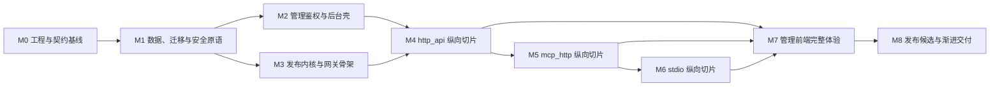

# 08 · 实施与交付计划

[← 返回索引](README.md)

本文把 [00-overview.md](00-overview.md) 的目标架构拆成可独立验收、可回退的纵向切片。它描述的是**待实现计划**，不是当前仓库能力清单；仓库目前只有架构文档，任何里程碑只有满足本文退出标准并产生可复核证据后，才可标记完成。

文中使用以下标记区分承诺：

- **[既定]**：第一版必须实现且进入发布验收。
- **[建议]**：推荐纳入第一版的工程增强；暂缓时必须记录 owner、风险和补齐条件。
- **[后续]**：本期不对外声明支持，必须由 feature flag/capability fail-closed。

## 1. 交付原则与方案取舍

### 1.1 计划原则

1. **安全能力先于高风险入口**：先完成秘密处理、对象级授权、原子发布、出网策略和资源预算，再开放远程连接、上传代码或 `none` 鉴权。
2. **纵向切片而非横向堆层**：每个业务切片同时交付 API、领域服务、持久化、worker/connector、最小 UI、日志指标和自动化验证；不以“表已建完”代替可用链路。
3. **候选版本与 active 版本隔离**：所有 build/sync/toolset 先进入 staging，经校验后 CAS 切换 active 指针；失败和旧 generation 只能 rejected/superseded，见 [01-data-model.md](01-data-model.md) 与 [03-service-crud.md](03-service-crud.md)。
4. **真实依赖验证**：PostgreSQL 14+ 与 MySQL 8.0+ 都是发布阻断项；Redis、OCI Registry、rootless Docker 和真实 MCP transport 不能长期用 mock 代替。SQLite 只用于轻量单测。
5. **一个可回滚单元对应一个可观察变化**：代码、迁移、配置、feature flag、镜像 digest 和验证证据均可追踪；业务回滚不依赖不可逆的数据库 downgrade。
6. **少声明 capability**：OAuth、Tasks、多副本 stdio、跨实例 durable stdio queue 等只有完整安全与测试闭环后才允许在 API、UI 或 MCP initialize 中出现。

### 1.2 与成熟交付方案的比较

| 基线 | 可借鉴点 | LiteMCP 取舍 |
|---|---|---|
| [The Twelve-Factor App](https://www.12factor.net/) | 依赖显式化、配置外置、build/release/run 分离、进程可处置、开发生产一致 | **[既定]** backend/worker 同镜像不同入口；用户代码 build/probe/run 分离；配置来自受保护环境；进程支持优雅关闭，不把本地文件状态当生产真源 |
| [FastAPI Deployment Concepts](https://fastapi.tiangolo.com/deployment/concepts/) | 启动前步骤、重启、复制、内存和 HTTPS 是共同部署约束 | **[既定]** migration 是独立 release step；backend 启动不隐式抢跑迁移；健康检查区分进程存活与依赖就绪 |
| [SQLAlchemy Session Basics](https://docs.sqlalchemy.org/en/20/orm/session_basics.html) | `AsyncSession` 是有状态事务对象，不能跨并发 task 共享 | **[既定]** request/job 每 task 独立 session；外部网络和 Docker I/O 不持有事务/行锁 |
| [Alembic Cookbook](https://alembic.sqlalchemy.org/en/latest/cookbook.html) | migration head 检查、async migration 接入和显式 upgrade/downgrade | **[既定]** 双方言 fresh install、上一发布升级、`upgrade → downgrade → upgrade` 测试；生产以兼容性迁移和应用回滚为主，不把 destructive downgrade 当首选 |
| [MCP Python SDK](https://py.sdk.modelcontextprotocol.io/get-started/) | 官方 SDK 示例由真实 client 测试；HTTP/stdio/client/server 能力有统一类型 | **[既定]** 锁定 SDK 版本；先做 in-memory contract，再用真实 Streamable HTTP/stdio 集成测试；不手写近似 MCP 协议 |
| [OWASP SAMM](https://devguide.owasp.org/en/11-security-gap-analysis/01-guides/01-samm/) / [ASVS](https://owasp.org/www-project-application-security-verification-standard/) | 安全工作覆盖治理、设计、实现、验证、运维；技术控制应可测试 | **[既定]** 每个里程碑都有威胁/安全验收；发布候选附 ASVS 适用项追踪表，不用一次性末期渗透替代持续门禁 |
| [SLSA](https://slsa.dev/spec/v1.2/) | 构建来源、输入和产物摘要可追溯；更高等级增加签名和构建隔离 | **[建议]** 首期生成 SBOM 与 digest-bound provenance；生产 release 验证 attestation。是否达到某 SLSA 等级须另行评估，本文不自我认证 |
| [OpenFeature](https://openfeature.dev/specification/sections/flag-evaluation/) | flag 评估与供应商控制面解耦，provider 未就绪时有明确默认值 | **[既定]** 本期先实现小型 typed flag registry，安全能力默认 false；**[后续]** 需要远程控制面时再接 OpenFeature provider |
| [Argo Rollouts](https://argo-rollouts.readthedocs.io/en/stable/) | canary/blue-green、自动分析和回滚把发布风险分段 | **[建议]** 生产采用 canary/blue-green 思路和自动停止条件；当前 Compose 不假定已有 Kubernetes/Argo，先提供版本化镜像、健康门禁和人工分批模板 |

### 1.3 跨文档约束与待协调项

**[既定]** 可观测性交付以 [07-observability.md](07-observability.md) 的更具体契约为准：OpenTelemetry traces、W3C Trace Context、OTLP Collector、SLO/recording rules、multi-window burn-rate 告警、六类 dashboard 和对应 runbook 都是第一版 MUST，并随纵向切片交付。`/metrics` 或基础 structlog 单独存在不构成完成。

[00-overview.md](00-overview.md) 与本文统一把 OpenTelemetry 作为首期基线，M0/M3/M7/M8 均按 07 执行。核心 compose 的五个应用/依赖进程不变；Prometheus、OTel Collector、trace backend 等通过 observability profile 或外部托管依赖加入验证/生产拓扑。

## 2. 全局关键路径与依赖关系

关键路径是 `M0 → M1 → M3 → M4 → M5 → M6 → M8`。M2 可在 M3 的协议/发布内核开发期间并行，但 M4 对外管理操作必须等 M2 的对象级 RBAC、step-up 和审计完成。M7 按切片渐进实现，不等于把前端全部推迟到最后；M7 只是统一收口可访问性、异常态和浏览器端到端。

### 2.1 能力开放顺序

| 能力 | 最早开放里程碑 | 前置门禁 | 默认状态 |
|---|---:|---|---|
| 管理登录/只读壳 | M2 | JWT/refresh/CSRF/Origin/用户状态验证 | 开启 |
| `http_api` 创建与 Agent 调用 | M4 | publication CAS、API Key、Session、限流、SSRF、结果上限 | 仅 `api_key` |
| `agent_auth_mode=none` | M4 之后 | step-up、部署级 allow、网络边界与审计验证 | 生产关闭 |
| `mcp_http` | M5 | 远程 URL policy、SDK client session pool、sync staging、breaker | flag 关闭至 M5 退出 |
| `stdio` 上传/构建/运行 | M6 | rootless/cgroup/seccomp 自检、包校验、digest 运行、队列/取消 | flag 关闭至 M6 退出 |
| OAuth 2.1 | 后续 | Resource Server、RFC 9728、scope/audience/subject 隔离全链路 | fail-closed |
| MCP Tasks | 后续 | task 状态机、主体隔离、TTL/结果/轮询限额 | 不声明 capability |
| stdio 多副本 | 后续 | fencing lease、owner epoch、故障转移验证 | runner replicas=1 |

## 3. 里程碑计划

每个里程碑都必须提交可运行 deliverables、自动化验证结果和已知风险记录。时间估算由团队根据人员和部署环境另行排期；本文用依赖和退出标准而非未经验证的日期承诺管理进度。

### M0 · 工程、契约与本地运行基线

**入口标准**

- 00–09 架构文档完成一致性评审，冲突项有明确 owner 和 ADR。
- 确认 Python/Node/MCP SDK/数据库最低版本及支持平台。

**Deliverables**

- 根 `Makefile`、`.env.example`、锁文件和 `docker-compose.yml`：database、Redis、backend、worker、frontend 五个进程；MySQL 使用独立 compose/profile，单环境只运行一个关系库。
- backend/worker 同一不可变应用镜像、不同命令；依赖精确锁定。开发允许 bind mount，release 镜像禁止依赖宿主源码。
- FastAPI app、`/livez`、`/readyz`、独立运维 listener 上的 `/metrics`、correlation-id、RFC 9457 风格错误骨架和统一 redaction；开发环境可共端口，生产不得让运维端点公网可达。
- OpenTelemetry API/SDK 与 W3C `tracecontext` 基线、固定 `service.name`/resource 属性、异步有界 OTLP exporter；observability profile 提供 Prometheus、OTel Collector 和测试 trace backend，遥测故障不得占用业务 deadline 或使请求失败。
- CI 基础：后端 lint/type/unit、前端 lint/type/unit/build、文档链接检查、secret scan、依赖/许可证审查。
- ADR 至少覆盖：MCP SDK/version、DB 方言策略、outbox/worker 机制、feature flag registry、对象存储/Registry 接口、生产反向代理与 trusted proxy。
- 初始威胁模型和 ASVS 适用项清单；风险必须关联后续里程碑，不能只列不跟踪。

**退出标准**

- 新环境仅凭 README/`.env.example` 可运行 `make setup`、`make dev`、`make test`、`make docker-down`。
- backend/worker 能处理 TERM 并在 deadline 内优雅退出；ready 在 DB/Redis 不可用时按职责返回失败，live 仍反映进程存活。
- 生产配置使用示例/短密钥、宽泛 Origin、错误 trusted proxy 或 debug 时启动拒绝；日志 canary secret 扫描为零泄漏。
- 一次健康请求可验证 `request_id ↔ trace_id` 日志关联；断开 Collector 时业务响应不失败、export failure/drop 可自监控且不会形成递归日志风暴。

**回滚**

- 此阶段没有持久业务数据；回滚为按 digest 恢复上一应用镜像和 compose 配置。锁文件/镜像必须与源码 revision 可关联。

### M1 · 数据模型、迁移与安全原语

**入口标准**

- M0 CI、配置验证、日志脱敏和双方言服务可运行。
- [01-data-model.md](01-data-model.md) 的实体、状态和约束已冻结为首个 migration contract。

**Deliverables**

- `ID/UTC_TS/JSON_DOC/CIPHERTEXT/LONG_TEXT/ENUM_CODE` 跨方言类型、session factory、repository 基类；每个 request/job 独立 `AsyncSession`。
- user、service、config revision、secret、artifact/build、toolset/tool/projection、sync/condition、permission、API Key、audit/outbox 等首期实体和 Alembic migration。MCP Task 表可保留，但 capability 仍关闭。
- `row_version`、`generation/observed_generation`、复合 active pointer FK、`uniqueness_scope`、creator editor 和 append-only audit 约束。
- MultiFernet 版本化加密、API Key selector + HMAC/摘要、统一 redactor、StorageBackend staging/available/quarantine/GC 状态。
- publication service 最小事务原语：创建候选、validate、generation CAS、active/retired 切换、回退前重校验；尚不接外部 connector。
- 迁移兼容说明：每个 migration 写明 schema 影响、应用兼容窗口、数据回填、锁风险、回退方法和 PostgreSQL/MySQL 差异。

**退出标准**

- PostgreSQL 14+、MySQL 8.0+ 均通过 fresh `upgrade head`、上一基线升级、`upgrade → downgrade → upgrade`、`current --check-heads`；无意外 autogenerate diff。
- 并发同名创建、软删除复用、乐观锁、旧 generation、原子 toolset 指针、事务审计/outbox 用例双方言结果一致。
- 密文轮换和备份恢复演练证明“数据库 + 外部密钥”组合可恢复；API/日志/audit/public JSON 无 canary secret。

**迁移/回滚**

- 首期仍按 **expand → migrate/backfill → switch → contract**：先增加可空/兼容结构，再双读或后台回填，再切写，最后于后续发布删除旧结构。
- 生产回滚优先回滚应用到仍兼容新旧 schema 的 N-1 镜像；`downgrade` 只在确认无数据丢失且已备份的受控维护窗执行。MySQL DDL 不能假定与 PostgreSQL 相同的事务回滚能力。

### M2 · 管理鉴权、授权与前端壳

**入口标准**

- M1 user/permission/audit 模型、Redis namespace 与安全原语已通过并发测试。
- 反向代理、管理 Origin、Cookie 安全属性和 TLS 终止方式已确定。

**Deliverables**

- `litemcp admin create` 一次性首管理员；Argon2id 密码、统一登录失败、观察窗口/锁定。
- 短期 access JWT、opaque refresh Cookie、Redis 原子轮换/重放检测、logout/logout-all、密码变更立即失效。
- router 默认管理认证、数据库当前用户状态/role、service viewer/editor/admin SQL 过滤、step-up、CSRF/Origin/Fetch Metadata/CORS 防护。
- React + TypeScript + Vite + HeroUI/Tailwind 壳；登录、刷新、登出、错误边界、401 single-flight、Web Locks/BroadcastChannel 跨 Tab 协调。access token 只在内存。
- 用户/权限变更和所有认证安全事件的 audit、metrics 与关联日志。

**退出标准**

- [02-admin-auth.md](02-admin-auth.md) 第 19 节与 [09-verification.md](09-verification.md) 管理鉴权场景通过，含 Redis/DB 故障 fail-closed。
- 浏览器存储、URL、日志、trace、错误、审计中无 access/refresh/password；CSP 和安全 Header 生效。
- viewer/editor/admin、不可见返回 404、资源可见但无权返回 403、最后 active admin 和 creator editor 不变量全部验证。

**回滚**

- 回滚应用不恢复已吊销 refresh session；JWT key 轮换需保留上一验证 key 至旧 access 最大 TTL，泄漏事件除外。
- 若 refresh 协议异常，管理写操作 fail-closed；只读也不得退化为信任 JWT 内旧权限。

### M3 · 发布内核、Worker 可靠性与 Agent 网关骨架

**入口标准**

- M1 publication 原语和 outbox 可重入性已验证；M2 可与本阶段并行，但 M3 不开放管理写入口。

**Deliverables**

- build/sync worker 的至少一次投递、job 去重、终态幂等、崩溃恢复和消息确认时序。
- MCP 官方 Python SDK 低阶 server 挂载 `/mcp/{service_id}`；initialize、initialized、tools/list、tools/call 协议骨架，未支持 method/capability fail-closed。
- Redis Session：高熵 ID、HMAC key、principal/service/auth mode 绑定、idle/absolute TTL、POST/GET/DELETE 和基础 SSE；限流 Redis 故障策略与 Session 故障策略使用独立组件。
- `GatewayRequestContext` active snapshot、Connector protocol、规范结果/错误分类、deadline/cancellation/bulkhead 接口。
- publication/gateway/connector 的基础 log/metric/OTel span schema、W3C 下游传播/异步任务 span link 和低基数 label policy；request/session/key/user/IP 不得成为 metric label 或 span name。

**退出标准**

- SDK in-memory tests 与真实 Streamable HTTP tests 均通过 initialize 顺序、Content-Type/Accept/Origin、notification 202、Session 跨实例、tools cursor 失效和取消资源释放。
- Redis Session 故障始终 503 fail-closed；限流组件故障测试尚未开启业务流量，但证明只影响限流路径。
- 重复 outbox、worker 在外部动作后/终态提交前崩溃、旧 generation 晚完成都不产生半发布。
- Agent request 与跨进程 worker workflow 可由 request/correlation ID 串联结构化日志和 OTel trace；遥测 exporter 故障不改变协议结果。

**回滚**

- 网关端点仍受 `gateway.enabled=false` 总开关保护；回滚时先停止新流量，再等待 in-flight deadline，最后回退镜像。Session 可失效并要求客户端重新 initialize，不做不安全格式迁移。

### M4 · 纵向切片一：`http_api`

**入口标准**

- M2 管理 RBAC/step-up 完成；M3 publication、Session 和 Connector contract 完成。
- 统一 URL/SSRF/TLS/Header policy 已有单元与恶意输入测试，不能先用宽松 HTTP client 临时绕过。

**Deliverables**

- [03-service-crud.md](03-service-crud.md) 的 `http_api` create/read/list/update/desired-status/delete/restore；完整 Tool Schema + HTTP binding 全量替换，201/Problem Details/row_version 契约。
- API Key 一次性明文展示、列表脱敏、吊销/过期、service/key 原子双桶限流及独立 Redis 降级状态机。
- active snapshot 上的 tools/list/call；HTTP connector 确定性 binding、下游秘密注入、SSRF/DNS/redirect/TLS、输入/输出 Schema、响应解压后大小和 media type 限制。
- frontend 最小纵向页：市场列表、http_api 表单、工具 Schema/binding 编辑、Key 面板、Agent 配置片段、revision/toolset 状态。
- 该链路的审计、QPS/latency/error、429、Redis 降级、connector outcome 指标和 trace。

**退出标准**

- `创建 → 发布 → 生成 Key → initialize/list/call → 429 → 吊销 401` 在 PostgreSQL/MySQL 环境均通过。
- 断开 Redis：Session/管理 refresh fail-closed，**仅限流**按 3 次失败/30 秒窗口 fail-open 且产生明确 metric/log；恢复后原子双桶立即生效。
- 坏 binding/Schema 整套拒绝且旧 active 可调用；发布竞争时单次请求固定旧或新完整 snapshot。
- SSRF、DNS rebinding、redirect 换 host、CRLF、压缩炸弹、超时和秘密扫描进入发布阻断测试。

**Feature flag 与回滚**

- `http_api.enabled` 可停止新建/编辑，但现有 active 数据面是否继续服务必须是单独的运维开关，避免控制面开关误杀已发布服务。
- `agent_auth_mode=none` 在生产默认禁用；即使开启也必须逐服务 step-up，且仍受 service 限流/资源边界。
- connector 版本回滚不切换 toolset；配置/工具错误通过 publication service 回退 retired toolset，应用错误通过镜像回滚，两者审计分开。

### M5 · 纵向切片二：`mcp_http`

**入口标准**

- M4 网关、限流、SSRF、publication 和错误模型稳定；公共 Connector contract suite 通过。
- 测试远端 MCP server 能模拟协议版本、Session 失效、超大 schema、延迟、取消和错误结果。

**Deliverables**

- `mcp_http` CRUD、202 operation/status、手动 sync；worker 使用 SDK client initialize + tools/list，生成 staging toolset 后校验/CAS 发布。
- 连接池按 `service + revision + secret version` 隔离，旧池 drain；入站/下游 ID、Session、Authorization、Cookie 不透明传递被禁止。
- call 保留 canonical `content/structuredContent/isError/_meta`；支持 progress/cancel，默认不重放 `tools/call`。
- deadline、只读操作受控 retry、revision-scoped breaker；远端工具变化仍走 sync/publication。
- frontend `mcp_http` 表单、同步进度、脱敏失败、active/retired/rejected 摘要和人工重试。

**退出标准**

- `创建 202 → 同步 → 原子 active → list/call → revision 切换 drain` 全链路通过；远端不可达/不兼容/巨大工具集不污染旧 active。
- 下游 Session 404 可重建连接，但进行中的非幂等 tools/call 不自动重放；breaker closed/open/half-open 和 retry budget 可复现。
- 远端 instructions/icon/description/`_meta` 作为不可信内容受到大小、脱敏和前端安全渲染限制。

**Feature flag 与回滚**

- `mcp_http.create_enabled=false` 直至本里程碑退出；紧急时可停止新同步/新建而保留旧 active 调用。
- connector 回滚后若下游 Session/版本不兼容，关闭池并重新 initialize；不得复用不兼容的池状态。

### M6 · 纵向切片三：`stdio` 上传、构建、运行

**入口标准**

- M5 证明公共 MCP client/Connector/publication 契约稳定。
- Linux sandbox 节点通过 rootless Docker、cgroup v2、seccomp、Registry digest pull、存储水位和 egress proxy capability self-check；缺任一强制项时 stdio fail-closed。

**Deliverables**

- actor/purpose/digest/TTL 绑定的上传 session；ZIP 流式校验、文件白名单、Zip Slip/symlink/hardlink/压缩炸弹防护和 quarantine。
- resolver 锁定 wheel/hash、离线 builder、build/probe/run 三阶段隔离；SBOM、scan report、OCI digest artifact 和 provenance。
- probe 仅 initialize + tools/list；完整 Tool Schema 进入 staging，经安全/Schema/generation CAS 后发布。
- rootless runtime 强制 non-root/drop capabilities/no-new-privileges/seccomp/read-only root/network none/cgroup/ulimit/tmpfs；inspect 后二次验证。
- SDK stdio bridge、严格 newline-delimited JSON-RPC、stdout/stderr 隔离、有界输入输出；实例池（默认 1，可配置到 `stdio_instance_max`）+ 单实例并发（默认 1，可配置到 `stdio_concurrency_per_instance`）、有界队列、deadline/cancel、单实例故障域隔离、restart budget、quarantine/reconcile。
- frontend stdio 上传、构建/探测阶段、脱敏日志、资源限制、出网白名单、队列状态和人工重试。

**退出标准**

- [04-stdio-sandbox.md](04-stdio-sandbox.md) 第 13.4 节全部满足；Linux `amd64` 是发布阻断平台，Windows/macOS Docker Desktop 只作开发 smoke。
- 恶意包、stdout `print`、stderr flood、fork bomb、资源耗尽、忽略取消/TERM、访问 metadata/socket/宿主路径、超大结果和 runner crash fixtures 均产生稳定 reason code 且不泄密。
- `上传 → build → probe → digest 登记 → CAS 发布 → Agent call → 回退` 可重复；任一失败 active 不变；旧 build 晚完成 superseded。
- 超时/取消后不存在未知业务进程继续执行，晚到响应不能匹配下一请求；非幂等 call 不自动重试。

**Feature flag 与回滚**

- `stdio.upload_enabled`、`stdio.build_enabled`、`stdio.runtime_enabled` 分开控制，默认 false，按顺序打开；停止上传不应立即破坏现有健康实例。
- 回滚 publication 指针前确认旧 image digest 仍在 Registry/本地并通过当前 policy；runner 对旧 revision drain，新请求只进入回退 revision。
- 镜像/对象 GC 在独立保留期后执行，不与部署回滚同批；禁止用可变 tag 回滚。

### M7 · 前端体验、可观测与运维闭环

**入口标准**

- M4–M6 各类型最小 UI 和稳定 OpenAPI/operation contract 已可用。

**Deliverables**

- [06-frontend.md](06-frontend.md) 五段式完整体验：列表/筛选、三类 discriminated form、Tool Schema editor、权限、Key、revision/toolset/build/sync 状态、回退/删除/恢复 step-up。
- loading/empty/partial/error/409 conflict/202 polling/operation superseded/secret one-time modal 等状态；表单不能提交 runtime/active 指针等只读字段。
- OpenAPI client 生成或类型同步、breaking-change diff、关键交互组件测试、浏览器多 Tab refresh 和可访问性检查。
- [07-observability.md](07-observability.md) 的稳定 metric/log/span contract 全量落地；提供版本化 recording/alert rules、30 天 SLO/error budget 与 multi-window burn-rate 计算。
- 至少交付 service overview、connector/dependencies、stdio sandbox、build/sync/publication、security/audit、telemetry health 六张 dashboard；07 中每条 MUST alert 都有可执行 runbook、`dashboard_url/runbook_url` 和 rule unit test。
- 明确 metric label cardinality budget：`request_id/session/key/user/IP` 永不作为 label；`service_id` 只有设定数量上限、聚合/降采样和压力验证后可启用。

**退出标准**

- 前端只依赖稳定 API contract，不解析内部队列 ID/数据库状态；一次性 Key 页面关闭后不可再次获取明文。
- 每个 [09-verification.md](09-verification.md) 故障可由 request/correlation ID 串联日志和 trace，并由低基数 metric 告警；审计与普通日志保持独立。
- `promtool` 或等价检查、合成 burn-rate 序列、Collector/exporter 故障、2× 峰值 30 分钟 cardinality/load test 通过；遥测队列有界，series 不超过 07 的预算。
- 浏览器键盘导航、焦点、label、错误关联、色彩对比和窄屏主流程通过自动/人工检查；用户提供的 Markdown/icon/metadata 不执行活动内容。

**回滚**

- 前端与 API 保持 N/N-1 契约兼容窗口；先部署兼容后端，再部署前端。回滚前端不应要求数据库回滚。
- dashboard/告警规则与应用版本绑定；若新 metric 缺失，告警使用 absent/版本条件避免虚假“健康”。

### M8 · 发布候选、演练与渐进交付

**入口标准**

- M0–M7 退出标准和 [09-verification.md](09-verification.md) 全矩阵通过；没有未定级高风险项。
- release candidate 的源码 revision、依赖锁、应用镜像 digest、SBOM、provenance、migration head 和配置 schema 已冻结。

**Deliverables**

- 生产部署清单、备份/恢复、密钥轮换、数据库迁移、流量切换、回滚、事故响应和 stdio sandbox 容量 runbook。
- release manifest：backend/worker/frontend 镜像 digest、SBOM、漏洞扫描、provenance/attestation、Alembic heads、最低配置版本和验证证据链接。
- staging 故障演练：DB/Redis/Registry/object storage/egress proxy/Docker daemon 故障，worker 重放，旧 generation，长调用 drain，磁盘水位和 secret canary。
- observability 演练：Prometheus scrape/rule、OTel Collector/trace backend、日志后端分别故障；业务保持既定可用性，同时 telemetry drop/盲区被独立监控发现。
- progressive rollout 模板：内部测试 → 小比例 canary → 扩大比例 → 全量；每阶段有持续观察窗、自动停止条件和人工责任人。

**退出标准**

- 备份恢复到隔离环境后，双方言任选目标环境能启动且密文可解、active pointer/artifact digest 一致；恢复演练记录 RTO/RPO 实测值。
- 演练应用回滚无需 destructive migration；若无法 N-1 回滚，release 必须中止或先补兼容 migration。
- canary 自动停止至少观察：5xx/JSON-RPC error/tool `isError`、p95/p99、鉴权拒绝异常、Session 503、Redis 降级、breaker、build failure、stdio restart/OOM 和 secret leak signal。
- 07 的 gateway/management/build/audit SLO 可从保留数据计算；fast/slow burn alerts、synthetic initialize/list probe、所有 dashboard/runbook 在 release 环境可访问且版本匹配。
- 高/严重漏洞、未签名或 digest 不匹配 artifact、迁移矩阵失败、ASVS 必选项失败、秘密扫描命中均阻断生产发布；例外必须有期限、owner 和 compensating control。

**回滚顺序**

1. 停止扩大流量，关闭产生新状态的 feature flag（新建、同步、构建），不先删除数据。
2. drain 新版本 in-flight；保留旧版本实例/镜像和 retired toolset。
3. 将流量切回上一已验证 digest；确认 Session/connector pool 能安全重建。
4. 必要时用 publication service 回退单个 service 的 active pointer；应用部署回滚与业务配置回退分别审计。
5. 只有应用兼容回滚无法恢复且已完成备份/影响评估时，才执行受控数据库修复/downgrade。

## 4. CI/CD 门禁

### 4.1 PR 快速门禁

- Python lint/format/type、单元测试、异步资源泄漏检查；TypeScript lint/type/unit/build。
- migration 静态检查、单一 head、无空 autogenerate、禁止业务代码依赖 PostgreSQL/MySQL 专有类型。
- secret scan、SAST、依赖变更与许可证审查；锁文件或基础镜像变化必须可见。
- OpenAPI snapshot/breaking diff、JSON Schema fixtures、MCP SDK in-memory contract。
- 文档内部链接和既定/建议/后续能力一致性检查。

### 4.2 合并/夜间集成门禁

| 矩阵 | 必测内容 | 阻断范围 |
|---|---|---|
| PostgreSQL 14+ | migrations、约束、事务、CAS、CRUD、auth、publication | 所有合并/发布 |
| MySQL 8.0+ | 与 PostgreSQL 同一 contract suite，不减项 | 所有合并/发布 |
| Redis | refresh/session fail-closed、限流 fail-open 状态机、Lua 原子性、恢复 | 网关/auth 变更 |
| MCP | SDK pinned version；in-memory + Streamable HTTP + stdio fixtures | gateway/connector 变更 |
| Browser | Chromium 基线；跨 Tab、Cookie/CSP/Origin、关键业务路径 | frontend/auth 变更 |
| Sandbox | Linux rootless/cgroup v2/seccomp/恶意 fixture/资源与取消 | stdio/build 变更 |

双方言矩阵可用 CI matrix 并行执行，但两者都必须 required；不得把 MySQL 标为 allow-failure。矩阵机制可参考 [GitHub Actions matrix](https://docs.github.com/en/actions/how-tos/write-workflows/choose-what-workflows-do/run-job-variations)，若使用其他 CI，要求不变。

### 4.3 Release 门禁

- 所有 migration 在 fresh DB、上一正式版本 DB、含代表性数据快照上验证；升级后跑 smoke/contract，再验证应用 N-1 兼容。
- 生成并归档 SBOM、镜像/包 digest、漏洞扫描与 provenance；生产按 digest 部署。GitHub Actions 环境可参考官方 [artifact attestations](https://docs.github.com/en/actions/how-tos/secure-your-work/use-artifact-attestations/use-artifact-attestations)，其他平台须提供等价可验证证据。
- 对 [09-verification.md](09-verification.md) 的安全、故障、回退和 observability 场景保留机器可读结果；人工验收需记录操作者、环境和版本。
- release approver 不得批准自己提交的高风险例外；生产秘密、签名 key、Registry 凭据不提供给不受信 build step。

## 5. Feature flag 与 capability 管理

### 5.1 规则

- flag 是发布控制，不是授权控制；关闭 flag 不替代 RBAC，打开 flag 也不能绕过 step-up、网络策略或资源上限。
- flag 使用 typed registry，声明 owner、默认值、环境约束、创建/到期日期和清理条件。安全相关 flag provider 不可用时回到安全默认值。
- 数据库 enum 中存在值不等于功能开启：`oauth2` 仍返回 `AUTH_MODE_NOT_IMPLEMENTED`，Tasks 不在 initialize 中声明。
- 对外 capability 只能由“代码可用 + 配置允许 + 依赖自检通过 + service/tool 支持”四项共同决定。
- 每次 flag 改动记录审计和部署事件；metric label 只用固定 flag 名和结果，禁止主体/请求上下文高基数值。

### 5.2 首期 flag 清单

| Flag | 默认 | 退出/删除条件 |
|---|---:|---|
| `gateway.enabled` | false 至 M3 | M4 稳定后成为部署级总开关，不删除 |
| `http_api.create_enabled` | false 至 M4 | 两个正式版本稳定后可移除创建门禁 |
| `mcp_http.create_enabled` | false 至 M5 | 两个正式版本稳定后评估移除 |
| `stdio.upload_enabled` | false 至 M6 | sandbox capability 自检成功才可开 |
| `stdio.build_enabled` | false 至 M6 | Registry/resolver/scan 可用才可开 |
| `stdio.runtime_enabled` | false 至 M6 | Linux policy/runner/取消验证通过才可开 |
| `agent.none_auth_enabled` | false（生产） | 保留为部署级高风险开关 |
| `mcp.oauth2_enabled` | false | 后续完整里程碑交付前不可开 |
| `mcp.tasks_enabled` | false | 后续完整状态机和主体隔离交付前不可开 |

## 6. 并行边界与所有权

可以并行的工作：

- M2 管理鉴权与 M3 gateway/publication 骨架可并行，共享错误、审计和配置接口先冻结。
- 每个里程碑内，后端实现、前端状态原型、测试 fixture、dashboard/runbook 可并行，但只能针对已冻结契约。
- PostgreSQL/MySQL contract、浏览器 E2E、恶意 sandbox fixture 可在功能开发同时建设，不能留到 release 前一次性补。
- SBOM/provenance pipeline、可观测 dashboard 和容量测试可在 M4 后持续演进。

必须串行或由单一 owner 协调的工作：

- Alembic revision graph、领域实体和 OpenAPI breaking change；并行分支不得各自生成冲突 head 后依赖临时 merge migration 收场。
- auth/redaction/secret/URL policy 等共享安全原语；connector 不得复制弱化版本。
- publication service 和 active pointer 切换；任何 connector/worker 都不能直接发布。
- MCP transport/session 生命周期先稳定，再接三类 connector；stdio 必须晚于公共 connector contract 和 sandbox policy。
- 生产 migration、流量切换和 GC 不并行执行；GC 在回滚观察窗结束后单独运行。

## 7. 统一完成定义（Definition of Done）

一个里程碑只有同时满足以下条件才可完成：

1. **需求**：相关架构文档的既定项有实现、测试或显式不适用证据；API/UI 不展示后续能力。
2. **代码**：review 完成，依赖方向为 `api/worker → service → repository/adapter`，无外部 I/O 持锁、无共享 AsyncSession、无秘密进入 repr/log/trace。
3. **数据**：PostgreSQL/MySQL migration 与 contract 通过，升级/应用回滚/备份恢复路径明确。
4. **安全**：威胁用例、ASVS 适用项、SSRF/IDOR/资源耗尽/秘密 canary 按切片验证；高风险发现清零或有经批准的限期例外。
5. **协议**：MCP SDK pinned，真实 transport/lifecycle/Schema/cancel/error contract 通过；未知扩展按既定策略保存。
6. **运维**：health、log、metric、trace、audit、dashboard/runbook 和告警停止条件可用；指标基数在预算内。
7. **交付**：构建产物按 digest 标识，SBOM/provenance 可追踪，feature flag 默认/回退行为演练完成。
8. **验收**：[09-verification.md](09-verification.md) 对应条目自动化或有可复核的人工记录；测试失败不得以“功能基本可用”替代。

## 8. 风险登记与缓解

| 风险 | 暴露阶段 | 缓解与门禁 | 回退/降级 |
|---|---|---|---|
| 双方言约束/DDL 语义漂移 | M1 起 | 同一 contract suite、真实数据库、代表性升级快照 | 应用 N-1 兼容；暂停 contract migration |
| SDK/协议版本变化 | M3 起 | 版本锁定、adapter 边界、in-memory + transport contract | 回滚 SDK/镜像；Session 重建 |
| Redis 单点影响 auth/session | M2 起 | 明确 namespace/TTL/监控；auth/session fail-closed | 已有 access 按 02 语义；不得退化内存 Session |
| 限流故障扩大流量 | M4 起 | 独立 3 次/30s breaker、bulkhead/circuit 和告警 | 仅限流 fail-open；必要时入口代理限流/停流 |
| SSRF/秘密外泄 | M4 起 | 统一 URL policy、逐跳解析、受控 egress、canary scan | 停止新建/同步；吊销/轮换 secret |
| 远端 MCP 非幂等重放 | M5 起 | tools/call 默认不 retry，Session 重建不重放调用 | 返回未知结果错误，人工确认 |
| 用户代码逃逸/资源耗尽 | M6 起 | rootless/cgroup/seccomp/network none/节点预算/恶意 fixture | stdio 三段 flag 关闭，quarantine/kill cgroup |
| Registry/对象存储失联 | M6 起 | digest、本地校验缓存、staging GC、容量告警 | 已缓存 digest 可运行；新 build/pull fail-closed |
| 迁移与应用回滚不兼容 | M8 | expand/contract、N/N-1 测试、备份恢复 | 停止 rollout，回滚应用；最后才受控修复 DB |
| 可观测标签爆炸或泄密 | 全程 | schema review、label allowlist、secret scan/负载测试 | 关闭有问题指标 exporter，不阻断数据面 |

## 9. 验证证据映射

| 证据 | 产生阶段 | 最终汇总 |
|---|---|---|
| lint/type/unit/contract 报告 | 每个 PR | CI required checks |
| 双方言 migration/事务/CAS | M1 起 | `make test-db-matrix` |
| 管理 auth/browser 安全 | M2 起 | `make test` + browser suite |
| MCP transport/Session/connector | M3–M6 | SDK contract + E2E |
| sandbox policy/恶意 fixture | M6 | Linux release runner |
| secret canary/ASVS 追踪 | 每里程碑 | release security evidence |
| SBOM/provenance/digest | M0 起，M8 阻断 | release manifest |
| 备份恢复/故障/回滚/canary | M8 | signed release rehearsal record |

命令入口应保持 [00-overview.md](00-overview.md) 第 9 节定义的 `make test`、`make test-postgres`、`make test-mysql`、`make test-db-matrix`、`make lint`、`make build`；专项命令可以新增，但不能让上述统一入口失效。完整用例以 [09-verification.md](09-verification.md) 为验收真源，本文负责规定这些用例在何时成为阻断门禁。

## 10. 参考基线

- [The Twelve-Factor App](https://www.12factor.net/)
- [FastAPI · Deployment Concepts](https://fastapi.tiangolo.com/deployment/concepts/)
- [SQLAlchemy · Session Basics](https://docs.sqlalchemy.org/en/20/orm/session_basics.html)
- [Alembic · Cookbook](https://alembic.sqlalchemy.org/en/latest/cookbook.html)
- [MCP Python SDK · Get started and testing](https://py.sdk.modelcontextprotocol.io/get-started/)
- [MCP Python SDK · Deploy and scale](https://py.sdk.modelcontextprotocol.io/run/deploy/)
- [MCP Python SDK · Client](https://py.sdk.modelcontextprotocol.io/client/)
- [OWASP SAMM](https://owaspsamm.org/)
- [OWASP ASVS](https://owasp.org/www-project-application-security-verification-standard/)
- [SLSA v1.2](https://slsa.dev/spec/v1.2/)
- [OpenFeature · Flag Evaluation API](https://openfeature.dev/specification/sections/flag-evaluation/)
- [Argo Rollouts](https://argo-rollouts.readthedocs.io/en/stable/)
- [GitHub Actions · Matrix jobs](https://docs.github.com/en/actions/how-tos/write-workflows/choose-what-workflows-do/run-job-variations)
- [GitHub Actions · Artifact attestations](https://docs.github.com/en/actions/how-tos/secure-your-work/use-artifact-attestations/use-artifact-attestations)
