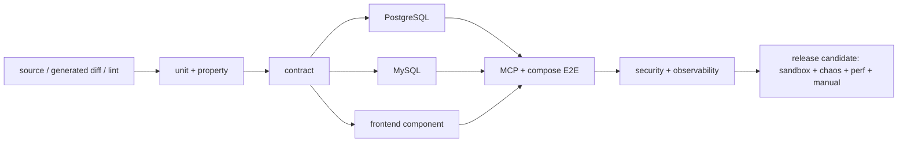

# 09 · 验证策略与发布门禁

[← 返回索引](README.md)

本文把 [00-overview.md](00-overview.md) 至 [08-implementation-plan.md](08-implementation-plan.md) 的架构约束转换为可执行、可复现、可审计的验证计划。验证的目标不是证明“主要路径能跑”，而是用自动化证据证明：三类服务在双方言、并发、失败、安全和升级条件下仍保持相同的不变量。

> **当前事实**：截至本文编写时，仓库主要内容是架构文档，本文出现的测试目录、fixture、Make target 和 CI job 是实施时必须建立的目标契约，不表示测试或实现已经存在。任何阶段只有在对应代码、自动化测试和证据产物均落库后才能标记完成。

本文使用以下标记：

- **[既定]**：第一版发布阻断要求；失败不得合并或发布。
- **[建议]**：生产质量增强；若暂缓，必须记录风险、负责人和补齐日期。
- **[后续]**：不进入第一版能力声明；启用相关能力时转为阻断项。

## 1. 验证原则与方案取舍

### 1.1 分层组合，而不是单一“测试金字塔”

LiteMCP 同时包含领域状态机、数据库并发、浏览器会话、MCP 协议、外部网络和不可信容器。只堆单元测试无法证明数据库与 transport 语义，只堆端到端测试又会慢、脆弱且难定位。因此采用以下组合：

| 层级 | 主要问题 | 运行频率 | 典型证据 |
|---|---|---|---|
| 静态检查 | 类型、格式、依赖和明显缺陷是否在运行前暴露 | 每次提交 | lint/typecheck/SAST/SBOM 报告 |
| 单元与性质测试 | 纯函数、解析器、状态机和边界是否满足不变量 | 每次提交 | pytest/Vitest JUnit、Hypothesis seed/反例 |
| 组件/契约测试 | API、connector、StorageBackend、redactor、metrics 等边界是否稳定 | 每次提交 | OpenAPI diff、contract suite、schema snapshot |
| 真实依赖集成 | PostgreSQL/MySQL/Redis/Docker/SDK 的真实语义是否一致 | PR；双方言完整矩阵每日/发布前 | 容器版本/digest、迁移日志、JUnit |
| 浏览器/MCP 端到端 | 用户和 Agent 的关键旅程是否真正闭环 | PR smoke；每日完整 | Playwright trace、MCP transcript、截图/录像（失败时） |
| 安全、故障与性能 | 恶意输入、依赖中断和负载下是否 fail-safe、有界且可恢复 | 每日/每周；发布前阻断 | SARIF、故障时间线、负载报告、资源曲线 |
| 人工探索与恢复演练 | 自动化难覆盖的可用性、辅助技术和操作风险 | 每个 release candidate | 签字 checklist、runbook 演练记录 |

组件边界优先做 provider/consumer 契约；端到端只覆盖少量高价值旅程。性质测试用于 round-trip、解析器、队列和状态机，尤其适合生成动作序列并在每一步检查不变量；Hypothesis 的 rule-based state machine 会生成并缩减失败动作序列，可用于 revision 发布、refresh 轮换、runner 生命周期和 breaker 状态机（[Hypothesis stateful testing](https://hypothesis.readthedocs.io/en/latest/stateful.html)）。

### 1.2 测试判定规则

- 断言可观测结果和领域状态，不断言实现细节、睡眠时长或日志文字片段；异步状态使用有上限的条件轮询和虚拟时钟。
- 所有负例同时断言：对外状态/错误码、持久状态、旧 active 是否保持、审计/遥测以及秘密未泄漏。
- 时间、随机数、DNS、外部 HTTP/MCP、对象存储和队列均通过可控 fixture；失败必须可由保存的 seed、输入和版本复现。
- 不以覆盖率替代质量。**[建议]** diff coverage 作为防漏提示；关键不变量、错误分支和状态迁移必须显式列入需求追踪矩阵。
- MCP 官方 SDK 是实现依赖，独立 reference client/fixture 是黑盒验证方；不得让被测代码和测试 oracle 共享同一段转换逻辑。

## 2. 可复现环境、数据与隔离

### 2.1 环境档位

| 环境 | 组成 | 用途 | 约束 |
|---|---|---|---|
| `unit` | Python/Node，纯内存 fake | 快速逻辑反馈 | SQLite 仅可用于不依赖生产数据库语义的测试 |
| `integration-postgres` | PostgreSQL 14+、Redis、对象存储 fake/MinIO 按用例 | 默认 PR 集成 | 数据库版本固定到 CI 镜像 digest |
| `integration-mysql` | MySQL 8.0+、Redis | 一级方言等价性 | 与 PostgreSQL 执行同一 contract suite |
| `sandbox-linux` | rootless Docker、cgroup v2、seccomp、Registry/egress proxy | stdio 阻断测试 | 只能在具备强制隔离能力的 Linux runner 上宣称通过 |
| `e2e` | compose 的 database、redis、backend、worker、frontend + 可控下游 | 管理 UI 与三类 Agent 流程 | 每个 worker/backend 使用独立实例 ID；固定时区 UTC |
| `chaos/perf` | 与生产拓扑等价的隔离环境 | 故障、容量、恢复 | 不能指向真实生产凭据或第三方服务 |

集成测试使用真实 PostgreSQL/MySQL/Redis 容器；Testcontainers 或等价生命周期封装负责启动、健康等待、随机端口和清理。Testcontainers 要求 Docker API 兼容 runtime，并会从标准 Docker 环境发现 daemon（[官方运行环境说明](https://java.testcontainers.org/supported_docker_environment/)）；LiteMCP 仍必须额外验证 rootless/cgroup/seccomp，因为“容器能启动”不等于 04 的安全 profile 生效。

### 2.2 固定版本与运行清单

每次 CI 产物保存：Git commit、dirty 状态、OS/arch、Python/Node/浏览器、lockfile digest、MCP SDK/Inspector 版本、DB/Redis/容器/基础镜像 digest、Alembic head、配置 profile、随机 seed 和测试分片。禁止在 release job 中使用 `latest` tag 或运行时浮动安装。

测试 runner 必须使用 UTC、固定 locale，清除不受控 `HTTP_PROXY/HTTPS_PROXY/NO_PROXY` 和宿主云凭据；需要代理的 SSRF/egress 用例显式注入专用 fake proxy。每个测试使用唯一 namespace/schema/database、Redis prefix、对象 key prefix、service 名和容器 label，清理只能按该测试持有的精确 ID执行。

### 2.3 标准 fixture 目录

**[既定]** 实施时建立版本化 `tests/fixtures/`（具体层级可调整，但语义固定）：

- `mcp/`：合规 2025-11-25 server、错误版本、非法生命周期、分页、SSE 断线/恢复、巨大/恶意 Tool、结构化结果、未知 `_meta`。
- `http/`：正常 JSON、慢响应、断连、429/5xx、重定向链、压缩炸弹、错误 media type、DNS 多地址/rebinding 和 metadata 目标。
- `stdio/`：最小 FastMCP、stdout 污染、stderr flood、忽略 cancel/TERM、fork/memory/PID/FD/tmpfs 消耗、超大 result、启动挂起、异常退出。
- `packages/`：Zip Slip、绝对/UNC/盘符路径、symlink/hardlink、central/local header 不一致、加密条目、压缩炸弹、Unicode 规范化重名、禁用后缀、依赖策略违规。
- `schemas/`：JSON Schema 2020-12 合法语料、深度/正则/远程 `$ref`、outputSchema、annotations、execution、icons、未知扩展以及 provider `exact/lossy/unsupported` golden cases。
- `secrets/`：只包含专用 canary（绝不是真实秘密）的多种编码、Header、URL、异常和嵌套表示，用于全信号扫描。
- `observability/`：metrics exposition、日志 JSON Schema、span contract、Prometheus rule 输入序列和 dashboard fixtures。

fixture 必须自描述期望值和许可用途。禁止测试调用不受项目控制的公网 API/MCP Server；所有网络结果由本地可控 server 生成。

## 3. 统一命令与 CI 作业契约

以下命令是实现阶段必须提供的稳定入口；底层工具可变，调用语义不可漂移：

```text
make lint                    # Python/TS 格式、lint、typecheck、文档/配置校验
make test-unit               # 后端单元/性质 + 前端单元/组件
make test-contract           # OpenAPI、Problem Details、connector、Storage、metrics/log/span 契约
make test-postgres           # PostgreSQL 全量迁移、约束、事务和并发契约
make test-mysql              # MySQL 同一套契约
make test-db-matrix          # 双方言结果汇总，不允许用 SQLite 替代
make test-mcp                # 2025-11-25 lifecycle/transport/tools/session/SSE 黑盒矩阵
make test-sandbox            # Linux rootless sandbox、恶意 fixture、清理与故障
make test-frontend           # Vitest/RTL/MSW + a11y 组件测试
make test-e2e                # compose + Playwright + 三类 Agent smoke
make test-security           # SAST、依赖/镜像/secret/IaC scan + 动态安全用例
make test-observability      # metrics/log/span、rules、dashboard、redaction/cardinality
make test-perf               # 版本化 workload、阈值和容量报告
make test                    # PR 默认阻断集合，不偷偷跳过缺失依赖
make verify-release          # 发布候选完整矩阵与证据汇总
```

建议 CI DAG：



| Job | PR | default branch/nightly | release candidate |
|---|---:|---:|---:|
| lint/type/generated diff/unit/contract | 阻断 | 阻断 | 阻断 |
| PostgreSQL + MySQL 完整迁移/并发 | 阻断 | 阻断 | 阻断 |
| Chromium 关键 E2E | 阻断 | 阻断 | 阻断 |
| Firefox/WebKit、跨 Tab、a11y 完整矩阵 | smoke/按变更 | 阻断 | 阻断 |
| MCP Inspector/reference client + 恶意协议矩阵 | 阻断 | 阻断 | 阻断 |
| Linux rootless sandbox | 触及 03/04/05 时阻断 | 阻断 | 阻断 |
| SAST/dependency/secret/IaC/image | 阻断基线 | 阻断 | 阻断且无未豁免高危 |
| chaos、30 min 容量、恢复演练 | 按变更 | 计划任务 | 阻断 |

作业若因 runner/daemon/浏览器缺失而 skip，发布矩阵视为未通过；不能把环境缺失解释为绿色。并行分片必须在汇总 job 检查所有预期分片和测试数存在。

## 4. 分层验证矩阵

### 4.1 静态、单元与性质测试

- Python/TypeScript strict typecheck、lint、格式、Alembic 多 head、compose/Prometheus/dashboard JSON/YAML、OpenAPI 生成差异均为阻断项。
- 规范化、稳定序列化/digest、游标签名、URL/IP 分类、Header 映射、Problem Details、JWT/API Key 解析、redaction、provider projection 做表驱动的正/负/边界测试。
- 用 Hypothesis 覆盖 JSON/Schema、ZIP/path、stdio framing 随机 chunk、Redis token bucket 数值边界；失败反例和 seed 写入报告并固定为回归 fixture。
- 用 rule-based state machine 验证 refresh rotate/reuse、revision/toolset publish/rollback、stdio queue/lifecycle、circuit breaker；每一步检查 active 完整性、单终态、资源有界和不可逆状态不回转。
- 并发测试使用 barrier/failpoint 控制交错，不用 `sleep()` 猜竞态。至少覆盖相同 `row_version`、同名创建、refresh 旧 token、generation N/N+1、重复 outbox、队列取消/超时和 runner lazy start。

### 4.2 API 与组件契约

- 从 FastAPI 生成 OpenAPI；校验三类 discriminated union、`extra=forbid`、operationId、201/202/204、Location/status URL、Problem Details、JSON Pointer 和 secret 三态。破坏性 diff 必须显式批准并同步前端生成代码/fixture。
- viewer/editor/admin、可见/不可见/已删除、step-up 新鲜/过期组成对象级授权矩阵；列表权限过滤与详情一致，IDOR 返回 404/403 语义符合 02/03。
- 三类 connector 执行同一 contract suite：接收冻结 snapshot、输入/输出 Schema、取消、deadline、资源释放、错误分类、秘密不透传，且无权修改 active pointer。
- PostgreSQL、MySQL repository 必须执行相同领域 contract；StorageBackend 对 filesystem/S3-compatible fake 执行摘要、staging/available、失败清理与不可变对象契约。
- 前端通过 MSW/contract fixture 验证 query key、mutation 不重试、401 single-flight、409 草稿保留、202 operation、Key 一次性明文和错误 pointer；mock 测试不能替代真实后端 E2E。

### 4.3 双方言数据库矩阵

每个一级数据库执行：

1. 空库 `upgrade head`，Schema/约束/索引检查；从每个受支持的上一 release 备份升级到 head。
2. `downgrade` 只在迁移声明可逆时执行；不可逆迁移必须有恢复/前滚演练，不能伪造 downgrade。
3. 唯一性、复合外键、CHECK、UTC 微秒、UUID/JSON/CIPHERTEXT、事务回滚、软删除名称复用。
4. 并发同名创建、乐观锁、creator editor、最后 active admin、API Key 吊销、publication CAS 和 outbox 至少一次投递。
5. 迁移失败/进程中断后的恢复，以及备份恢复后密文能由外部 key 解密；只有数据库备份而没有密钥恢复不算通过。

双方言的预期业务结果和错误码必须一致；允许的执行计划/物理类型差异记录在 dialect fixture。双方言 job 任何一方失败均阻断发布。

### 4.4 MCP 协议一致性

协议矩阵固定 `2025-11-25`，至少覆盖：

- POST/GET/DELETE、Content-Type/Accept/Origin、单对象/拒绝 batch、notification 202、JSON/SSE 响应、Cache-Control。
- `initialize → notifications/initialized` 顺序、版本/能力协商、初始化前方法、未知方法、ping、cancel、Session TTL/绑定/DELETE。
- `tools/list` 分页、cursor 与 active toolset 绑定、完整 Tool Schema/未知 `_meta` 无损、`tools/call` 参数/输出校验及 `isError` 与 JSON-RPC error 区分。
- SSE heartbeat、两条 stream、event ID、断线 replay、过期 resume point、慢消费者有界取消；重放事件不能重新执行 tool。
- 发布竞态：单次请求固定旧 snapshot，新请求读取新 active；远端 ID/Session 不透传或冲突。

使用两类独立客户端：官方 Python SDK reference client 执行自动契约；MCP Inspector CLI 执行发布 smoke 和人工诊断。Inspector 官方项目支持 stdio、SSE、Streamable HTTP 以及 CLI 的 `tools/list/tools/call`（[MCP Inspector](https://github.com/modelcontextprotocol/inspector)）。Inspector 版本必须锁定，且它只是额外互操作证据，不代替项目自己的负例和状态断言。在 MCP 官方发布可声明认证的 conformance suite 之前，本项目只能表述为“通过本文协议一致性矩阵”，不得自称获得官方兼容认证。

### 4.5 浏览器与可访问性

- Playwright `projects` 至少覆盖 Chromium、Firefox、WebKit；PR 可只阻断 Chromium 关键路径，release 必须三者全过。CI 开启 `forbidOnly`，失败保留 trace/HTML report；Playwright 支持将首次失败、重试后成功单独标为 flaky，并提供 `--fail-on-flaky-tests`（[重试语义](https://playwright.dev/docs/test-retries)、[CLI](https://playwright.dev/docs/test-cli)）。
- 关键旅程：CLI 初始化 admin → 登录/refresh → 市场列表/深链 → 三类创建 → operation → http_api Tool 编辑/发布 → 权限/Key → Agent 配置 → 409 恢复 → 启停/删除/恢复。
- 同 Tab 10 个 401 只刷新一次；两个 Tab 竞争不触发 reuse；logout/password/permission 变化跨 Tab 生效。扫描 Local/Session Storage、IndexedDB、Cookie、URL、DOM、console、trace/screenshot，确认 access/step-up/Key/canary 不泄漏。
- 320 CSS px、200% zoom、reduced motion、高对比、键盘全流程；axe 自动检查加 NVDA 或 VoiceOver 至少一种人工 smoke。自动化不能替代焦点顺序、live region 和一次性 Key 阅读时间检查。
- 构建预算按 06 执行：login/market 初始 chunk、editor lazy chunk、Lighthouse accessibility/performance 趋势和恶意大 JSON 主线程预算均产出报告。

## 5. 关键场景：正向、负向、边界、并发与故障

### 5.1 管理认证与授权（02）

- 正向：一次性 CLI 首个 admin、Argon2id 登录、refresh 每次轮换、logout、step-up、viewer/editor/admin 合法操作。
- 负向：用户不存在/坏密码/disabled/locked 的 401 body 和显著时序不枚举账号；`alg=none`、错误 `kid/typ/iss/aud/sub`、过期/未生效/超大 JWT；Origin/CORS/Fetch Metadata/CSRF 拒绝。
- 边界/并发：用户名 NFKC、密码长度/字节上限、失败观察窗口临界点、并发失败计数、并发 refresh 恰好一个成功，旧 token 再用吊销 family。
- 故障：DB 不可用管理 API fail-closed；Redis 不可用 login/refresh 不签发会话；密码/角色/service 权限改变下一请求立即生效。

### 5.2 CRUD、版本与发布（01/03）

- 三种合法 create/update 与跨类型/只读/未知字段负例；secret `keep/set/clear`，响应永无明文。
- metadata-only 不增加 generation；配置/secret/tool 变化恰好 `+1`。创建 service、creator editor、revision、audit/outbox 任一步失败整体回滚。
- 两个同名创建仅一个成功；软删除后名称复用，恢复冲突；删除与全部 Key 吊销同事务，恢复不恢复 Key。
- 无效候选保持 active 指针和完整旧工具集；generation N 晚于 N+1 标 `superseded`；回退只切指针且 Agent 只读到完整旧集或新集。
- outbox 在“DB commit 后、消息确认前”崩溃并重复投递，最终单一终态且不重复副作用。

### 5.3 `http_api` 与 `mcp_http`（03/05）

- HTTP binding path/query/header/cookie/body 精确映射；未绑定 placeholder、CRLF、Host/Authorization 覆盖、错误 media/status、超大/压缩响应均受控失败。
- SSRF 覆盖 IPv4/IPv6、整数/混合编码、loopback/link-local/private/ULA/metadata、DNS 多地址/rebinding、redirect 每跳、跨 origin secret header、环境 proxy；静态校验和连接时校验都必须命中。
- `mcp_http` 同步保存 protocol/capabilities/serverInfo/instructions/完整 Tool；远端超时、坏 Schema、巨大列表和 Session 失效不污染 active。
- `tools/call` 默认零自动重试；只有明确安全/幂等白名单允许 retry，且共享总 deadline/retry budget。通过物理 attempt 指标证明非幂等调用只发送一次。

### 5.4 stdio 沙箱（04）

- 包性质/fuzz 语料覆盖第 2.3 节全部路径、链接、压缩和 header 变体；拒绝项进入 quarantined，临时文件可回收。
- 构建锁 base image/依赖/builder/platform digest；重复构建通过相同 cache key/layer/digest 或显式 cache-hit 指标证明复用，**不得以“明显更快”作为唯一断言**。依赖无 hash、sdist、VCS/URL/自定义 index 被拒绝。
- inspect build/probe/run 容器，断言 rootless、non-root、drop ALL、no-new-privileges、seccomp、read-only、tmpfs、cgroup/ulimit、无 host mount/device/socket 和默认无网络；缺 cgroup v2/seccomp 的生产 profile fail-closed。
- stdout framing 随机分块、非法 UTF-8/JSON、污染、未知/重复/晚到 ID、超大消息；stderr flood 不阻塞 stdout且有丢弃指标。
- 队列 FIFO/满/等待超时/取消、单 in-flight、并发 lazy start、call timeout 后 cancel→TERM→KILL、孙进程清理、revision drain、restart budget/quarantine。
- runner crash/restart 只按精确 label/lease reconcile；Docker/Registry/resolver/egress proxy/Storage 故障符合 04 的继续服务或 fail-closed 语义。

### 5.5 Agent 网关（05）

- 固定顺序：service 可用性 → Agent 鉴权 → 双桶限流 → protocol/session → connector；管理 JWT 不能作为 Agent 凭据，Key 不能跨 service。
- Redis 双桶全扣或全不扣；并发原子、配置即时生效。仅 rate-limit Redis 失败进入有告警的 fail-open；Session Redis 失败必须 503 fail-closed，两者不可混淆。
- 全局/service/principal/SSE 舱壁、queue 和 payload 上限均快速拒绝并带稳定 reason/Retry-After；客户端断线不自动等同 tool cancel。
- breaker closed/open/half-open、revision 隔离；业务 `isError=true`/4xx 不错误计入 transport failure。
- HTTP、JSON-RPC、ToolResult 三层错误 truth table；任何错误不包含下游原文、容器/Redis/数据库细节或秘密。

### 5.6 可观测性（07）

- registry snapshot 断言所有稳定 metric 名/type/HELP/labels/buckets；真实 path、request/trace/session/key/user/参数不能成为 label，超出 service cap 进入 `__overflow__`。
- 一次 `tools/call` 可由 response `request_id` 找到 gateway/connector 日志与 trace；async build/sync 通过 correlation/link 串联；HTTP、JSON-RPC、Tool outcome 分别计数。
- redaction corpus 注入所有 signal：JSON log、trace attribute/event、metrics、build log、audit changes、error response 和 Playwright artifact；canary 原值在所有产物中检索必须为零。
- 断开 DB、Redis 两种用途、下游、Docker、Storage、Collector/log backend；同时断言业务语义、readiness、metric/log/span 和 alert transition。遥测后端故障不能把业务拖过 deadline。
- `promtool check rules` 与 rule unit test 证明 14.4x/6x/1x burn-rate fire/reset；六张 dashboard 的 query、单位、空值与阈值由 fixture 验证，所有 alert URL 指向存在的 runbook。

## 6. 安全与供应链验证

安全测试以威胁模型为入口，不是发布末尾只跑一次扫描器。至少包括：

1. **SAST/类型/规则**：Python/TypeScript、Dockerfile、compose/IaC；新 critical/high 必须修复或由安全 owner 限时豁免。
2. **依赖与许可证**：lockfile 漏洞扫描、直接/传递依赖清单、许可证策略；扫描数据库版本随报告保存，离线/过期数据库不能产生绿色结论。
3. **秘密扫描**：提交历史/工作树/构建上下文/镜像层/source map/artifact；托管平台可启用 push protection，GitHub 的 push protection 会阻止检测到的 secret 并记录 bypass（[官方说明](https://docs.github.com/en/code-security/how-tos/secure-your-secrets/prevent-future-leaks/enable-push-protection)）。任何 bypass 都需安全审批和轮换证明。
4. **SBOM 与镜像**：为 backend/worker/frontend 和 stdio build artifact 生成 CycloneDX/SPDX SBOM，按 digest 签名/关联 provenance；扫描 OS package、Python/Node dependency、misconfiguration 和 secret。
5. **DAST/手工安全测试**：按版本化 OWASP WSTG 场景覆盖认证、会话、授权、输入、错误、客户端和 API；WSTG 建议在引用时固定版本化场景 ID（[OWASP WSTG](https://owasp.org/www-project-web-security-testing-guide/)）。重点加入 IDOR、CSRF/CORS、JWT、SSRF、资源耗尽、敏感数据过度暴露和 source map。
6. **沙箱逃逸前置检查**：非 root/rootless/seccomp/capability/mount/network/device/socket/cgroup 必须由自动 inspect 断言；高对抗部署的 gVisor/Kata 属 [建议]，启用后纳入同一恶意 fixture 矩阵。

扫描发现不能仅存控制台。CI 上传 SARIF/JSON、SBOM 和豁免清单；豁免包含 advisory/CVE、影响范围、补偿控制、owner、到期日和批准人，到期自动阻断。不能访问漏洞库、Registry 或签名验证服务时，release job fail-closed。

## 7. 性能、容量、耐久与恢复

### 7.1 工作负载模型

版本化 workload 至少包含：

- `gateway-read`：initialize/tools/list/ping，不含下游延迟，用于验证 07 的 non-call latency 与 gateway overhead。
- `http-call`：小/中/大 arguments/result，受控下游延迟、错误和 keep-alive。
- `mcp-http-call`：独立下游 Session、JSON/SSE、结构化结果。
- `stdio-queue`：不同 tool latency、队列深度、取消、启动冷/热路径。
- `admin-mix`：列表/详情/更新/权限/Key，包含 row_version 冲突。
- `build-sync`：并发上传、构建、probe、发布和 GC，测 worker backlog/terminalization。

报告必须写并发模型、到达率、service/tool 数、Schema/结果大小分布、DB pool、runner/worker 数、硬件、预热、持续时间和下游延迟；只报单个“QPS”无效。

### 7.2 门槛

- 07 已定义的 SLO 阈值是正确性门槛：Agent non-call 99% ≤ 500 ms、gateway overhead 99% ≤ 100 ms、management read 99% ≤ 500 ms、build/sync 99% 在 15 min 内终态、audit freshness 99.9% ≤ 60 s。
- 前端 bundle/Lighthouse 预算按 06 原值执行。
- 每个 release candidate 在 **2× 预计峰值**下稳态 30 min：无未解释错误、无限队列/内存增长、DB/executor pool starvation、restart storm、series budget 超限或 telemetry backpressure；资源水位需保留部署定义的安全余量。
- soak **[建议]** 2–8 小时覆盖 Session TTL、idle container、GC、refresh、连接池和 gauge 清理；生产首次发布和重大 runner/SDK/DB 变更必须执行。
- 容量结论是“已测试到 N，在给定配置满足门槛”，不能外推为无限容量。基线变化超过 10% 或任何 SLO 失守阻断，除非附 profiling、影响分析和批准后的新基线。

### 7.3 备份、升级与灾难恢复

- PostgreSQL/MySQL 均从最近一次受支持 release 数据快照升级；升级前后 active revision/toolset、权限、Key 摘要、audit hash/outbox 和 artifact 引用一致。
- 关系库 + 外部 Fernet/JWT/API Key pepper/Registry/object storage 联合恢复；验证密文能解密、API Key 行为保持且审计可查询。不得在报告中保存真实 key。
- worker/backend 滚动重启期间验证 Session、SSE replay、outbox、build/sync 重入和 stdio drain/reconcile；不允许半发布或重复副作用。
- 运行 RB-001～RB-008 tabletop/实际演练：记录发现、缓解、恢复验证、RTO/RPO 实测和后续项。破坏性命令只在隔离环境且经审批执行。

## 8. 03–08 覆盖与阶段 Gate

### 8.1 文档覆盖矩阵

| 来源 | 关键不变量 | 阻断验证 |
|---|---|---|
| 03 CRUD | 分型、RBAC、secret 三态、row_version、generation、软删除、原子发布 | API/DB contract、并发 failpoint、三类 E2E、secret scan |
| 04 stdio | 包/依赖策略、强制 sandbox、严格 framing、有界队列、取消清树、reconcile | property/fuzz、container inspect、恶意 fixture、crash/资源故障 |
| 05 gateway | 2025-11-25 lifecycle/session/SSE、Key、双桶、fail-open/closed 分离、connector snapshot、零默认 retry | SDK/Inspector 黑盒、Redis 故障、attempt 计数、发布竞态 |
| 06 frontend | 内存 token、跨 Tab refresh、无损 Tool、202/409、Key 一次性、WCAG/bundle | RTL/MSW、三浏览器 Playwright、storage/DOM scan、axe+人工 |
| 07 observability | 稳定低基数信号、三层 outcome、trace/link、SLO/rules/dashboard/runbook、统一 redaction | registry/log/span contract、故障注入、promtool、canary/cardinality/load |
| 08 plan | 纵向切片各自可运行，不把未交付能力提前声明 | 下列阶段 gate；每阶段独立 evidence manifest |

01/02 虽不在用户指定的扩写文件组内，仍是所有 gate 的前置：双方言数据不变量、审计/秘密、管理认证和授权失败会阻断任何纵向切片。

### 8.2 08 各里程碑退出条件

| 里程碑 | 退出 Gate（全部满足） |
|---:|---|
| M0 工程与契约基线 | compose config 可校验且 PostgreSQL/MySQL profile 互斥；backend/worker 分离；镜像/依赖固定；app/worker 优雅启停；live/ready、Problem Details、redaction、OTel/metrics 骨架和 Collector 故障语义通过；Make/CI 在干净环境可执行 |
| M1 数据与安全原语 | 双方言 fresh/上一版本升级/约束/并发/回滚全过；active 复合归属、软删除唯一、publication CAS、secret/audit/outbox 不变量成立；数据库+外部密钥恢复 smoke |
| M2 管理鉴权与前端壳 | CLI bootstrap、JWT/refresh/CSRF/锁定/RBAC/step-up、DB/Redis fail-closed、内存 token 与跨 Tab contract 全过；无凭据泄漏且安全 Header/CSP 生效 |
| M3 发布内核与网关骨架 | worker 至少一次投递/重入、旧 generation、真实 Streamable HTTP lifecycle/Session/SSE、active snapshot、取消/资源释放以及 log/metric/trace correlation 全过；`gateway.enabled` 未越权开放 |
| M4 `http_api` 切片 | 创建→发布→Key→MCP initialize/list/call 闭环；SSRF/binding/限流/Redis 两类故障/吊销/坏候选/并发发布均过；最小 UI、审计与 telemetry 可定位 |
| M5 `mcp_http` 切片 | 远端 sync→候选→发布→call→revision pool drain 闭环；协议/Session/取消/breaker/错误/非幂等零重试/旧 active 保护和不可信 metadata 渲染通过 |
| M6 `stdio` 切片 | 上传→构建→SBOM/scan→probe→OCI digest→发布→queue/call→drain/回退闭环；Linux sandbox 全部强制项、恶意/故障、孙进程清理与 reconcile 矩阵通过 |
| M7 前端与运维闭环 | 三类完整页面、真实 API contract、409/202/403/404、一次性 secret、三浏览器/响应式/a11y 通过；稳定 telemetry schema、SLO/rules、六张 dashboard、全部 runbook、cardinality 2× load 通过 |
| M8 发布候选 | 冻结 commit/digest/SBOM/provenance；双方言完整矩阵、三类 E2E、`none` 风险语义、MCP 一致性、故障/回滚/备份恢复、渐进发布停止条件、安全与人工签字全部通过 |

阶段状态只允许 `not_started/in_progress/verified/blocked`。只有 evidence manifest 指向的 commit 与当前候选一致时才能为 `verified`；后续变更触及不变量时自动回到 `in_progress`。

## 9. 发布退出门槛与风险处置

### 9.1 必须全部满足

- 所有 [既定] job 绿色，预期分片/测试数齐全，无意外 skip、`test.only`、非 strict xfail 或被重试掩盖的 flaky。
- 03–08 覆盖矩阵无空项；双方言、三类服务、管理认证、MCP 2025-11-25、Linux sandbox 和三浏览器关键流程有同一 commit 证据。
- 新/变更代码的关键状态迁移和错误路径有测试；不得用降低断言、扩大 timeout 或删除 fixture 解决失败。
- 无未批准 critical/high 安全发现、secret 泄漏或 sandbox 强制项缺失；豁免未过期且具备补偿控制。
- 性能/SLO/bundle/cardinality 预算通过；故障注入证明恢复后无半发布、孤儿进程、重复副作用和永久降级。
- audit/metrics/log/trace/alert/dashboard/runbook 均能回答对应故障，canary 扫描为零命中。
- release notes 只声明已通过 gate 的 capability；`oauth2`、Tasks、多副本 stdio 等 [后续] 能力不得提前启用。

### 9.2 已知问题和豁免

豁免记录包含：失败 test/finding ID、影响不变量、用户影响、复现步骤、补偿控制、owner、到期日、批准人和回归计划。以下不可豁免：鉴权/授权 fail-open、秘密明文泄漏、active 半发布/跨 service、Key 吊销失效、stdio 强制隔离失效、不可恢复的数据损坏、审计证据静默丢失。

## 10. 证据、可追溯性与 flaky 管理

### 10.1 Evidence manifest

每个阻断 job 上传机器可读 manifest，至少包括：

```json
{
  "schema_version": 1,
  "commit": "<sha>",
  "job": "test-db-matrix",
  "started_at": "<UTC>",
  "environment": {"os": "linux", "arch": "amd64"},
  "versions": {"python": "<version>", "postgres": "<digest>", "mysql": "<digest>"},
  "seed": "<seed-or-null>",
  "expected_shards": 2,
  "completed_shards": 2,
  "results": {"passed": 0, "failed": 0, "skipped": 0, "flaky": 0},
  "artifacts": ["junit.xml", "logs-redacted.jsonl"],
  "status": "passed|failed|incomplete"
}
```

测试数示例中的 `0` 不是允许空套件；汇总器必须配置每个 job 的最小预期 collection，收集为 0 直接失败。证据按 release 保留策略保存：JUnit/coverage/contract/SARIF/SBOM、Playwright trace、MCP transcript、Prometheus rule、性能原始数据和人工 checklist；日志与 trace 在上传前同样经过 canary/redaction 扫描。

需求追踪表用稳定 ID（如 `V-CRUD-CAS-001`）连接“文档章节 → 测试 → CI job → 证据 URI → 最近通过 commit”。修改 01–08 的 [既定] 条款时，PR 必须更新追踪表或明确说明已有测试覆盖。

### 10.2 Flaky 策略

- PR/发布阻断 job 默认不自动 rerun；Playwright 若为诊断配置一次 retry，任何“首失败、重试通过”仍计 flaky 并使 release job 失败。
- 确认 flaky 后创建缺陷，记录 owner、首次/最近发生、频率、seed、环境和到期日。隔离只能放入独立 non-blocking quarantine job，不能从总测试数和日报隐藏。
- 安全、数据库并发、publication CAS、secret、migration、sandbox 和恢复测试不得 quarantine；它们失败必须修复或阻断。
- 修复应消除共享状态、真实时钟/睡眠、端口冲突、非确定外网、顺序依赖和资源泄漏；不能靠无限 timeout/retry。
- quarantine 到期未修自动恢复为阻断失败；连续 20 次干净运行且有根因修复证据后才可移出。每周跟踪 flaky 数、频率、平均修复时长和 top owner。

## 11. 建议与后续演进

### 11.1 建议（SHOULD）

- 对 parser、framing、ZIP、JSON Schema、URL policy 和 redactor 接入持续 fuzz，并把崩溃语料最小化后提交为回归 fixture。
- 使用 mutation testing 检查 CAS、权限、redaction 和失败保持 active 等关键断言是否真正能杀死缺陷；不设全仓机械分数。
- 建立临时 preview 环境执行 DAST 与人工 UX/a11y；测试数据和 canary 在作业后自动回收。
- 对 SDK、browser、DB minor、base image 更新使用独立依赖 PR，自动跑完整协议/双方言/sandbox/性能回归后再合并。

### 11.2 后续（能力启用时转阻断）

- OAuth 2.1：issuer/audience/resource/scope、RFC 9728 metadata、PKCE、跨主体 Session/Task 和 token 不透传完整矩阵。
- MCP Tasks：task create/get/result/cancel/list、主体隔离、TTL、终态、远端 ID 映射和 GC。
- stdio 多副本：lease/fencing、故障转移、脑裂和旧 owner 操作拒绝。
- 新 MCP 协议版本：独立 version adapter 和双版本 contract，不通过条件分支静默改变 2025-11-25 行为。

## 12. 权威参考

- [MCP 2025-11-25 · Transports](https://modelcontextprotocol.io/specification/2025-11-25/basic/transports)
- [MCP 2025-11-25 · Lifecycle](https://modelcontextprotocol.io/specification/2025-11-25/basic/lifecycle)
- [MCP 2025-11-25 · Tools](https://modelcontextprotocol.io/specification/2025-11-25/server/tools)
- [MCP Inspector](https://github.com/modelcontextprotocol/inspector)
- [JSON Schema Draft 2020-12](https://json-schema.org/draft/2020-12)
- [Hypothesis · Stateful testing](https://hypothesis.readthedocs.io/en/latest/stateful.html)
- [Testcontainers · Supported Docker environments](https://java.testcontainers.org/supported_docker_environment/)
- [Playwright · Best practices](https://playwright.dev/docs/best-practices)
- [Playwright · Retries](https://playwright.dev/docs/test-retries)
- [OWASP Web Security Testing Guide](https://owasp.org/www-project-web-security-testing-guide/)
- [OWASP API Security Top 10 2023](https://owasp.org/API-Security/editions/2023/en/0x11-t10/)
- [OpenTelemetry Specification](https://opentelemetry.io/docs/specs/otel/)
- [Prometheus · Unit testing rules](https://prometheus.io/docs/prometheus/latest/configuration/unit_testing_rules/)
- [Docker · Rootless mode](https://docs.docker.com/engine/security/rootless/)
- [SLSA v1.2 · Build track](https://slsa.dev/spec/v1.2/build-requirements)
