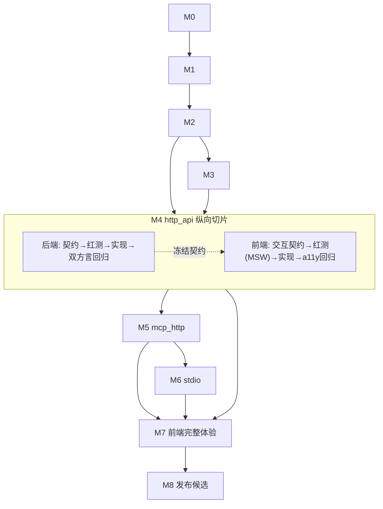

# 10 · TDD 执行计划（编码方案 × UI/UX 流程）

[← 返回索引](README.md)

本文不新增里程碑体系，也不改变 [08-implementation-plan.md](08-implementation-plan.md) 的 M0–M8 骨架、退出标准、feature flag 清单和回滚顺序，也不改变 [09-verification.md](09-verification.md) 的分层验证矩阵和 Definition of Done。本文只做一件事：把每个里程碑拆成固定的**红→绿→重构**四步循环，并把 [UI_UX_PLAN.md](../UI_UX_PLAN.md) 第 17 章的五个前端阶段挂到对应里程碑上，使后端契约与前端体验在同一里程碑内同步推进，不把前端拖到最后一次性补齐。

> **当前事实**：仓库目前只有架构文档，本文出现的目录、命名和清单是实施时的目标约定，不代表代码或测试已经存在。

## 1. 通用 TDD 四步循环

### 1.1 后端 / worker / gateway

| 步骤                      | 产出                                                                                                             | 状态 | 对应 09 章节    |
| ------------------------- | ---------------------------------------------------------------------------------------------------------------- | ---- | --------------- |
| 1. 契约先行               | OpenAPI/JSON Schema/事件契约草案 +`tests/fixtures/`（目录语义见 09 第 2.3 节），此时实现代码不存在             | 红   | 09 §2.3        |
| 2. 失败测试               | 对应 unit/property/contract 测试先写出来并确认失败：状态机不变量、并发 failpoint、connector contract             | 红   | 09 §4.1、§4.2 |
| 3. 最小实现               | 只写让测试变绿所必需的领域服务/repository/connector 代码，不预先做未来里程碑的能力                               | 绿   | 08 DoD 第2条    |
| 4. 双方言/契约回归 + 重构 | `make test-postgres`/`make test-mysql`/`make test-contract` 全过后再重构；先测试通过、后重构，顺序不可颠倒 | 重构 | 09 §4.3        |

### 1.2 前端 / UI-UX

| 步骤                      | 产出                                                                                                                       | 状态 | 对应文档        |
| ------------------------- | -------------------------------------------------------------------------------------------------------------------------- | ---- | --------------- |
| 1. 交互契约先行           | 依据 UI_UX_PLAN 对应章节，先定页面状态机（loading/empty/error/409/202/一次性 secret…）和组件 props/事件契约，不写组件实现 | 红   | UI_UX_PLAN §16 |
| 2. 失败测试               | 用 MSW mock 后端契约，先写 RTL/Vitest 组件测试和关键状态断言（例如"发布中"绝不能显示成功 Chip）                            | 红   | 09 §4.2 末段   |
| 3. 最小实现               | 按 HeroUI 组件映射（UI_UX_PLAN 第12章）实现到测试变绿，不引入映射表以外的自造组件                                          | 绿   | UI_UX_PLAN §12 |
| 4. a11y/浏览器回归 + 重构 | Playwright smoke + axe 通过后再重构样式/结构                                                                               | 重构 | 09 §4.5        |

两条循环在同一个里程碑内**并行但不合并**：后端先冻结契约（步骤1），前端的步骤1直接消费该契约草案；后端进入步骤3实现时，前端可以用 MSW mock 同一契约并行推进步骤2–3，最终在里程碑退出前做一次真实联调（对应 09 的浏览器/MCP 端到端层）替换 MSW。

## 2. 里程碑 ↔ UI 阶段映射

映射关系已确认不调整：

| 08 里程碑                                   | 对应 UI_UX_PLAN 阶段                       | 本里程碑新增的前端 TDD 产物                                                                                        |
| ------------------------------------------- | ------------------------------------------ | ------------------------------------------------------------------------------------------------------------------ |
| M0 工程与契约基线                           | —                                         | 无业务 UI；只搭前端 CI（lint/type/unit/build）+ 组件测试脚手架（Vitest/RTL/MSW）                                   |
| M1 数据模型、迁移与安全原语                 | —                                         | 无 UI                                                                                                              |
| M2 管理鉴权、授权与前端壳                   | 阶段1 基础体验                             | 登录/会话恢复/市场列表骨架页面的状态测试先行（Skeleton/空/错误态、401 single-flight、跨 Tab）                      |
| M3 发布内核、Worker 可靠性与 Agent 网关骨架 | —                                         | 无 UI（网关骨架阶段）                                                                                              |
| M4`http_api` 纵向切片                     | 阶段2 服务工作台 + 阶段3 HTTP API 纵向链路 | 创建向导、Tool Schema 编辑器双视图、发布状态条（UI_UX_PLAN §7.3a 五档状态）先写状态映射测试；409 并发冲突恢复路径 |
| M5`mcp_http` 纵向切片                     | 阶段4（远程 MCP 部分）                     | 202 operation 轮询、同步进度、breaker/失败摘要的组件测试先行                                                       |
| M6`stdio` 纵向切片                        | 阶段4（stdio 部分）                        | 上传/构建/探测阶段进度组件，含实例池/并发提示文案（UI_UX_PLAN §6.4）的测试先行                                    |
| M7 前端体验、可观测与运维闭环               | 阶段5 接入与安全闭环                       | Agent 接入片段、API Key 一次性弹窗、权限页、团队/用户/审计三个新页面、step-up，三浏览器/响应式/a11y 完整矩阵       |
| M8 发布候选、演练与渐进交付                 | —                                         | 无新增 UI；做响应式/a11y 最终验收和渐进发布观察                                                                    |

## 3. 里程碑依赖与内部四步循环

依赖关系与 08 第2章一致：关键路径 `M0 → M1 → M3 → M4 → M5 → M6 → M8`，M2 可与 M3 并行但 M4 的管理写操作必须等 M2 的对象级 RBAC/step-up/审计完成。

## 4. 各里程碑检查清单（可直接转 TaskList）

以下清单是执行时逐项打勾的最小集合，详细验收条目仍以 08 各里程碑的"退出标准"和 09 对应场景为准，本文不复述。

### M2

- [ ] 后端：登录/refresh/CSRF/Origin 契约与 fixture 先行，测试先红
- [ ] 后端：Argon2id/JWT/Redis 轮换实现使测试转绿，双方言回归通过
- [ ] 前端：登录页/会话恢复/401 single-flight 状态机先行，MSW 红测先行
- [ ] 前端：壳层组件实现转绿，跨 Tab（Web Locks/BroadcastChannel）测试通过
- [ ] 联调：真实后端替换 MSW，Playwright Chromium smoke 通过

### M4

- [ ] 后端：`http_api` CRUD + Tool Schema/HTTP binding 契约、SSRF/binding fixture 先行
- [ ] 后端：连接器与发布 CAS 实现转绿，坏 binding/Schema 拒绝且旧 active 可调用
- [ ] 前端：创建向导四步状态机、Tool Schema 双视图校验反馈层次先行红测
- [ ] 前端：发布状态条五档合成规则（UI_UX_PLAN §7.3a）组件测试先行
- [ ] 前端：409 并发冲突（保留草稿/reload/rebase）交互先行红测
- [ ] 联调：`创建 → 发布 → 生成 Key → initialize/list/call → 429 → 吊销 401` 端到端通过

### M5

- [ ] 后端：`mcp_http` 同步/202 operation/breaker 契约与远端 fixture 先行
- [ ] 前端：同步进度、脱敏失败摘要、active/retired/rejected 展示先行红测
- [ ] 联调：`创建202 → 同步 → 原子active → list/call → revision切换drain` 通过

### M6

- [ ] 后端：上传/构建/探测三阶段隔离契约、恶意包 fixture 先行
- [ ] 前端：上传进度、构建/探测阶段、实例池/并发配置提示先行红测
- [ ] 联调：`上传 → build → probe → digest登记 → CAS发布 → Agent call → 回退` 通过

### M7

- [ ] 前端：五段式完整体验（列表/表单/编辑器/权限/Key）状态矩阵先行红测
- [ ] 前端：一次性 Key Modal、step-up、团队/用户/审计三页面先行红测
- [ ] 联调：三浏览器矩阵、a11y（axe + 人工 smoke）、响应式断点全部通过

## 5. 与既有文档的关系

- 不改变 08 的 flag 默认值、退出条件、并行边界与所有权、风险登记表。
- 不改变 09 的分层验证矩阵、fixture 目录语义、CI 作业契约和证据保留策略；本文的"红→绿→重构"只是把这些层级安排出**先后顺序**。
- 不改变 UI_UX_PLAN 的信息架构、组件映射和评审重点；本文只把其阶段 1–5 对齐到 08 的里程碑编号。
